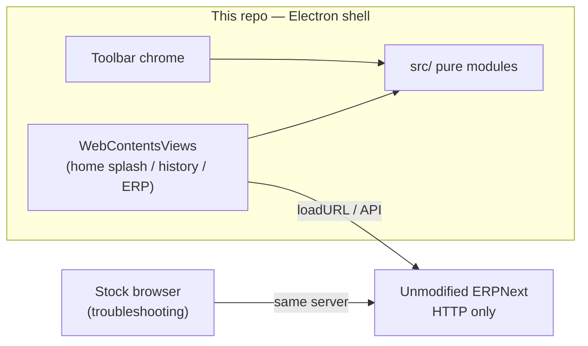

# erpnext-ui-app — handoff & doc lifecycle

> **Active rebuild** (not the museum). Architecture: Electron shell → HTTP → unmodified ERPNext.  
> Process: ADR-0002 · Clean Core ADR-0001 · conventions in `~/agent-harness/memory/conventions.md`.  
> **Product purpose (GitHub / humans):** [README.md](README.md) § Why this exists — UI hygiene, non-enterprise
> PC security (vs browser extensions), document-first muscle memory; target 1080p full / 4K half–quarter.

## Read order (agents)

1. This file — **Architecture map** (below) + where facts live.
2. [README.md](README.md) purpose (if scope/UX tradeoffs come up).
3. Current dated working plan under `docs/implementation-plan-YYYY-MM-DD.md` (if any).
4. `docs/beta-slice.md` · `CONTRIBUTING.md` · open discovery in museum `open_items.md`.

---

## Architecture map (thin — scaffold only)

> **Update this section only when** a layer, folder role, or invariant changes.  
> **Do not** update for each feature/OI (those belong in dated plans → then CHANGELOG / OI status).  
> If this disagrees with ADR-0001 or ADR-0002, **the ADR wins**.

### Layers



| Layer | Job | Not its job |
|-------|-----|-------------|
| `src/` | Pure business/helpers (testable offline) | DOM, IPC, `BrowserWindow` |
| `electron/` | Window, views, IPC, load ERP URL | Re-implementing parse/dedupe/health logic |
| ERPNext | Books data + Desk | Patched by us (never) |
| Stock browser | Prove server works without the shell | Product chrome |

### Folder map

| Path | Role |
|------|------|
| `src/*.js` | SSoT for each concern’s **logic** (health, history, route-info, nav-guard, config, money, …) |
| `tests/*.test.js` | Unit tests; same change as the `src/` they cover |
| `electron/main.js` | Wires views + IPC; calls into `src/` |
| `electron/*.html` + `*-preload.cjs` | Chrome / splash / history UI surfaces |
| `docs/` | beta-slice, commit conventions, **dated** working plans |
| Museum `~/agent-harness/erpnext/doc-shell/` | Reference only — layouts, OIs, lessons |

### Invariants (do not casually break)

1. **Clean Core** — no edits under vendor `apps/frappe` / `apps/erpnext` (ADR-0001).
2. **HTTP only** — shell talks to ERP over the network; vanilla browser remains a valid fallback.
3. **Pure first** — new behavior lands in `src/` + `tests/` before Electron wiring.
4. **One configured ERP base** — `src/config.js` / env; panels must not invent a second server URL.
5. **AGPL public tree** — process/license in ADR-0002; 5zorro (5zorro) alone pushes GitHub.

### Extension points (where new work plugs in)

| Capability | Pure module(s) | Electron surface |
|------------|----------------|------------------|
| DB / reachability | `health.js` (+ future diagnose helpers) | Toolbar health control in `chrome.html` |
| Recent history | `route-info.js`, `history.js`, `doctype-labels.js` | Left `history.html` view |
| Allowed navigation | `nav-guard.js` | `main.js` will-navigate / window-open |
| Chrome UI state | `chrome-state.js` | Toolbar highlight / home vs ERP |
| Money helpers | `money.js` (e.g. nickel) | Later Doc tools |
| Launcher tiles | `home-tiles.js` | Splash `home.html` + toolbar **Launcher** |
| Dogfood DevTools | — (IPC only) | Toolbar **ERP console** → `openDevTools` on ERP (or chrome/home/hist) |
| Doc skin (future) | new `src/` binders — not yet | New view / lens (M3+) |

Toolbar **Home** → ERP site root `/`. **Launcher** → splash tiles. **Vanilla skin** → `/desk`.
Splash `home.html` is first-run + return-via-Launcher.

### Dogfood debugging (5zorro → agent)

1. Reproduce the bug.
2. Click toolbar **ERP console** (detached DevTools for the Desk pane).
3. **Console:** copy errors; **Elements:** Copy selector or note `data-testid` on shell controls.
4. Name the surface (ERP / Launcher / Recent / toolbar) + expected vs observed in one breath.

### Test strategy (locked 2026-07-16 — OI-049)

**Goal:** Full product confidence without trapping progress in flaky desktop+ERP automation.

There **is** real Electron automation (Playwright `_electron`, WebDriverIO `@wdio/electron-service`).
Plain **Selenium** is not a better Electron story (no first-class Electron product; you’d reinvent
WDIO). Neither tool removes the hard parts of *this* app: multiple `WebContentsView`s, WSL/display,
and a live ERPNext dependency.

| Layer | Role | Tool | CI gate? |
|-------|------|------|----------|
| **1. Pure unit** | Business logic in `src/` | `node --test` (`npm test`) | **Yes — required** |
| **2. ERP workflow e2e** (bulk of “full suite”) | Doc/Desk paths against unmodified ERP | Playwright **as a browser** → `ERP_BASE` | Optional; **skip-OK** if ERP down |
| **3. Shell smoke e2e** | One smoke per scaffold | Playwright `_electron` + `E2E=1` `__erpE2e` surface (see `e2e/GOTCHAS.md`). Specs: `scaffold-*.spec.js`. | Optional; **not** merge gate |
| **4. Manual** | Feel / dogfood | You (+ **ERP console**) | Never a substitute for layer 1 |

**Gotcha summary:** WebContentsViews are not reliable Playwright Pages — drive via `evaluate` /
`execInView`, not `firstWindow()` clicks. Pure logic stays in `npm test`. Details: `e2e/GOTCHAS.md`.

**MVP e2e:** health + scaffolds (URL/API, chrome, pure wiring, views).

**Rejected for this repo:** Spectron (dead), Cypress-as-Electron-driver, Selenium-without-WDIO,
museum-style “Playwright Electron + live ERP as the only proof.”

**Full suite = layers 1+2+3 together**, not one mega Electron-ERP script. Units stay the merge gate
(ADR-0002).

```bash
npm test              # required
npm run test:e2e      # optional shell smoke (needs display)
npm run test:e2e:xvfb # same under Xvfb (WSL/CI-friendly)
```

---

## Long-term documentation (keep)

| Home | Role | Erase when done? |
|------|------|------------------|
| `~/agent-harness/memory/decisions.md` | Append-only **why** / locked choices | **No** |
| `~/agent-harness/docs/adr-*.md` | Load-bearing architecture/process | **No** (supersede with new ADR) |
| Museum `erpnext/doc-shell/open_items.md` | Discovery inbox (OI-NNN); status updates | **No** (mark done; don’t delete IDs) |
| `docs/beta-slice.md` | What `main` may claim | Update in place |
| `docs/commit-conventions.md` · `CONTRIBUTING.md` | How we commit / contribute | Update in place |
| `CHANGELOG.md` (when present) | What **landed** | Append only |
| `bug-bounty/` | Recurring failures + debrief | Keep after fix |
| **This file — Architecture map** | Scaffold / layers / extension points | Update only on scaffold change |

## Temporary documentation (delete when tranche done)

| Home | Role |
|------|------|
| `docs/implementation-plan-YYYY-MM-DD.md` | **Working how** for one build tranche: modules, flows, business rules being coded to, tests. 5zorro audits this before/during implementation. |

Rules:

1. **Never** keep a permanent undated `implementation-plan.md` as the living SSoT.
2. When open items become **ready to implement**, create a **new dated** plan with enough **how**
   that a non-programmer can spot wrong assumptions — not only a milestone title list.
3. After the tranche ships and durable facts are copied to decisions/ADR/CHANGELOG/OI status,
   **delete** that dated plan file.
4. High-level milestone maps may stay sparse in an early draft; **how** is required before coding
   a promoted OI (or when 5zorro asks to review architecture).

## Communication (what 5zorro wants from agents)

- Prefer **auditable how** over “I’ll just implement M2.”
- Propose changes against **agreed business logic**; don’t silently reshape the rule to match code.
- Point at the **dated plan** + OI IDs when discussing scope; don’t bury process only in chat.

## Run / validate

```bash
cd ~/erpnext-ui-app && npm test && npm start
```

GitHub: only **5zorro** pushes. Fix CI locally (`npm test`) before asking for a push.
