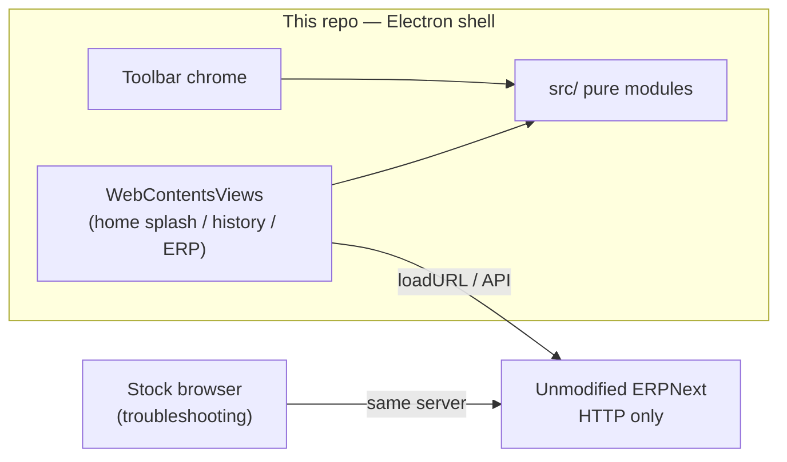

# erpnext-ui-app — handoff & doc lifecycle

> **Active rebuild** (not the museum). Architecture: Electron shell → HTTP → unmodified ERPNext.  
> Process: ADR-0002 · Clean Core ADR-0001 · conventions in `~/agent-harness/memory/conventions.md`.  
> **Product purpose (GitHub / humans):** [README.md](README.md) § Why this exists — UI hygiene, non-enterprise
> PC security (vs browser extensions), document-first muscle memory; target 1080p full / 4K half–quarter.

## Read order (agents)

1. This file — **Architecture map** (below) + where facts live.
2. [README.md](README.md) purpose (if scope/UX tradeoffs come up).
3. Dated working plans (create new when a museum OI tranche is promoted):
   `implementation-plan-2026-07-29.md` (Vanilla Simplified / OI-086).
   `implementation-plan-2026-09-03.md` (Doc Pay skin economic batching / OI-138 · OI-161) —
   planned, no code yet.
   **Closed:** `implementation-plan-2026-08-19.md` (nav instrumentation OI-126/127/128 A,
   2026-09-05) — map folded into **Navigation spine** below; residuals live on as museum
   OI-128 (peek granularity) and OI-040 (concurrent instances, parked).
   `implementation-plan-2026-08-30.md` (AP Doc skin T0–T6 + T1 dogfood, 2026-08-31) —
   runtime lessons in [docs/gotchas.md](docs/gotchas.md); remaining OIs in museum only.
   Older `implementation-plan-2026-07-18.md` closed 2026-07-29 (T1–T4 MVP).
4. `docs/beta-slice.md` · `CONTRIBUTING.md`. Discovery / issues inbox (private): museum
   `~/agent-harness/erpnext/doc-shell/open_items.md` — **not** mirrored into this public tree.

---

## Architecture map (thin — scaffold only)

> **Update this section only when** a layer, folder role, or invariant changes.  
> **Do not** update for each feature/OI (those belong in dated plans → then CHANGELOG / OI status).  
> If this disagrees with ADR-0001 or ADR-0002, **the ADR wins**.

### Layers


```mermaid
flowchart LR
  subgraph shell ["This repo — Electron shell"]
    Chrome["Toolbar chrome"]
    Pure["src/ pure modules"]
    Views["WebContentsViews\n(home splash / history / ERP)"]
    Chrome --> Pure
    Views --> Pure
  end
  ERP["Unmodified ERPNext\nHTTP only"]
  Views -->|"loadURL / API"| ERP
  Browser["Stock browser\n(troubleshooting)"] -->|"same server"| ERP
```

| Layer | Job | Not its job |
|-------|-----|-------------|
| `src/` | Pure business/helpers (testable offline) | DOM, IPC, `BrowserWindow` |
| `electron/` | Window, views, IPC, load ERP URL | Re-implementing parse/dedupe/health logic |
| ERPNext | Books data + Desk | Patched by us (never) |
| Stock browser | Prove server works without the shell | Product chrome |

### Folder map

| Path | Role |
|------|------|
| `src/*.js` | SSoT for each concern’s **logic** (health, history, route-info, nav-guard, config, money, …) |
| `src/sample-data/` | Pure sample corpus plan + sandbox guard (OI-055 / S−1) |
| `ops/sample-data/` | Sandbox-only bench seed runner (`npm run seed:sample`) |
| `ops/input-count/` | Bill scrape dogfood report (`npm run report:input-count`) |
| `ops/erp-host/` | Optional ERP host scripts: `ensure-erp-up.sh` (docker + ping; no UI); example autofix wrapper |
| `docs/gotchas.md` | Runtime/architecture gotchas from dogfood (bill enrich, ERP IPC, nav) |
| `docs/input-count-gotchas.md` | Measurement gotchas + dogfood checklist before Simplified mockups |
| `docs/erp-unreachable.md` | ERP timeout: host `start-shell.sh` + IT notify/autofix setup in diagnose |
| `docs/erpnext-schema-browse.md` | Safe MariaDB/DBeaver schema browse (read-only, one-hop recipe, Clean Core) |
| `tests/*.test.js` | Unit tests; same change as the `src/` they cover |
| `electron/main.js` | Wires views + IPC; calls into `src/` |
| `electron/*.html` + `*-preload.cjs` | Chrome / splash / history UI surfaces |
| `docs/` | beta-slice, commit conventions, **dated** working plans |
| Museum `~/agent-harness/erpnext/doc-shell/` | Reference only — layouts, OIs, lessons |
| ERP source (in Docker) | `docker exec frappe_docker-backend-1 ls /home/frappe/frappe-bench/apps/` — frappe + erpnext + payments + hrms; read-only browse only (Clean Core) |
| MariaDB | `localhost:3306` (Docker port-forward); read-only schema access — see `docs/erpnext-schema-browse.md` |
| Docker compose | `~/erpnext/frappe_docker/` |

### Invariants (do not casually break)

1. **Clean Core** — no edits under vendor `apps/frappe` / `apps/erpnext` (ADR-0001).
2. **HTTP only** — shell talks to ERP over the network; vanilla browser remains a valid fallback.
3. **Pure first** — new behavior lands in `src/` + `tests/` before Electron wiring.
4. **One configured ERP base** — `src/config.js` / env; panels must not invent a second server URL.
5. **AGPL public tree** — process/license in ADR-0002. **Commits:** agents/harness may commit freely on local branches (checkpoints OK). **Pushes:** only 5zorro (5zorro) pushes to GitHub.
6. **One window** (5zorro 2026-09-05) — the whole app stays in the single main window (chrome +
   history rail + a `surfaceMode`-switched `WebContentsView`), never a popup, unless the user
   deliberately spawns a second *all-purpose* window (not a feature-specific one). A tile/action
   that wants its own "page" gets a new `surfaceMode` value + persistent view (see `place()` /
   `showHome()` / `showPayOutstanding()` in `main.js` for the pattern), not a `new BrowserWindow`.
   Doc skins themselves stay scoped to the **transaction-entry forms** — Purchase Order, Item
   Receipt, Bill, Payment Entry, Sales Order, Sales Invoice, Quotation, Journal Entry — not spread
   across list views, reports, or other Vanilla surfaces.

### Extension points (where new work plugs in)

| Capability | Pure module(s) | Electron surface |
|------------|----------------|------------------|
| DB / reachability | `health.js`, `diagnose.js`, `health-remediation.js` | Toolbar health + diagnose; IT notify/autofix prefs in userData only |
| Recent history | `route-info.js`, `history.js`, `history-nav.js`, `peek-stack.js`, `doctype-labels.js` | Left `history.html` rail (peek tree under parent Doc, OI-128 A; collapsible) |
| Submitted this session | `submitted-docs.js` | One rail row + running count → `submitted-dropdown.html` panel; the way back after submit-and-move-on (Drafts is `docstatus 0` only, Recent keeps one row per doctype). OI-162 — shipped 2026-09-05 |
| Allowed navigation | `nav-guard.js` | `main.js` will-navigate / window-open |
| Nav intent guard | `erp-nav-intent.js` | Arm/clear around an intentional ERP nav so a late event from the page we left cannot rewrite `currentRoute` (G6) |
| Nav incident log | `nav-incident.js` | DB ping diagnose → **Nav issue** (Ctrl+Shift+M); `userData/nav-incidents.log` |
| Chrome UI state | `chrome-state.js` | Toolbar lens chip (from the **live** ERP path, not the believed route) + Recent rail width/collapse |
| Money helpers | `money.js` (e.g. nickel) | Later Doc tools |
| Launcher / workflow Home | `home-tiles.js` (`HOME_GROUPS`) | `home.html` Doc Workflow Home (museum-style tiles) |
| Dogfood DevTools | — (IPC only) | Toolbar **ERP console** → `openDevTools` on ERP (or chrome/home/hist) |
| Doc terms | `doc-terms.js` | Bill / Home labels (QB-style) |
| Bill map (M3a) | `bill-map.js` | Header/item projectors; Amount Due checksum |
| Dirty-gate (M3b) | `dirty-gate.js` | Nav prompt classifier (wire in M3c) |
| Doc ↔ Vanilla form bridge | `erp-form-bridge.js` + `electron/erp-form-bridge-page.js` | Event-driven `waitForForm` / `setRow` / `setHeader` (Bill template → PO/IR) |
| Lens prefs | `lens-prefs.js` | Per-doctype last lens; default **doc**; persisted `lens-prefs.json` across restarts |
| Lens context | `lens-context.js` (`DOC_SKIN_INDEX` + `ready`) | Doc tab only when indexed **and ready** |
| Link search (T1) | `link-search.js`, `vendor-activity.js` | Normalize `search_link` rows; idle/never-PO vendors sink (OI-131) |
| Doc skin UI (M3c–d + T1) | `bill-map` + `electron/bill.html` | Doc Bill; lines `set_value`; ▾ Link pickers |
| **Fixed** Source modal after vendor | `docs/bug-bounty-source-modal-vendor-pick.md` | HAR: PR Item 403; enrich removed (`ce79ba6`) |
| **Fixed** Setup peek return (OI-112 class) | `docs/bug-bounty-setup-peek-return.md` | Vanilla Create-new-Account; Esc/Recent parent now in-SPA |
| Bill feature catalog (museum↔alpha) | `src/bill-feature-catalog.js` + `tests/bill-*.test.js` | Pure contracts; CI fails if built features lack tests |

Toolbar **Home** → **Doc Workflow Home** (tiled shell page, not ERP Desk).
**Vanilla skin** → ERP `/desk`. Site root `/` is a tile under Shell.
ERP Desk itself is unmodified — it will not show our tiles (by design).

### Navigation spine (OI-126 map — folded from the 2026-08-19 plan)

One window, one ERP WebContents SPA, one `surfaceMode` (`home | doc | erp`), one
`dirtyState`. **Approach A only:** Recent draws nested peeks under the parent Doc on that
single view. Approach B (overlay WebContents) is out; C (warm pool of N SPAs) stays parked
on museum **OI-040**.

| Vanilla Desk job | Shell mechanism | Status after the OI-127 incident corpus |
|------------------|-----------------|------------------------------------------|
| Same-SPA hop to a master, typing survives | soft-peek + Doc park/rebind | **Confirmed** — OI-112 strike 1 closed; rebind misses not seen since |
| Peek a Link without leaving the form | coarse surface swap + peek tree (depth 1) | **Open** — in-Doc overlay is still museum OI-128 |
| Second live client (browser tab) | singleton `dirtyState`; unmanaged `window.open` | **Open** — parked on OI-040; incident snapshots count guest windows |
| Browser Back | Esc dismisses peek; Recent is a deduped resume | **Confirmed** — do not mash Back into Recent |
| "Where am I?" (toolbar lens chip) | `toolbarLensId()` from the **live** ERP path | **Repaired 2026-09-05** — believed route could lag the page (G6) |

**`currentRoute` is a claim, not a fact.** It is set optimistically at nav time and
reconciled from browser events, so anything user-visible that reads it (lens chip,
Simplified injection gate, Recent rows) must tolerate it lagging — see `docs/gotchas.md` G6.
Guarding those events is `erp-nav-intent.js`; the guard must always resolve to arm **or**
clear, never "leave the last one armed".

**Persistence contract** (`userData/nav-state.json`): Drafts, Calculator history, Submitted
docs and the rail's collapsed state survive restart (calc and submitted rows restored from
disk are marked *previous session*, so the "this session" counter stays honest).
**Recent does not** — it is this session's trail by design, so the flyout legitimately opens
empty after a restart while Drafts still lists work in progress.

**Lens tabs are earned per page.** Vanilla is always there — it is the ERP itself. Every
other tab must be earned by the page in front of you (`chrome-state.js` `lensTabsFor()`;
the toolbar renders the answer, it never guesses):

| Page | Tabs |
|------|------|
| Bill record | Vanilla · Simplified · Doc |
| PO record | Vanilla · Simplified · Doc |
| IR (Purchase Receipt) record | Vanilla · Simplified · Doc |
| Desk, dashboards, lists, masters | Vanilla only |

(2026-09-05: Simplified's seed now covers all three anchored doc-skin doctypes, not just
Bill — see `simplified-seed-profiles.js`. Any future doctype with a Doc skin but no seed
yet stays Vanilla + Doc only, same rule as before.)

- **Simplified** needs a seeded doctype *and* an open record — availability derives from
  `SEED_PROFILES` via `lens-context.js` `hasSimplifiedLens()`, so shipping a seed lights up
  the tab and there is no second list to forget.
- **Doc** appears for a Doc-skinnable record, or a genuine **one-step** return to one (a
  parked Doc or a peek parent that is itself a Doc form — peeking a master while editing a
  Bill keeps it). A peek parent that is just another Vanilla page does not qualify.
- Which route answers "what am I looking at" differs by surface: on ERP the **live** page
  wins (`currentRoute` lags), on the Doc surface `currentRoute` wins (the hidden ERP view
  trails it — reading the live path there reports the *previous* document).
- Clicking **Vanilla** while already on a Vanilla page with no other lens **stays put**; it
  does not bounce to Desk.

OI-112 — always-on Doc tab narrowed 2026-09-05; rule extended to the whole toolbar.

### Dogfood debugging (5zorro → agent)

1. When **navigation** feels wrong, open toolbar **DB** ping → **Nav issue** immediately
   (or Ctrl+Shift+M). Type what happened and what you expected; Submit. That writes
   `userData/nav-incidents.log` (typically `~/.config/erpnext-ui-app/` on Linux) plus a
   `user-incident` line on `nav-debug.log`. The next agent should read those files first —
   do not re-describe the bug in chat unless the log is missing.
2. Reproduce if needed. Click toolbar **ERP console** (detached DevTools for the Desk pane).
3. **Console:** copy errors; **Elements:** Copy selector or note `data-testid` on shell controls.
4. Name the surface (ERP / Launcher / Recent / toolbar) + expected vs observed in one breath
   — or skip this if step 1 already captured it.

### Test strategy (locked 2026-07-16 — OI-049)

**Goal:** Full product confidence without trapping progress in flaky desktop+ERP automation.

There **is** real Electron automation (Playwright `_electron`, WebDriverIO `@wdio/electron-service`).
Plain **Selenium** is not a better Electron story (no first-class Electron product; you’d reinvent
WDIO). Neither tool removes the hard parts of *this* app: multiple `WebContentsView`s, WSL/display,
and a live ERPNext dependency.

| Layer | Role | Tool | CI gate? |
|-------|------|------|----------|
| **1. Pure unit** | Business logic in `src/` | `node --test` (`npm test`) | **Yes — required** |
| **2. ERP workflow e2e** (bulk of “full suite”) | Doc/Desk paths against unmodified ERP | Playwright **as a browser** → `ERP_BASE` | Optional; **skip-OK** if ERP down |
| **3. Shell smoke e2e** | One smoke per scaffold | Playwright `_electron` + `E2E=1` `__erpE2e` surface (see `e2e/GOTCHAS.md`). Specs: `scaffold-*.spec.js`. | Optional; **not** merge gate |
| **4. Manual** | Feel / dogfood | You (+ **ERP console**) | Never a substitute for layer 1 |

**Gotcha summary:** WebContentsViews are not reliable Playwright Pages — drive via `evaluate` /
`execInView`, not `firstWindow()` clicks. Pure logic stays in `npm test`. Details: `e2e/GOTCHAS.md`.

**MVP e2e:** health + scaffolds (URL/API, chrome, pure wiring, views).

### Unit ↔ e2e coverage matrix

Do **not** mirror every unit case in Playwright. Units own edges; e2e owns **wiring** through Electron.

| Unit suite (`tests/`) | What units prove | Covered by e2e wiring? |
|-----------------------|------------------|------------------------|
| `health.test.js` | URL build, classify ok/bad, injectable fetch | `scaffold-url-api` + `health-indicator` (real ping → `__erpE2e.lastHealth`) |
| `nav-guard.test.js` | Allow ERP origin; deny external | `scaffold-url-api` + `scaffold-pure-wiring` (`isAllowed`) |
| `config.test.js` | `ERP_BASE` from env | `scaffold-url-api` (`erpBase`) |
| `route-info.test.js` | Parse desk/app routes | Indirect via `scaffold-pure-wiring` (`trackNav` → history entries) |
| `history.test.js` | Dedupe, cap, `splitHistory` | `scaffold-pure-wiring` (`trackNav` / `getHistory`); split UI still best-effort in hist view |
| `peek-stack.test.js` | Nested peeks under parent Doc; collapse vs Esc-keep; flyout tree decorate | Flyout tree is visual; collapse wired in `main.js` |
| `doctype-labels` (via history) | Friendly labels | `scaffold-pure-wiring` (Bill label) |
| `home-tiles.test.js` | Grouped tile SSoT valid | `scaffold-views` (tile/group DOM counts) |
| `chrome-state.test.js` | Toolbar lens chip (live path beats stale route); rail width | `scaffold-chrome` (lens buttons; `showingHome` polled, never read bare) |
| `money.test.js` | Nickel rounding | **Gap** — no UI wire yet (OI-042) |
| `doc-terms.test.js` | QB-style relabel / reverse | Used by Bill Doc labels |
| `bill-map.test.js` | Header/items; amount-due checksum | Bill view (`bill.html`) |
| `dirty-gate.test.js` | Lens dirt vs user edit nav gate | Bill leave prompts in main |
| `lens-prefs.test.js` | Default doc; prior-session vanilla; per-doctype; registry extensibility | Enter Bills + prefs file |
| `lens-context.test.js` | Doc-skin index + readiness matrix | Doc tab visibility |

When adding a `src/` module: add units first; extend an existing scaffold smoke if main wires it; only add a new e2e file for a new scaffold.

**Rejected for this repo:** Spectron (dead), Cypress-as-Electron-driver, Selenium-without-WDIO,
museum-style “Playwright Electron + live ERP as the only proof.”

**Full suite = layers 1+2+3 together**, not one mega Electron-ERP script. Units stay the merge gate
(ADR-0002).

```bash
npm test              # required
npm run test:e2e      # optional shell smoke (needs display)
npm run test:e2e:xvfb # same under Xvfb (WSL/CI-friendly)
```

---

## Long-term documentation (keep)

| Home | Role | Erase when done? |
|------|------|------------------|
| `~/agent-harness/memory/decisions.md` | Append-only **why** / locked choices | **No** |
| `~/agent-harness/docs/adr-*.md` | Load-bearing architecture/process | **No** (supersede with new ADR) |
| Museum `erpnext/doc-shell/open_items.md` | Discovery inbox (OI-NNN); status updates | **No** (mark done; don’t delete IDs) |
| `docs/beta-slice.md` | What `main` may claim | Update in place |
| `docs/commit-conventions.md` · `CONTRIBUTING.md` | How we commit / contribute | Update in place |
| `CHANGELOG.md` (when present) | What **landed** | Append only |
| `bug-bounty/` | Recurring failures + debrief | Keep after fix |
| **This file — Architecture map** | Scaffold / layers / extension points | Update only on scaffold change |

## Temporary documentation (delete when tranche done)

| Home | Role |
|------|------|
| `docs/implementation-plan-YYYY-MM-DD.md` | **Working how** for one build tranche: modules, flows, business rules being coded to, tests. 5zorro audits this before/during implementation. **First section** must include cross-architecture dogfood handling (group by architecture family; residual table — do not reopen Done batches; promote decisions before delete). |

Rules:

1. **Never** keep a permanent undated `implementation-plan.md` as the living SSoT.
2. When open items become **ready to implement**, create a **new dated** plan with enough **how**
   that a non-programmer can spot wrong assumptions — not only a milestone title list.
3. Copy the **How to handle cross-architecture dogfood** preamble from the prior plan (or this HANDOFF)
   into the top of every new dated plan.
4. Mid-tranche dogfood that spans Bill / PO / IR / chrome goes in that plan’s **Dogfood residuals**
   table (by architecture family / error class) — **not** as a dump into museum `open_items.md`.
5. After the tranche ships and durable facts are copied to
   `~/agent-harness/memory/decisions.md` (via `append-decision.sh`) / ADR / CHANGELOG / OI status,
   **delete** that dated plan file.
6. High-level milestone maps may stay sparse in an early draft; **how** is required before coding
   a promoted OI (or when 5zorro asks to review architecture).

## Communication (what 5zorro wants from agents)

- Prefer **auditable how** over “I’ll just implement M2.”
- Propose changes against **agreed business logic**; don’t silently reshape the rule to match code.
- Point at the **dated plan** + OI IDs when discussing scope; don’t bury process only in chat.

## Run / validate

```bash
cd ~/erpnext-ui-app && npm test && npm start
```

**Git workflow:** Cursor/agents **commit** as often as useful (local checkpoints on `wip/…` or `alpha`). Only **5zorro** **pushes** to GitHub. Fix CI locally (`npm test`) before asking for a push.
