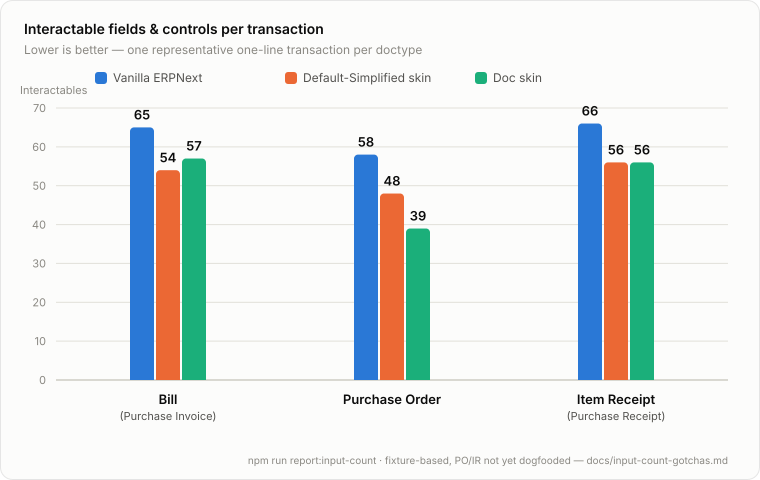

# erpnext-ui-app

Standalone **desktop UI + tools** for [ERPNext](https://erpnext.com/) / Frappe — Doc-style forms, chrome, and shortcuts that behave like an app, while the backend stays **unmodified vanilla ERPNext**.

**License:** [AGPL-3.0-or-later](LICENSE)

> **Alpha stage.** While Alpha only pushes to `main` when tests pass, there is still a high likelihood of broken links or similar issues if you do not have the exact ERPNext modules installed as in the test environment. Please file problems in [GitHub Issues](https://github.com/5zorro/erpnext-ui-app/issues); **5zorro** will read them and decide the best path forward.

## Why this exists (product purpose)

This shell is not a second ERP. It exists to make daily books work safer and more familiar on ordinary office PCs:

1. **Interface hygiene** — Fewer jarring switches between 
 - input pages (toolbar, history, Doc vs Vanilla, and the forms themselves). Same job, less mode thrash.
 - input interfaces (qwerty, 10-key, and mouse). Same input, less input changes.
2. **Security on non-enterprise PCs** — Many workstations have no corporate browser lockdown. A normal browser with extensions can read data on **every** site the user visits, including ERPNext. A dedicated desktop shell talks to your Books server over HTTP and does not inherit the whole extension ecosystem of a general-purpose browser. (Vanilla browser access remains available for troubleshooting; it is not the recommended daily path on an unlocked PC.)
3. **Document-view-first and process-first flows** — Layouts and workflows that match how people already think about paperwork (years on a document-first UI train the fingers the same way years on a QWERTY keyboard do, and users are simply "faster/smarter" if they keep the same keyboard shortcuts and similar flows). The aim is verification and data entry that feel like the expected format, not a generic dense database input and navigation grid by default.

**Target display:** design primarily for a **1080p 16:9** monitor at full screen, or a **4K 16:9** monitor at half (longer on the vertical edge) or quarter screen. Prefer flexible layout (so other sizes still work) over hard-coded one-resolution UI.

### Measured Performance Gains

Doc and Simplified both cut real interactable fields and controls versus stock ERPNext, on
every anchored transaction type — measured, not asserted. Competitor products are
deliberately left out (elevated advertising-claim risk for an unaffiliated comparison).



<details>
<summary>Details about source data</summary>

Every lens is scored the same way: count the actual interactable controls (fields, buttons,
tabs) on a representative one-line Purchase transaction. **Doc** is a purpose-built form;
**Simplified** is stock ERPNext with an assumptions bar that pre-fills or quiets the fields
a given doctype's Doc skin already owns.

| Transaction | Vanilla ERPNext (labelled Default) | Default-Simplified skin | Doc skin |
|---|---|---|---|
| Bill (Purchase Invoice) | 65 | 54 (−17%) | 59 (−9%) |
| Purchase Order | 58 | 48 (−17%) | 40 (−31%) |
| Item Receipt (Purchase Receipt) | 66 | 56 (−15%) | 57 (−14%) |

Both alternate lenses cut real interactables versus stock ERPNext on every transaction type
that has one; **Doc vs Simplified is not a race** — read the two independently, not against
each other (methodology and why: `docs/input-count-gotchas.md`, gotcha G11).

Caveats, stated plainly: the Vanilla fixture is a representative-density snippet, not a live
Desk HTML dump, and it is **not tab-gated** — every tab's fields sit flat and visible in one
file, so Vanilla's own count already includes fields a real one-tab-at-a-time Desk session
would not show at once (gotcha G1). Simplified's count is a direct subset of that same
fixture (Vanilla's items minus the seed), so it inherits this, not a separate penalty of its
own. Simplified's seed profiles for Purchase Order and Item Receipt shipped 2026-09-05 and
have not yet been dogfooded end-to-end. The Doc counts move whenever a Doc skin gains a
control — the credit-memo work on 2026-09-07 added three, which is why Doc's Bill margin
narrowed. Reproduce with `npm run report:input-count`; redraw the chart above with
`npm run chart:input-count`.

</details>

## Architecture (same as the prior decision log)

| Layer | What it is |
|-------|------------|
| This repo | Electron shell, Doc skin, shortcuts, history, tools |
| ERPNext | Unmodified server — also usable in a normal browser for troubleshooting |
| Link | HTTP / API only (Clean Core: no edits under `apps/frappe` or `apps/erpnext`) |

Language for this tree: **plain JavaScript** . That is a tooling choice, not an architecture change.

Areas that have achieved "MVP" status:
 - A/P form entry documents (purchase order, purchase receipt, and purchase invoice)
 - A/P process dashboard (Extended Purchase Invoice)
 - Navigation Flyout bar
 - Calculator
 - DB Health Ping and Auto Server Healing

This Repo's ToDo list is outlined in the living (updated and eventually deleted) implementation plans.

## Develop

```bash
cd ~/erpnext-ui-app
npm install
npm test
npm run test:e2e:xvfb   # optional Playwright Electron smoke (health ping)
npm start
```

In the app: **Home** is the **Document Workflow Home** (grouped tiles by process). Click a tile to open
that ERP route. **Default skin** → Vanilla ErpNext Desk; **ERP console** → DevTools to aid in dogfood. Left **Recent** updates as you browse.

**Plan (working, dated):** **Handoff / doc lifecycle:** [HANDOFF.md](HANDOFF.md) · **Beta:** [docs/beta-slice.md](docs/beta-slice.md) · **Commits:** [docs/commit-conventions.md](docs/commit-conventions.md)

## Related

- Process: unit tests first; `alpha` → `main` when a milestone is green; agents may **commit** freely — only the maintainer **pushes** GitHub.
- Clean Core: never edit vendor ERPNext/Frappe in place — customize via fixtures / HTTP shell only.
