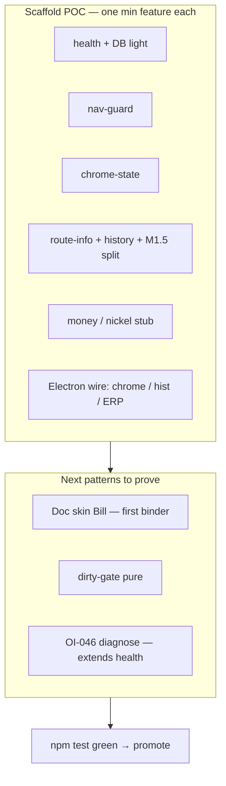
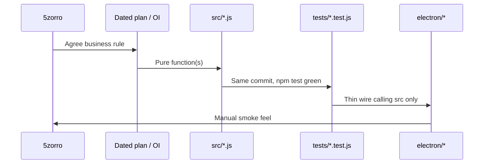

# Implementation plan — scaffold POC + museum-parity ladder

> **Working plan (temporary).** Filename is dated on purpose:  
> `docs/implementation-plan-YYYY-MM-DD.md`.  
> Audit the **human-readable how** here; when this tranche is done and durable facts live in
> HANDOFF / decisions / OI status / CHANGELOG, **delete this file**.  
>
> **Status:** Expanded how 2026-07-16 (5zorro: one min feature per scaffold + prove unit patterns).  
> **Progress:** **M0 + M1 + M1.5 landed on local `alpha`** (not all pushed; CI glob fix still local).  
> **Repo:** `erpnext-ui-app` · **Museum:** reference only · **Process:** ADR-0002 · **Map:** `HANDOFF.md`

## Goal (this tranche)

1. **Prove the architecture** by placing **one minimum feature** in each scaffold slot, with a
   **unit-test pattern** others can copy.
2. Only then grow features (more doctypes, OIs) by adapting those patterns.
3. Promote to `main` when offline `npm test` is green and the beta-slice claims are honest.

Architecture (unchanged): **Electron shell → HTTP → unmodified ERPNext**.

---

## Where we are (2026-07-16)

| Item | State |
|------|--------|
| M0 chrome + live ERP | **Done** locally (`alpha`) |
| M1 deduped Recent | **Done** |
| M1.5 Recent 7 + Older | **Done** (code + units; may be unpushed) |
| Home button → ERP `/` | **Done** locally (was splash; fixed) |
| CI `tests/**` glob | **Fixed locally** — needs push |
| M2 launcher tiles + ERP console | **Done** locally |
| M2+ / Doc skin / e2e folders | M3 **not started** |
| Scaffold POC matrix | **Mostly proven** — gaps: Doc binder pattern, dirty-gate, diagnose extension |

**Manual proof so far:** login, Desk browse, Recent/Older, Home→`/`, Vanilla→`/desk`, DB light.

**Automated proof so far:** `npm test` (layer 1) + Playwright scaffold smokes
(`scaffold-url-api`, `scaffold-chrome`, `scaffold-pure-wiring`, `scaffold-views` + health MVP)
via `npm run test:e2e:xvfb`. See `e2e/GOTCHAS.md`. Layer 2 browser→ERP not built yet.

---

## Scaffold POC matrix (SSoT for “min feature + test pattern”)

Each row = one architecture slot from `HANDOFF.md`. **Pattern** is what the next feature copies.

| # | Scaffold | Min feature (business-facing) | Pure module(s) | Unit pattern to copy | Electron wire | Status |
|---|----------|-------------------------------|----------------|----------------------|---------------|--------|
| S1 | Reachability | DB ✓/✗ from `/api/method/ping` | `health.js` | Injectable `fetch`; classify ok/bad/unknown; URL builder | Toolbar light + interval in `main.js` | **Done** |
| S2 | Nav allowlist | Block external sites in ERP view | `nav-guard.js` | Table of allow/deny URLs vs `erpBase` | `will-navigate` / `setWindowOpenHandler` | **Done** |
| S3 | Chrome state | Home vs ERP / lens / health flags | `chrome-state.js` | `reduceChrome(state, action)` pure reducer | `ui-state` IPC → `chrome.html` | **Done** |
| S4 | Config | Resolve `ERP_BASE` from env | `config.js` | Env → base URL cases | `main.js` / `get-config` | **Done** |
| S5 | Route parse | Turn Desk URL → doctype + route | `route-info.js` | String fixtures: `/desk/...`, strip base, query | Feeds history tracker | **Done** |
| S6 | History list | One row per doctype, cap 12 | `history.js` `pushHistory` | Push/dedupe/cap; no mutation of prior array | `did-navigate` → `history.html` | **Done** |
| S7 | History display split | Recent 7 + Older | `history.js` `splitHistory` | Slice boundary tests | Older toggle in `history.html` | **Done** (M1.5) |
| S8 | Labels | Friendly doctype names | `doctype-labels.js` | Map + titleize fallback | History button text | **Done** |
| S9 | Money helper | Round to nickel (US cash) | `money.js` `roundToNickel` | Numeric fixtures / edge cents | **Not wired to UI yet** (OI-042) | **Stub + units Done** |
| S10 | Electron layout | Chrome + hist + ERP views | *(thin)* | — (manual / later Electron smoke) | `main.js` `place()` / IPC | **Done** |
| S10b | Launcher tiles | Workflow shortcuts on splash | `home-tiles.js` | validate ids/routes | `home.html` + **Launcher** | **Done** (M2) |
| S10c | Dogfood DevTools | Inspect / Console on ERP pane | — | — | **ERP console** → `openDevTools` | **Done** (M2) |
| S11 | Doc skin binder | **Bill** read+save, one field cycle | *new* `src/` (see M3 how) | Pure map/apply helpers before DOM | Doc lens WebContents or overlay | **Not started** |
| S12 | Dirty-gate | Skip prompt when only lens dirt | *new* `src/dirty-gate.js` (museum lesson) | Classifier table: dirty vs clean nav | Before route changes | **Not started** |
| S13 | Diagnose (extends S1) | Click DB light → copyable panel | *new* `src/diagnose.js` etc. | Host class + decision-tree strings | Popover on health control | **OI-046 — later** |

**POC exit (scaffold tranche):** S1–S10 done ✅. Remaining POC for *patterns* before wide feature fan-out: **S11 + S12** (Doc path). S9 UI and S13 are optional polish after Bill pattern exists.

---

## How we build (every feature — copy this)

1. Write the **business rule** in one sentence (OI or plan).
2. Implement **pure** logic in `src/` — no Electron imports.
3. Add/adjust `tests/*.test.js` — table-driven where possible.
4. Wire Electron to **call** the module (IPC / loadURL / render).
5. `npm test` must pass **without** ERPNext up.
6. Manual smoke only for window feel.

**CI note:** `npm test` must use `tests/*.test.js` (not `**`) so GitHub Actions expands the glob.

---

## Milestone how (detail)

### M0 — Chrome + live ERP — **DONE** (how it was built)

**Business rules**

- Toolbar can open ERP Desk and return to site root.
- Health light reflects ERP ping reachability today. (**5zorro note:** later OI-046 may turn this into
  a client diagnose dropdown — ping server vs DNS vs internet — so do not read “not admin tools” as
  “never more than a light.” The light is the entry point; it is not a LAN-admin Doc Ops panel.)
- ERP view may only load the configured origin.

**How**

1. Pure: `health.js`, `nav-guard.js`, `chrome-state.js`, `config.js` + tests.
2. Electron: `BrowserWindow` + `WebContentsView`s — chrome, splash `home.html`, erp, (later hist).
3. Warm-load `erpUrl(ERP_BASE, "/desk")` so login session is ready.
4. IPC: `go-home`, `open-erp`, `get-config`, health + ui-state events.

**Correction (post-land):** Toolbar **Home** loads ERP **`/`** (`forceLoad`), not splash. Splash remains first-run only. Vanilla → `/desk`.

---

### M1 / M1.5 — History flyout — **DONE**

**Business rules**

- One Recent row per doctype; newest first; cap 12 stored.
- Show at most 7 in Recent; remainder under collapsed **Older (N)**.
- Click opens that route in the ERP view.
- In-memory only (OI-035 / OI-040 later).

**How**

1. `routeInfo(url, { erpBase })` → `{ route, dt, … }`.
2. `pushHistory(prev, url, { erpBase, labels })` → new array (immutable).
3. `splitHistory(list, { recentMax: 7 })` → `{ recent, older }`.
4. `main.js` `trackNav` on `did-navigate` / in-page; `hist` view `onHistory` + `openErp`.
5. `history.html` imports `splitHistory` (renderer ES module from `../src/`).

**Pattern to copy:** parse → reduce list → split for UI → thin view.

---

### M2 — Launcher tiles + dogfood DevTools — **DONE** (2026-07-16)

**Intent:** Prove “launcher” without Doc skin + make dogfood reports precise (Inspect / Console).

**Business rules**

- Splash **Launcher** lists workflow tiles from SSoT `src/home-tiles.js` (real ERP routes).
- Tile click → same `openErp(route)` path as history.
- Toolbar **Home** → ERP `/`; toolbar **Launcher** → splash tiles again.
- Toolbar **ERP console** opens detached Electron DevTools for the **ERP** WebContentsView so 5zorro
  can Inspect Element and copy Console errors when something breaks.

**How**

1. Pure: `HOME_TILES` + `validateHomeTiles()` + unit tests.
2. `home.html` renders tiles from the module; `data-testid="tile-…"`.
3. IPC: `show-launcher` → `showHome()`; `open-devtools` → `openDevTools({ mode: "detach" })` on
   `erp` | `chrome` | `home` | `hist` (UI defaults to `erp`).
4. Chrome: Launcher + ERP console buttons (`data-testid` for future e2e / reports).

**Dogfood — what to paste back to the agent**

When something breaks, prefer:

1. Click **ERP console** (or ask for chrome/home/hist target if the bug is in the shell UI).
2. **Console** tab — copy red errors / failed network lines.
3. **Elements** — right-click the broken control → Copy → Copy selector (or note `data-testid`).
4. Say which surface: **ERP Desk** vs **Launcher** vs **Recent** vs **toolbar**.
5. One sentence expected vs observed.

**Exit**

- [x] `home-tiles.js` + unit tests
- [x] Tiles open live routes when ERP up
- [x] Launcher / Home distinction
- [x] ERP console DevTools for dogfood
- [x] `npm test` green offline
- [x] M0/M1.5 behaviors unchanged

**Out of scope:** OI-035 persistence, OI-040 tabs, workflow cube as production, OI-046 diagnose panel.

---

### M3 — Doc skin Bill (first S11 binder pattern) — **POC for Doc scaffold** — **NEXT**

**Intent:** One bound doctype so every later Doc page copies **one** pattern.

**Business rules (from beta-slice / museum)**

- User can view a **Bill** (Purchase Invoice) in Doc skin and **save** a change.
- Child table cells use `frappe.model.set_value` (never raw assignment) — museum gotcha.
- Vanilla lens still opens the same document for troubleshooting.
- Dirty navigation: prompt only when document is actually dirty (S12).

**How (phased inside M3)**

| Step | What | Tests |
|------|------|-------|
| M3a | Pure term/label helpers + field path map for Bill (extract museum lessons; rewrite) | String/map fixtures offline |
| M3b | Pure dirty-gate classifier `shouldGateNavigation(...)` | Table of cases (OI-033 class) |
| M3c | Electron: enable Doc lens; load Bill Doc UI (new view or inject — **decide in plan comment before code**; prefer separate view over inject if practical) | Manual + units for a–b |
| M3d | Save path + one child-row edit via `set_value` discipline | Optional Playwright **browser→ERP** smoke (OI-049 layer 2); skip-OK |

**Exit → `main`**

- [ ] Bill Doc read+save works on sandbox
- [ ] Units for map + dirty-gate green offline
- [ ] Vanilla still works for same Bill
- [ ] Pattern documented in HANDOFF extension points (one row update)

**Do not:** port all museum `bind.js` at once; do not gate on Electron e2e.

---

### M4 — More doctypes / tools (adapt M3 pattern)

Only after M3 pattern is green. Order flexible; **tests drive pivots**.

| Order | Feature | Adapt from |
|------|---------|------------|
| 4a | PO + Item Receipt Doc skins | M3 binder map |
| 4b | Source modal (shared) | New pure picker state + one HTML modal |
| 4c | Assumptions / Second Skin (narrow) | Museum OI-012 family — pure first |
| 4d | Shortcuts cheat sheet | Static content + open external/modal |
| 4e | Wire `roundToNickel` into a visible tool (OI-042) | S9 already tested |

---

### M5 — Open items (after Doc pattern exists)

| ID | Feature | Depends on pattern |
|----|---------|---------------------|
| OI-040 | Multi-window / tabs / tint | S6 history + Electron windows |
| OI-041 | AP bowtie | Doc layout |
| OI-042 | Nickel UI | S9 |
| OI-043 | 5-digit SO/PO | Clean Core fixtures |
| OI-044 | Date fat-finger filter | Doc inputs |
| OI-046 | DB diagnose panel | **Extends S1** — next health pattern |
| OI-047 | Self-update | Packaging first |
| OI-048 | Feedback Form/modal | Chrome button + config URL |
| OI-049 | Test stack policy | **Locked** — units + Playwright health MVP landed; WDIO not used |

---

## Suggested immediate next commits (for 5zorro)

1. Push CI fix + Home→`/` + M1.5 + **M2** (tiles, Launcher, ERP console) when ready.
2. **M3a–b** pure Bill map + dirty-gate — proves Doc/test patterns before UI.
3. Then M3c–d UI against sandbox.

---

## What we are *not* doing

- Playwright Electron as merge gate
- Editing vendor Frappe/ERPNext
- Big-bang museum Electron dump
- Secrets / live books in the public repo
- Building OI-035/040 before ASCII sketch from 5zorro

## Maintainer decisions (this draft)

1. Scaffold POC = **one min feature + unit pattern per slot** (matrix above).
2. Stopped productively at **M2** (tiles + ERP console); next how-focus = **M3 Bill pattern**.
3. Plain JavaScript; pure-first; 5zorro pushes GitHub.
4. Test strategy SSoT: `HANDOFF.md` (OI-049 locked).
