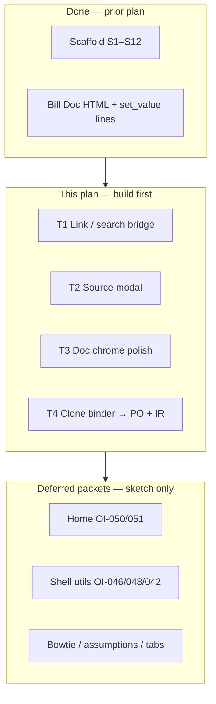

# Implementation plan — Doc usability + shared patterns (post–Bill scaffold)

> **Working plan (temporary).** `docs/implementation-plan-YYYY-MM-DD.md`  
> When this tranche’s durable facts live in HANDOFF / OI status / CHANGELOG, **delete this file**.  
>
> **Started:** 2026-07-18 · **Supersedes:** `implementation-plan-2026-07-15.md` (scaffold + Bill M3 done)  
> **Repo:** `erpnext-ui-app` · **Museum:** reference only · **OI inbox:**  
> `~/agent-harness/erpnext/doc-shell/open_items.md` · **Gap audit:** canvas *Bill Doc skin — expected features vs M3c* (update statuses as we close gaps)

## Goal (this tranche)

Ship the **next layer of Doc Workflow** by architectural families — same bridge, same tests, same dogfood context — not by dumping the whole museum.

1. Make **Bill** daily-driver usable (Link pickers, source-from-PO, toolbar basics).
2. Prove **shared Doc patterns** once, then clone to PO / Item Receipt.
3. Keep Home / shell / bowtie / assumptions as **later packets** (sketched, not fully planned here).

Architecture unchanged: **Electron shell → HTTP / ERP WebContents bridge → unmodified ERPNext**.

---

## Baseline (honest — 2026-07-18)

| Area | State |
|------|--------|
| Scaffold + units + optional e2e smokes | **Done** |
| Bill Doc view (`bill.html`) | **Done** — T1–T3 dogfood passed 2026-07-21 |
| Bill vs museum | Daily-driver usable; still missing Delete/Copy/Recalc/Pay Bill/nav tabs |
| PO / Item Receipt Doc skins | **MVP done** — T4 dogfood 2026-07-21 (submit PO + IR); chrome gaps remain |
| Home inventory (OI-050/051) | Direction locked; tiles not finalized |
| Layer-2 browser→ERP e2e | **Not built** (sandbox `.env` pattern ready) |

**Promote rule:** offline `npm test` green; dogfood claims honest; 5zorro pushes.

---

## How we group work (architecture families)

| Family | Shared mechanism | Why batch | Primary tests |
|--------|------------------|-----------|---------------|
| **Link / search bridge** | One ERP-side search/`make_control` or API list → Doc HTML picker | Vendor, Terms, Item, Project all need the same hole | Pure picker state + Bill dogfood + optional ERP smoke |
| **Source modal** | List related docs → `get_mapped_doc` / merge | Bill Select PO; later PR/PO; OI-001 drafts | Pure modal state + Bill→PO pick |
| **Doc chrome** | Toolbar actions on `cur_frm` | Find / New / Print / Attach / Revert / Recalc | Thin IPC + manual |
| **Binder clone** | `*-map.js` + Doc HTML + `DOC_SKIN_INDEX` row | PO + Item Receipt copy Bill pattern | Units per map + index matrix |
| **Home tiles** | `home-tiles.js` only | OI-050 chunks; OI-051 statement tile | `validateHomeTiles` |
| **Shell utils** | Chrome / health / money | OI-046 diagnose; OI-048 feedback; OI-042 nickel UI | Units + chrome smoke |

---

## Build now (ordered)

### T1 — Link / search bridge (Bill first)

**Business:** Clerk can pick Vendor / Terms / Item / Project without memorizing exact names.

**How**

| Step | What | Tests |
|------|------|-------|
| T1a | Pure `link-search.js` (query → options shape; injectable fetch or ERP `eval` result) | Fixture tables offline |
| T1b | Doc HTML picker UI (typeahead or modal list) reused for header + line Links | Component-ish pure + Bill manual |
| T1c | Wire Vendor + Terms on Bill header | Dogfood |
| T1d | Wire Item + Project on lines (still `set_value` after pick) | Dogfood; OI-004 description fill should improve |

**OI / gaps closed:** museum `mountLink` class; partial Vendor/Terms/Item/Project gaps.  
**Out:** Second Skin assumptions placement (OI-012/034).

**Exit:** Bill entry without typing exact Supplier/Item codes for happy path.  
**Status (2026-07-18):** **Done** — `src/link-search.js`, ERP `search_link` bridge, Bill ▾ pickers on Vendor / Terms / Item / Project.

---

### T2 — Source modal (Select PO → Bill)

**Business:** Enter Bill from a submitted PO (W2); drafts visible but not selectable (OI-001).

**How**

| Step | What | Tests |
|------|------|-------|
| T2a | Pure modal state: list rows, filter, draft vs submitted, selection | Units (OI-001 rules) |
| T2b | HTML modal in Bill (or shared `source-modal.html` fragment) | Manual |
| T2c | ERP bridge: fetch POs for supplier + map into PI (`get_mapped_doc` / museum merge lesson) | Dogfood; optional skip-OK ERP smoke |
| T2d | Toolbar **Select PO** + optional open-after-vendor (museum timing) | Manual |

**OI:** OI-001, OI-024 (fix wrap when building — don’t copy museum ellipsis bug), OI-009 later for IR.  
**Exit:** Select PO on Bill works on sandbox; drafts greyed.  
**Status (2026-07-18 evening):** **In progress / dogfood** — pure `src/source-modal.js`, Bill modal after vendor + toolbar **Select PO / source**, ERP `get_list` + `make_purchase_invoice` merge. Drafts greyed (OI-001).

---

### T3 — Doc chrome polish (Bill)

**Business:** Day-to-day actions without dropping to Vanilla for basics.

| Step | What | Gaps / OI |
|------|------|-----------|
| T3a | Toolbar: Find Bills, New, Print, Attach | **Hardened** Find waits for list; Print matches form; Attach partial |
| T3b | Revert unsaved | **Done** |
| T3c | Recalculate + Expenses tab disclaimer | Expenses→Taxes orientation done; Recalculate still out |
| T3d | Amount Due USD format on blur | **Done** (money model) |
| T3e | Optional Σ reconciliation banner (chip already exists) | OI-002 polish — optional |

**Exit:** Toolbar covers Find / New / Print / Attach / Revert; Expenses note visible.  
**Hardening (2026-07-20→21):** OI-057 save-gate settle + live meta preflight; OI-056 Find list;
OI-058 Print → Vanilla print preview (visible + Recent); OI-059 Expenses copy; unified dirty gate
(modal for toolbar + Home); Find Bills vs Bill history slots. **Dogfood passed 2026-07-21.**

---

### T4 — Clone Doc binder → Purchase Order + Item Receipt

**Business:** Same Doc pattern on the other two AP entry docs.

| Step | What | Tests |
|------|------|-------|
| T4a | `po-map.js` + shared `doc-form.html` (layout key) | Units like bill-map |
| T4b | `receipt-map.js` + IR via same Doc shell | Units |
| T4c | `DOC_SKIN_INDEX` ready rows + lens prefs | Index matrix |
| T4d | Reuse T1 pickers + T2 source modal (IR Select PO) | Dogfood |
| T4e | PO Date Expected stamps line `schedule_date` on save | Units + dogfood |

**OI touch:** OI-006/010 totals (Σ Qty / Σ Amount on both); OI-011 IR supplier invoice ref — **dropped from Doc IR** (dogfood: packing list/BOL only at receive; invoice # belongs on Bill).  
**Exit:** PO + IR open in Doc skin with read+edit+save; Bill still green.  
**Status (2026-07-21 evening):** **MVP dogfood passed** — PO submit (Date Expected → Required By stamp); IR submit (Select PO). Shared `doc-form` shell. Not a full gambit; chrome gaps remain (see museum gap list below plan / OIs).

**Museum logic still parked (not blocking MVP):**
- PO: Mark as Closed, Create Copy, Create Item Receipt toolbar / OI-007 ribbons
- IR: Recalculate, Delete/Copy, nav tabs Bill↔IR
- Both: museum footer Save & Close / Save & New variants

---

## Deferred packets (sketch only — expand when T1–T4 stable)

Do **not** flesh full how until the packet starts. Parking lot:

| Packet | Contents | OI / notes |
|--------|----------|------------|
| **D-DocChrome** | Museum toolbar leftovers (Delete, Copy, Closed, Recalc, Pay Bill, ribbons, nav tabs) | Museum `open_items.md` **OI-064** (private issues SSoT — not mirrored in this repo) |
| **D-Home** | Chunks &lt; 12; report defaults; Vendor Center statement tile | OI-050, OI-051 |
| **D-Bowtie** | AP bowtie PoC → Home tile only after proof | OI-041 (also indexed under OI-064 in museum inbox) |
| **D-Shell** | DB diagnose panel; Feedback; nickel UI wire | OI-046, OI-048, OI-042 |
| **D-Assumptions** | Second Skin values on Doc; placement greyed | OI-012, OI-030–034 |
| **D-Nav** | Multi-window / tabs / tint; session history by date | OI-040, OI-035 |
| **D-CleanCore** | 5-digit SO/PO series; shipping preferred address | OI-043, OI-037 |
| **D-EntryExtras** | Date fat-finger; calc insert; zero-qty hash; CC charges model | OI-044, OI-018, OI-026, OI-027 |
| **D-Product** | Self-update | OI-047 |
| **D-E2E** | Layer-2 browser→ERP Bill/PO smoke with sandbox auth | OI-049 layer 2 |

---

## Open items map (this plan)

| OI | Role in this plan |
|----|-------------------|
| OI-001, OI-024 | **T2** source modal |
| OI-002 | Mostly done (chip); banner polish in **T3e** |
| OI-003, OI-004 | Lines/delete done in M3d; OI-004 improves with **T1d** |
| OI-005 | Attach in **T3a**; memo placement optional |
| OI-009 | IR source — with **T4** / after T2 |
| OI-049 | Policy locked; expand layer-2 in **D-E2E** |
| OI-050, OI-051 | **D-Home** |
| OI-041 | **D-Bowtie** |
| OI-046, OI-048, OI-042 | **D-Shell** |
| OI-012 family | **D-Assumptions** |
| OI-040, OI-035 | **D-Nav** |
| Rest | Deferred packets as named above |

---

## Suggested dogfood order (5zorro)

1. Restart shell; dogfood **T1** Link pickers on Bill (Vendor ▾, Item ▾).  
2. **T2** Select PO / source modal (unblocks real Bill entry path).  
3. **T3** toolbar polish.  
4. **T4** PO + IR clones.  
5. Only then open a deferred packet (likely **D-Home** or **D-Bowtie** PoC).

| Batch | Status |
|-------|--------|
| T1 Link / search bridge | **Done** — Vendor/Terms/Item/Project ▾ pickers via `search_link` |
| T2 Source modal | **Done** — Select PO / after-vendor; drafts greyed |
| T3 Doc chrome | **Done** — dogfood OI-056–059 + gate/print/history harden (2026-07-21); next T4 |
| T4 PO + IR clones | **Next** |

---

## What we are *not* doing (this file)

- Big-bang museum port  
- Editing vendor ERPNext  
- Electron e2e as merge gate  
- Fully specifying deferred packets before T1–T4  
- Secrets / live books in the public repo  

## Maintainer decisions

1. Prior plan closed: scaffold + Bill binder pattern proven.  
2. New work is **architecture-batched** (T1→T4), then deferred packets.  
3. Pure-first; `DOC_SKIN_INDEX` + `ready` remain the Doc-tab SSoT.  
4. Gap canvas / OI list are discovery; **this file** is the how for the active tranche.
