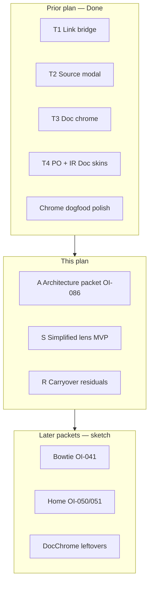

# Implementation plan — Vanilla Simplified lens (OI-086) + dogfood carryover

> **Working plan (temporary).** `docs/implementation-plan-YYYY-MM-DD.md`  
> When this tranche’s durable facts live in HANDOFF / OI status / CHANGELOG, **delete this file**.  
>
> **Lifecycle:** When closed, delete this file and open a **new** dated plan. Do not grow forever.  
>
> **Started:** 2026-07-29 · **Supersedes:** `implementation-plan-2026-07-18.md` (T1–T4 MVP + chrome dogfood)  
> **Repo:** `erpnext-ui-app` · **Museum:** reference only · **OI inbox:**  
> `~/agent-harness/erpnext/doc-shell/open_items.md` · Primary OI: **OI-086** (Vanilla Simplified)

---

## How to handle cross-architecture dogfood (copy into every new dated plan)

> **Template for future plans:** Keep this section near the top of every
> `docs/implementation-plan-YYYY-MM-DD.md`. It is process SSoT for the *working*
> tranche — not for museum `open_items.md` (that inbox stays long-lived discovery).

Cross-surface dogfood (Bill + PO + IR + chrome/nav in one message) strains the
LLM harness when treated as one blob. Prefer **error classes / architecture
families**, not a single mega-diff.

### Intake (before code)

1. Sort 5zorro feedback into **architecture families**.
2. Log under **Dogfood residuals** below. **Do not** reopen Done batches from prior plans.
3. **Do not** dump mid-workflow triage into museum `open_items.md`.
4. Prefer class language in residual rows.

### Execute (one family per slice)

1. Gather context for **one** family only.
2. Surgical fix + sibling/variant check.
3. **Self-critique** (class fixed vs symptom patched).
4. Unit tests for pure logic + `npm test` green.
5. Checkpoint the residual row; then the next family.

### Closeout (before deleting this plan)

1. Append durable **decisions** via `~/agent-harness/scripts/append-decision.sh`.
2. Update museum **OI status**; touch public **HANDOFF** / CHANGELOG as needed.
3. **Delete** this dated plan; open a **new** dated plan for the next tranche.

---

## Goal (this tranche)

1. **Architecture-first:** design **Vanilla Simplified** as a third lens (`vanilla` | `simplified` | `doc`) without bolting UI onto broken prefs/hijack paths.
2. Implement the thinnest Simplified surface that dogfoods as “less Desk chrome, still ERP truth.”
3. Clear **carryover dogfood** from the prior plan (small residuals only).

Architecture unchanged: **Electron shell → HTTP / ERP WebContents bridge → unmodified ERPNext**.



---

## Baseline (honest — 2026-07-29)

| Area | State |
|------|--------|
| Bill / PO / IR Doc skins | **MVP done** (T1–T4); chrome polish dogfood mostly green 2026-07-28 |
| Lens prefs | Per-doctype; default **doc**; persist `lens-prefs.json`; Find **list** does not flip pref |
| Find Bill focus | **Passed** 2026-07-28 (onboarding settle + native click + post-IPC refocus + focus keeper) |
| Vanilla Simplified | **Not started** — `simplified` is a lens id that currently opens `erp-form` (full Vanilla) |
| Layer-2 e2e | **Not built** |

---

## Packet A — Architecture first (OI-086) — **do before coding UI**

Non-programmer auditables (answer in plan / Mermaid / mock before merge):

| Question | Why it matters |
|----------|----------------|
| What does Simplified **hide** vs Vanilla Desk? | Scope ceiling |
| Same WebContentsView as Vanilla, or a second inject skin? | SoC / focus races |
| How does toolbar **Simplified** tab relate to Doc / Vanilla? | Lens chrome |
| Does `rememberLens(..., "simplified")` stick like Doc/Vanilla? | Prefs already have the id |
| Does Desk hijack open Simplified when pref is simplified? | `openRoutePreferred` / `openDocSkinProfile` |
| Lists (Find) — Simplified or always full Vanilla list? | Find focus path |

**Deliverable:** short architecture section + Mermaid in this file (or linked mockup under `docs/mockups/`) **agreed by 5zorro** before Simplified HTML/CSS work.

**Likely code touch (after agree):** `lens-prefs.js` (`resolveEntryOpen` surface for simplified), `lens-context.js` / chrome tabs, `main.js` open/hijack, optional inject CSS — prefer registry/`shell` dispatch already used for Doc skins.

---

## Packet S — Simplified MVP (after A)

| Slice | Intent | Exit |
|-------|--------|------|
| S1 | Chrome tab + pref write/read for `simplified` | Enter Bills with simplified pref lands Simplified |
| S2 | Minimal Simplified chrome over PI form (hide Desk noise only) | Dogfood: new Bill + save still ERP truth |
| S3 | PO / IR Simplified **only if** A says one shared path | Same pref key per doctype |

**Out of scope this tranche unless promoted:** bowtie, Pay Bill, Delete/Copy, Home redesign, Assumptions Second Skin.

---

## Carryover dogfood residuals (from 2026-07-18 plan)

| Area | Item | Status | Re-dogfood |
|------|------|--------|------------|
| Bill binder | Save after description (light `setRow`, flush cap) | **code shipped** | Edit description → Save &lt; ~5s |
| PO binder | Explicit Date Expected force-stamps Required By | **code shipped** | Multiple dates → type date → all lines |
| Doc chrome | Back to top focuses Submit (no activate) | **code shipped** | Tab → Enter focuses; second Enter submits |
| Lens prefs | Doc default; vanilla sticks across restart | **code shipped** | Restart after Vanilla form → still Vanilla |
| Nav / Find PO·IR | Focus ID field | **code shipped** | Find PO / IR → orange on ID |
| Shell / modals | OI-078 Esc / outside / New with picker open | **Open** | After other greens |

---

## Deferred (not this plan)

| Packet | Notes |
|--------|-------|
| **D-DocChrome** | Delete / Copy / Closed / Recalc / Pay Bill / ribbons / nav tabs (OI-064) |
| **D-Bowtie** | OI-041 |
| **D-Home** | OI-050 / 051 |
| **D-Assumptions** | OI-012 family |
| **D-E2E** | Layer-2 browser→ERP |

---

## Validate

```bash
cd ~/erpnext-ui-app && npm test && npm start
```

**Git:** commit on `alpha`; only **5zorro** pushes. Promote to `main` when dogfood + tests agree.
