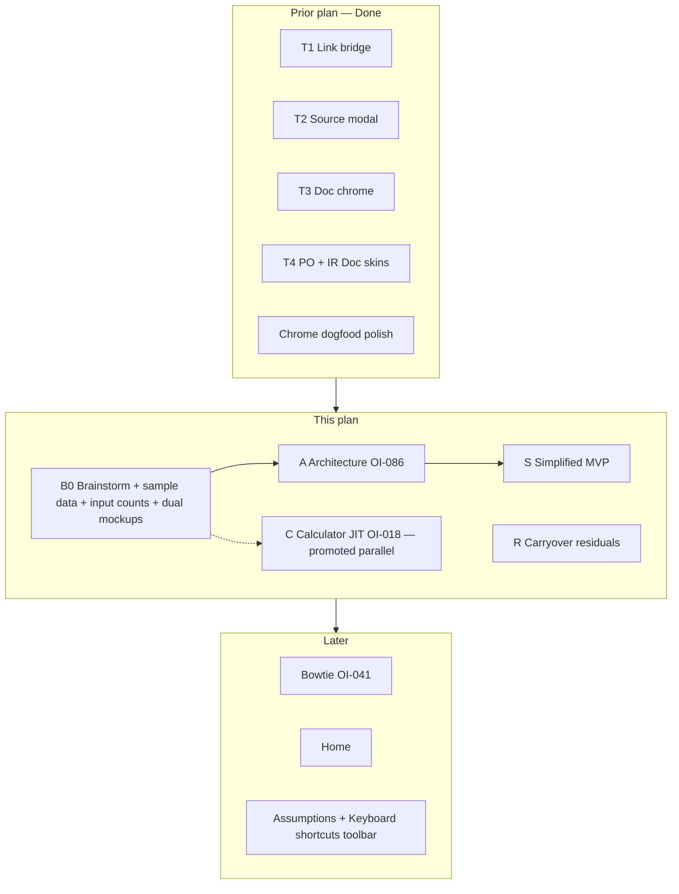
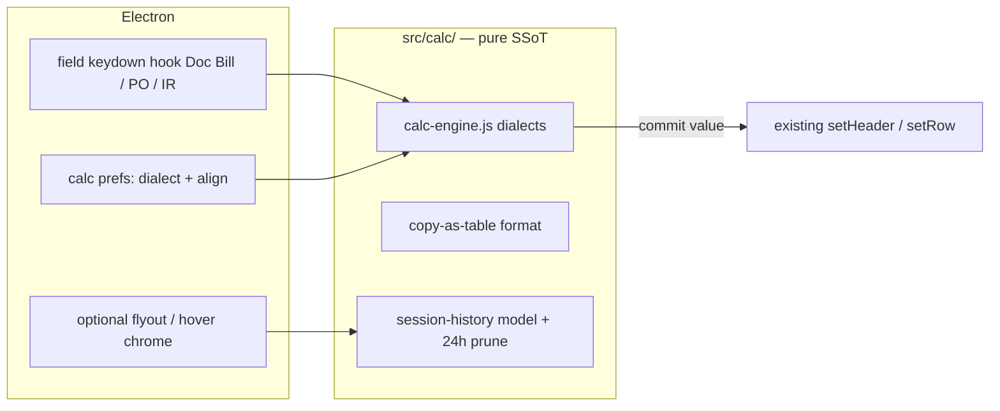

# Implementation plan — Vanilla Simplified lens (OI-086) + dogfood carryover

> **Working plan (temporary).** `docs/implementation-plan-YYYY-MM-DD.md`  
> When this tranche’s durable facts live in HANDOFF / OI status / CHANGELOG, **delete this file**.  
>
> **Lifecycle:** When closed, delete this file and open a **new** dated plan. Do not grow forever.  
>
> **Started:** 2026-07-29 · **Supersedes:** `implementation-plan-2026-07-18.md` (T1–T4 MVP + chrome dogfood)  
> **Repo:** `erpnext-ui-app` · **Museum:** reference only · **OI inbox:**  
> `~/agent-harness/erpnext/doc-shell/open_items.md` · Primary OI: **OI-086** (Vanilla Simplified)

---

## How to handle cross-architecture dogfood (copy into every new dated plan)

> **Template for future plans:** Keep this section near the top of every
> `docs/implementation-plan-YYYY-MM-DD.md`. It is process SSoT for the *working*
> tranche — not for museum `open_items.md` (that inbox stays long-lived discovery).

Cross-surface dogfood (Bill + PO + IR + chrome/nav in one message) strains the
LLM harness when treated as one blob. Prefer **error classes / architecture
families**, not a single mega-diff.

### Intake (before code)

1. Sort 5zorro feedback into **architecture families**.
2. Log under **Dogfood residuals** below. **Do not** reopen Done batches from prior plans.
3. **Do not** dump mid-workflow triage into museum `open_items.md`.
4. Prefer class language in residual rows.

### Execute (one family per slice)

1. Gather context for **one** family only.
2. Surgical fix + sibling/variant check.
3. **Self-critique** (class fixed vs symptom patched).
4. Unit tests for pure logic + `npm test` green.
5. Checkpoint the residual row; then the next family.

### Closeout (before deleting this plan)

1. Append durable **decisions** via `~/agent-harness/scripts/append-decision.sh`.
2. Update museum **OI status**; touch public **HANDOFF** / CHANGELOG as needed.
3. **Delete** this dated plan; open a **new** dated plan for the next tranche.

---

## Goal (this tranche)

1. **Bounded brainstorm + measurable MVP ceiling** (input counts, dual mockups).
2. **Sample data** so advertising counts and clerk pickers are dogfoodable.
3. **Architecture-first** Simplified lens after mockup pick (`vanilla` | `simplified` | `doc`).
4. Thinnest product MVP that still ERP-truths; warm-load curated inventories; **Doc clerk affordances** (pickers / focus / validations) on the Simplified path.
5. Clear **carryover dogfood** from the prior plan.

Architecture unchanged: **Electron shell → HTTP / ERP WebContents bridge → unmodified ERPNext**.



---

## Baseline (honest — 2026-07-29)

| Area | State |
|------|--------|
| Bill / PO / IR Doc skins | **MVP done** (T1–T4); chrome polish mostly green 2026-07-28 |
| Lens prefs | Per-doctype; default **doc**; persist; Find list does not flip pref |
| Find Bill focus | **Passed** 2026-07-28 |
| Vanilla Simplified | **Not started** — `simplified` lens id opens full Vanilla today |
| In-field / sidebar calculator | **C0–C3 landed 2026-08-01** — Bill + PO/IR JIT; flyout session history + copy; OI-018 C4–C5 remain |
| Sample / demo data for dogfood | **S−1 scripted** — `npm run seed:sample` (sandbox guard); live apply still needs `CONFIRM_SAMPLE_SEED=1` |
| Input-count / scrape (Bill anchor) | **S0 landed** — `interactable-scrape.js` + `inventories/bill-doc-inventory.js` + Vanilla fixture; `npm test` |
| Layer-2 e2e | **Not built** |

---

## Packet B0 — Bounded brainstorm (before A / S)

> 5zorro 2026-07-29→30 + 2026-08-01: lock MVP ceiling with **numbers + two mockups**; sample data before marketing counts; Doc affordances on Simplified; calculator noted (not this branch).

### B0.1 Keyboard shortcuts — **out of this branch**

| Decision | Detail |
|----------|--------|
| **This tranche** | **Skip** keymap stub |
| **Later home** | Assumptions (OI-012) and/or chrome toolbar **Keyboard shortcuts** |
| **Note** | Context chords still need a keymap *when* built — not architecture-blocking for Simplified MVP |

### B0.2 What Simplified *is*

| Lens | Role |
|------|------|
| **Vanilla** | Untouched Desk — super-user |
| **Simplified** | Vanilla − noise (skip-tab / dim / hide); ERP truth; **Doc clerk affordances** where relevant |
| **Doc** | Document-first assumptions (current skins) |

Long-term dream (not MVP): scale bare-minimum ↔ near-Vanilla control across Doc and Simplified. MVP picks one shippable path via mockups.

### B0.2b Doc affordances on Simplified (locked intent)

Pickers, focus policy, and similar validations that already work on **Doc** must land in the **relevant parts** of Simplified — not a stripped Vanilla that loses Link pickers / focus targets / clerk checks.

| Class | Doc today (examples) | Simplified must |
|-------|----------------------|-----------------|
| **Link pickers** | Vendor / Item / Sales Order (search ▾) | Same class of picker UX on fields that remain visible |
| **Focus** | Find → field focus; post-nav focus; finalize focus | Same policies on Simplified surfaces that own those jobs |
| **Validations** | Source-modal selectability, editable-field gates, etc. | Reuse shared policy modules — do not fork weaker rules |
| **Bill Ref checks** | OI-054 dupe + **OI-087** pattern (when built) | Same classifiers on Simplified `bill_no` if field remains |

Ground-up mockup reuses Doc modules more naturally; thin-inject must still **preserve or re-host** these behaviors (not “hide until broken”).

### B0.3 Inventory: curated warm load + scraper **in unit tests** (locked)

| Layer | Role |
|-------|------|
| **Curated inventory** (per doctype / profile) | Production SSoT — **warm load**, no runtime scrape |
| **Scraper** | Unit/CI (and optional authoring script) against fixture / golden DOM of the **anchor** page |
| **Completeness gate** | Test fails (or lists unknowns) if curated set misses scraper-found interactables |

Gives flexibility without slow production scrape.

### B0.3b Sample data — **prerequisite to marketing / input-count dogfood**

Empty ERP sites make dogfood of pickers (e.g. **Sales Order** on PO lines) and advertising demos brittle. Sample-data generation is a **prerequisite** (or hard parallel) to marketing input-count work — not an afterthought.

| Need | Why |
|------|-----|
| Seed masters + docs | Vendors, Items, SOs, POs, Bills, IRs so pickers and source flows have rows |
| Repeatable script | Dev/demo site can reset → known corpus (CI or local `npm` script) |
| Enough variety | Advertising screenshots / input-count dogfood cover real Link searches, not empty dropdowns |

**Order:** sample data → (or with) input-count fixtures → mockups. Pure DOM fixtures may still land first for \(N_v\)/\(N_d\) unit tests; **live dogfood and marketing** need the seed corpus.

### B0.4 Prerequisite — **input-count unit tests** (advertising / MVP bar)

| Metric | Meaning |
|--------|---------|
| \(N_v\) | Vanilla interactable count (anchor page) |
| \(N_d\) | Doc skin count for same job (Bill) |
| **Mode switches** | Extra effort (e.g. QWERTY ↔ 10-key) — counted in MVP “effort,” not only raw fields |
| \(N_s\) | Simplified thin target ≈ **\(N_d\)** |
| \(N_s'\) | Simplified expanded target ≈ **\(N_v\)** |

Ship these tests **before or with** mockups so MVP is a green bar, not vibes. Depends on **B0.3b** for honest live counts / demos.

### B0.5 Dual mockups — same anchor page

Two mockups of Simplified on the **same** anchor (e.g. Purchase Invoice / Bill form):

| Mockup | Intent | What we learn |
|--------|--------|----------------|
| **Thin + focus-stealing** | Inject over Vanilla WC; hide/dim/skip-tab; focus the clerk path | Speed to ship; Electron focus-race risk; must still keep Doc-class pickers/focus/validation |
| **Ground-up + full control** | Rebuild clerk path (Doc-like control), config drives which fields appear | More SoC; heavier; may converge on Doc; easiest path to reuse Doc affordances |

**Must answer:**

1. Can thin path reach **Doc-like** input/effort count?  
2. Can either path **expand** to **Vanilla-like** count without a rewrite?
3. Does the pick preserve **B0.2b** (pickers / focus / validations)?

5zorro picks **one** for Packet S.

### B0.6 Lists (Find)

Shared engine → optional Simplified, **default off** on lists. Hand-built per page → **skip lists**.

### B0.7 Desk hijack

Form navigations from Desk follow last lens — including **simplified** once it exists (`rememberLens` sticks).

### B0.8 Calculator — **promoted parallel (OI-018)** while sample-data dogfood

| Question | Answer (2026-08-01) |
|----------|---------------------|
| In-field JIT today? | **No** — not in `erpnext-ui-app` |
| Museum | **OI-018** (widened): sidebar/panel v1 + flyout history, JIT animation, dialects, copy-as-table, … |
| Tranche decision | **Promote** as **Packet C** (parallel to Simplified A/S) — Bill MVP clerks need in-field math; do not wait for Simplified ceiling |

See **Packet C** below for the build outline. Surfaces: Doc **and** Simplified numeric fields that remain (B0.2b).

### B0.9 Discovery parked (museum — not Simplified-blocking)

Captured 2026-08-01 so they are not lost; **do not** pull into A/S unless 5zorro reprioritizes. **OI-018 moved out** → Packet C.

| OI | Topic |
|----|--------|
| **OI-088** | i18n hand-in-hand with ERPNext catalogs |
| **OI-089** / **OI-090** | DB health: dep versions (color) + OS in Copy-all |
| **OI-091** | Donation / Patreon page + disclaimers + alpha X/Y |
| **OI-087** / **OI-054** | Bill Ref pattern + duplicate soft warnings |
| **OI-092** | Research malformed currency UX |
| **OI-093** | After Save draft: emphasize Save & Close vs Discard |

### B0.10 Adjacent

| Packet | Note |
|--------|------|
| **D-Bowtie** | Other major skin — seams only |
| **D-Assumptions / D-Shortcuts** | Levers + future toolbar shortcuts — not required for mockups / input-count tests |
| **C / OI-018** | Calculator JIT — **promoted** (was D-Calc); see Packet C |
| **D-BillRef** | OI-054 + OI-087 — needs sample data; inherits to Simplified via B0.2b |
| **D-Health+** | OI-089 / OI-090 |
| **D-Donate** | OI-091 |
| **D-i18n** | OI-088 |
| **D-CurrencyUX** | OI-092 research |
| **D-SaveEmphasis** | OI-093 |

**Exit B0:** sample-data path agreed → input-count fixtures+tests → two mockups (with Doc affordances) → pick approach → Packet A. Calc proceeds in parallel (C).

---

## Packet A — Architecture (after mockup pick)

| Topic | Answer |
|-------|--------|
| Hide what? | Curated inventory; scraper **tests** completeness; warm load |
| Thin inject vs ground-up? | **Per B0.5 pick** |
| Doc affordances | Pickers / focus / validations shared with Doc (**B0.2b**) |
| Sample data | Seed script for dogfood + marketing (**B0.3b**) |
| Tabs / sticky lens | Vanilla / Simplified / Doc; last wins |
| Hijack | Forms follow last lens |
| Lists | Optional / default off, or skip |
| Keymap | **Deferred** (D-Shortcuts) |
| Calculator | **Packet C** (parallel; OI-018) — not blocked on Simplified pick |

**Code (after agree):** prefs + chrome tab; inventory + input-count tests; sample-data seed; inject **or** ground-up surface reusing Doc picker/focus/validation modules. No keymap. Calc = Packet C.

---

## Packet C — Calculator JIT (OI-018) — parallel while sample-data dogfood

> Promoted 2026-08-01: Bill clerks need in-field math before Simplified ships. Build **thin-first**; expansions stay staged.

### Business rule (locked intent)

- Typing a number in a **currency/qty/rate** field then an operator (`+` `-` `*` `/`) activates an in-field calculator (QB-class JIT).
- **Enter / `=`** commits the result into the field (same path as a typed value → dirty gate / `set_value`).
- **Esc** dismisses without commit (restore pre-calc field text).
- Non-numeric fields ignore. Clear focus memory on skin / doc switch.
- Session history + flyout chrome are **follow-ons** (C2+), not required for Bill MVP dogfood.

### Architecture (how)



| Layer | Job |
|-------|-----|
| `src/calc/calc-engine.js` | Pure evaluate + dialect tables (standalone 10-key vs Excel); unit-tested first |
| `src/calc/session-history.js` | Append-only session entries; prune >24h; no ERP writes |
| Doc form hook (`bill.html` / `doc-form-page.js`) | On eligible `input` keydown: detect JIT start; overlay / inline chrome; commit via existing blur/`set_*` |
| History flyout (later) | Button → session tables; copy total / copy table / Ctrl+multi |

### Slices

| Slice | Intent | Exit |
|-------|--------|------|
| **C0** | Pure engine + dialect fixtures (Excel vs standalone) | **Landed 2026-08-01** — `src/calc/calc-engine.js`; LTR chain; Excel infix + standalone leading-op |
| **C1** | Bill Doc JIT on Amount Due + line qty/rate | **Landed** — vertical footing tape **above** field; Tab/click-away commit; Esc cancel |
| **C2** | Same hook on PO / IR Doc currency fields | **Landed** — shared `attach-field-calc.js` on PO/IR qty+rate |
| **C2b** | Back into unit cost from Amount | **Landed 2026-08-01** — click Amount → calc/edit → rate = amount÷qty (Bill + PO/IR). **Polish 2026-08-01:** plain number + Tab/blur commits; tape matches field decimals + decimal-aligned |
| **C3** | Flyout entry + session history + copy-as-table | **Landed 2026-08-01** — left-rail Calculator section; main-owned ledger (Bill→PO); copy table / total; 24h prune in `nav-state.json`. **Hover tape:** mid-calc hover expands scrollable prior history toward top of Doc surface with per-block Copy |
| **C4** | Prefs: align (flyout vs input); dialect toggle; opacity/hover polish | Partial opacity-on-hover landed with C3 tape; prefs / dialect / grow-on-scroll remain |
| **C5** | Simplified numeric fields that remain (after S2 inventory) | B0.2b inherit |

**Out of C1:** animation “from flyout”, scroll-grow history, Ctrl+I insert (unless free with C1 commit path), Vanilla inject.

### Dogfood (C1)

1. New Bill → Amount Due → `100+` `25=` → field shows 125; Save draft works.
2. Line rate → `10*` `1.1=` → rate updates; checksum chip reacts.
3. Esc mid-calc restores prior text; no false dirty.
4. Tab to vendor (non-numeric) — calc does not activate.

### Dogfood (C3)

1. Bill Amount Due → `100+` `25=` → left rail **Calculator history** shows **Bill entry** with tape + `= 125`.
2. **Copy table** / **Copy total** → paste into a notepad; table has rule + total.
3. Open a PO Doc skin → rate calc → history gains a **Purchase Order** block; Bill block still present.
4. Restart app after a calc → entry still listed if &lt;24h (userData); plain Amount `106` Tab does **not** add a history row.
5. **Hover tape:** start a new calc (`50+`); hover the floating tape → prior history scrolls above (sources + totals); **Copy** on a block; leave hover → collapses to live tape; finish with `=` still commits.
6. **Flyout button:** left rail shows **Calculator history** button (count) → opens a detail panel beside the rail (not an inline dropdown). Previous sessions still collapse under a sub-toggle when current session has entries.

---

## Packet S — Simplified MVP (after A)

| Slice | Intent | Exit |
|-------|--------|------|
| **S−1** | Sample-data seed (dev/demo) | **Applied 2026-08-01** on HECSANDBOX — 25× Q/SO/SI/PO/PR/PI (`ui-app-sample-v1`). Re-run: `CONFIRM_SAMPLE_SEED=1 npm run seed:sample [-- --reset]`. Dogfood pickers + from-nothing vs from-source. |
| **S0** | Input-count unit tests + fixtures | **Bill anchor landed** — scraper + curated Doc inventory + Vanilla fixture; CI \(N_v > N_d\). Bar helpers in `input-count.js`. **Next:** dogfood via `npm run report:input-count` + `docs/input-count-gotchas.md` before Simplified mockups. |
| **S1** | Simplified tab + prefs | Pref lands Simplified |
| **S2** | Chosen mockup path on PI/Bill + Doc affordances | Save = ERP truth; \(N_s \approx N_d\); pickers/focus/validations dogfood green |
| **S3** | Expand config toward \(N_s' \approx N_v\) | No rewrite to grow |
| **S4** | PO/IR only if shared engine | Same pattern (incl. SO picker with seed data) |

**Out of scope (this tranche):** bowtie, Pay Bill, Delete/Copy, Home, **keyboard shortcut engine**, full Assumptions editor, donation page, i18n, Bill Ref pattern (OI-087), currency research, save-emphasis (OI-093), DB health follow-ons — see Deferred / B0.9. **Calculator = Packet C** (in tranche, parallel).

---

## Carryover dogfood residuals (from 2026-07-18 plan)

| Area | Item | Status | Re-dogfood |
|------|------|--------|------------|
| Bill binder | Save after description | **code shipped** | Edit description → Save &lt; ~5s |
| Bill addresses | Ship from / Ship to / Billing multiline (OI-077) | **Display landed 2026-08-02** — USA multi-row; country row if not USA; Bill uses dispatch/shipping/supplier displays; PO uses supplier/shipping/billing (empty OK if ERP field missing) | Open Bill + PO with addresses set in Vanilla → three blocks; non-US shows country line |
| PO binder | Date Expected force-stamp | **code shipped** | Multiple dates → type date → all lines |
| Doc chrome | Back to top focuses Submit | **code shipped** | Tab → Enter focuses; second Enter submits |
| Lens prefs | Doc default; vanilla sticks | **code shipped** | Restart after Vanilla form → Vanilla |
| Nav / Find PO·IR | Focus ID | **code shipped** | Find → orange on ID |
| Shell / modals | OI-078 Esc / outside / New | **Open** | After other greens |
| Bill submit | Clean loaded draft → **Save draft & submit** hangs on posting-date confirm (hidden ERP) | **Hardened 2026-08-01** — bridge **v10**: align posting date + auto-accept that confirm; plain `pickShelveDoc` (circular Frappe locals broke v9 drain); open/peek prune submitted from Drafts. | Open draft with old posting date → Doc Submit; Vanilla submit → draft leaves flyout ≤ ~1s; click submitted draft → drops from Drafts |

---

## Deferred

| Packet | Notes |
|--------|-------|
| **D-DocChrome** | OI-064 leftovers |
| **D-Bowtie** | OI-041 |
| **D-Home** | OI-050 / 051 |
| **D-Assumptions** | OI-012 — Simplified levers |
| **D-Shortcuts** | Keymap — chrome toolbar or Assumptions; **not this branch** |
| **D-BillRef** | OI-054 + **OI-087** pattern; needs OI-055 sample data |
| **D-Health+** | OI-089 deps color; OI-090 OS in diagnose; IT notify/autofix setup landed 2026-08-02 (`docs/erp-unreachable.md`, userData only) |
| **D-Donate** | OI-091 Patreon + disclaimers + alpha X/Y |
| **D-i18n** | OI-088 — Frappe catalogs + shell catalog |
| **D-CurrencyUX** | OI-092 research malformed money |
| **D-SaveEmphasis** | OI-093 post–Save draft button emphasis |
| **D-E2E** | Layer-2 |

> **D-Calc removed** — promoted to **Packet C** (OI-018).

---

## Validate

```bash
cd ~/erpnext-ui-app && npm test && npm start
```

**Git:** commit on `alpha`; only **5zorro** pushes.
