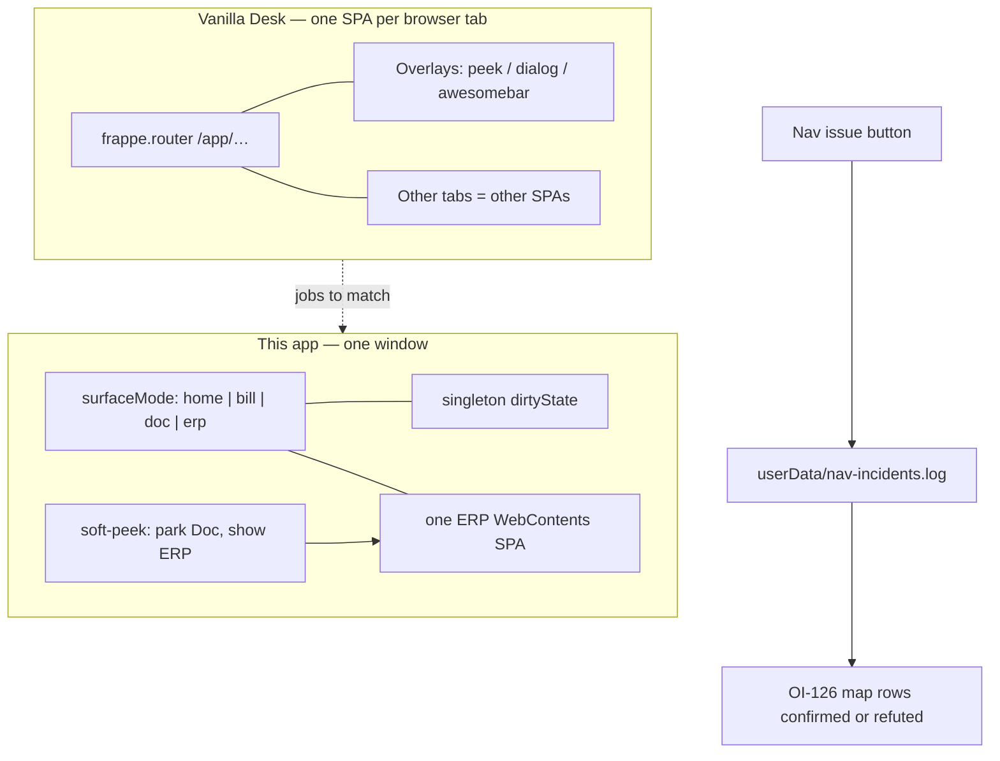

# Implementation plan — Nav instrumentation + architecture map (OI-126 / OI-127)

> **Working plan (temporary).** `docs/implementation-plan-YYYY-MM-DD.md`  
> When this tranche’s durable facts live in HANDOFF / OI status / CHANGELOG, **delete this file**.  
>
> **Started:** 2026-08-19 · **Does not supersede** `implementation-plan-2026-07-29.md` (Simplified / OI-086 still open).  
> **Repo:** `erpnext-ui-app` · **Museum:** `~/agent-harness/erpnext/doc-shell/open_items.md`  
> **Primary OIs:** **OI-127** (Nav issue log — shipped) · **OI-128 A** (peek tree on current ERP view — shipped this follow-on) · **OI-126** (Vanilla vs shell nav map — living)

---

## How to handle cross-architecture dogfood (copy into every new dated plan)

> **Template for future plans:** Keep this section near the top of every
> `docs/implementation-plan-YYYY-MM-DD.md`. It is process SSoT for the *working*
> tranche — not for museum `open_items.md` (that inbox stays long-lived discovery).

Cross-surface dogfood (Bill + PO + IR + chrome/nav in one message) strains the
LLM harness when treated as one blob. Prefer **error classes / architecture
families**, not a single mega-diff.

### Intake (before code)

1. Sort 5zorro feedback into **architecture families**.
2. Log under **Dogfood residuals** below. **Do not** reopen Done batches from prior plans.
3. **Do not** dump mid-workflow triage into museum `open_items.md`.
4. Prefer class language in residual rows.
5. **Nav family:** prefer an **OI-127 Nav issue** log line over a chat reconstruction.

### Execute (one family per slice)

1. Gather context for **one** family only.
2. Surgical fix + sibling/variant check.
3. **Self-critique** (class fixed vs symptom patched).
4. Unit tests for pure logic + `npm test` green.
5. Checkpoint the residual row; then the next family.

### Closeout (before deleting this plan)

1. Append durable **decisions** via `~/agent-harness/scripts/append-decision.sh`.
2. Update museum **OI status**; touch public **HANDOFF** / CHANGELOG as needed.
3. **Delete** this dated plan; open a **new** dated plan for the next tranche.

---

## Goal (this tranche)

1. Give clerks a **fail-fast / fail-loud** way to attach a freeform note to a **frozen** nav snapshot (OI-127).
2. Record a **first-pass** Vanilla vs shell navigation map (OI-126) so later flyout/peek work has a job list — not a guess from chat.
3. **Do not** lock **B** (Vanilla overlay WebContents) or **C** (warm pool) in this tranche.

Architecture unchanged: **Electron shell → HTTP / ERP WebContents bridge → unmodified ERPNext**.

---

## Packet N — Fail-loud Nav issue (OI-127) — **landed 2026-08-19**

### Business rule

When navigation feels wrong, the clerk captures **now**, not later. The log is the SSoT the next agent reads. Chat is optional.

### How

| Piece | Job |
|-------|-----|
| Toolbar **Nav issue** (orange) + Ctrl+Shift+M | Fail loud; always visible in the nav zone of chrome |
| Click | Freeze snapshot (`collectNavIncidentContext`) — even if the page later changes |
| Dialog textarea | Required note: what happened + what was expected |
| `src/nav-incident.js` | Sanitize note; slim history/doc identity; no field values / cookies |
| `userData/nav-incidents.log` | JSONL full records |
| `userData/nav-debug.log` | Existing trail + `nav-incident-open` / `user-incident` / `nav-incident-cancel` |
| Diagnose copy | Session incident ring appended under the nav debug section |

Snapshot fields (privacy-safe): `surfaceMode`, routes, parked Doc slot, doc **identity** (doctype/name/docstatus), `userEdited`/`isDirty`/`isNew`, preferred lens, company abbr, `guestWindowCount`, Recent labels/routes, last nav-debug trail.

Empty notes are rejected. The dialog is **not** click-away dismissed (unlike diagnose) so a note cannot vanish. It is also **not** modal, so the broken UI stays visible while typing.

Linux log home is Electron `userData` (typically `~/.config/erpnext-ui-app/`).

### Tests

`tests/nav-incident.test.js` — sanitize, slim, reject empty, ring cap, digest. `html-reachability` allowlists `nav-incident-dialog.html`.

---

## Packet P — Peek tree on the current ERP view (OI-128 A) — **landed 2026-08-20**

### Business rule

While a Bill/PO/IR is the parent, Recent draws those setup peeks as indented children under it. Vanilla-in-browser and Vanilla-in-this-app should feel like the same job (in-SPA hop), not a second client.

### How

| Piece | Job |
|-------|-----|
| `src/peek-stack.js` | Parent + sibling children (depth 1); collapse vs keep |
| `electron/main.js` | Begin stack on soft-peek; keep on Esc/Doc-tab; flatten on Home / hard Vanilla / other Doc |
| `electron/history.html` | Keyboardable `L→` indent; parent and children stay clickable |
| Collapse | Clear the stack only — children already live in Recent as `vanilla-always` rows |
| **Not built** | B extra WebContents overlay; C warm pool of N SPAs (stays **OI-040**) |

Nav issue snapshots include `peekParent` / `peekChildren` routes (no field values).

Tests: `tests/peek-stack.test.js`.

---

## Packet M — Vanilla vs shell map (OI-126) — **first pass; not locked**

Public **how** only. Discovery essay stays in museum **OI-126**.

| Vanilla job | Shell mechanism today | Change-candidate? |
|-------------|----------------------|-------------------|
| Same-SPA hop to a master, Bill typing survives | Soft-peek + Doc park/rebind (A.nav) | Only if incidents show rebind misses |
| Peek a Link **without** leaving the Bill | None on Doc; coarse surface swap | Yes — peek granularity |
| Second live client (browser tab) | Singleton `dirtyState`; OI-040 parked; unmanaged `window.open` | Yes — concurrency |
| Browser Back | Esc dismisses peek only; Recent is deduped resume | Maybe — do not mash Back with Recent |
| Search everywhere | Home tiles + Recent | Separate from this tranche |

**Flyout:** nested peeks under the parent Doc are **OI-128 A** (landed). Overlay WebContents (B) and a warm pool (C) are out unless later incidents demand them.

**Confidence:** shell rows are from this repo. Vanilla overlay/tab jobs are Desk v14/v15 product knowledge (no vendor `frappe` tree in the workspace). Promote a row to “locked” only after an OI-127 record matches it.

---

## Dogfood residuals

| Family | Status | Notes |
|--------|--------|-------|
| Nav instrumentation | Landed | Use **Nav issue** on the next miss; do not reconstruct in chat first |
| Peek granularity | Open | In-Doc Link overlay still later; flyout tree is A |
| Setup peek return | Landed + confirmed | OI-112 strike 1 — 5zorro restart 2026-08-21: chrome no longer lies |
| Concurrent instances | Open | OI-040 still parked; snapshot now counts guest windows |
| Flyout visual | Landed A | Nested peeks under parent Bill; flatten on hard leave |

---

## Out of this tranche

- Implementing OI-040 multi-window / tint
- Approach B (Vanilla peek overlay WebContents) and C (warm pool)
- Simplified lens (still `implementation-plan-2026-07-29.md`)
- Telemetry off-box or screenshots in the incident file
