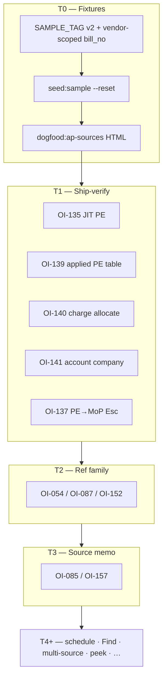

# Implementation plan — AP Doc skin backlog (museum open items)

> **Working plan (temporary).** `docs/implementation-plan-YYYY-MM-DD.md`  
> When a tranche’s durable facts live in HANDOFF / museum OI status / CHANGELOG, **delete or trim**
> this file.  
>
> **Started:** 2026-08-30 · **Scope:** **AP Doc skin only** — Bill · PO · IR · AP fixtures · pay-at-Bill
> · charge allocation · ref/dupe · source/memo · PO Find.  
> **Out of scope here:** Pay skin brainstorm (**OI-138**, **OI-129**, **OI-161**), CRM (**OI-143**),
> Simplified lens (**OI-086**), report generation (**OI-133**), AR-only seeds, alpha exit pointer
> (**OI-109**).  
> **Repo:** `erpnext-ui-app` · **Museum inbox:** `~/agent-harness/erpnext/doc-shell/open_items.md`  
> **Precondition:** Tranche 10 unified `doc-form.html` shell landed; DRY / SSoT / SoC for Bill boot,
> source modal, focus chain.

---

## How to handle cross-architecture dogfood (copy into every new dated plan)

Cross-surface dogfood (Bill + PO + IR + chrome/nav in one message) strains the harness when treated
as one blob. Prefer **error classes / architecture families**, not a single mega-diff.

### Intake (before code)

1. Sort feedback into **architecture families** (ref/dupe, source/memo, pay-at-Bill, peek/nav, seed).
2. Log under **Dogfood residuals** at the bottom. **Do not** reopen Done batches from prior plans.
3. **Do not** dump mid-workflow triage into museum `open_items.md`.
4. **Nav family:** prefer an **OI-127** Nav issue log line over chat reconstruction.

### Execute (one family per slice)

1. Gather context for **one** family only.
2. Surgical fix + sibling/variant check (`src/` pure first → Electron IPC → `bill-form-page.js` / PO/IR peers).
3. Self-critique (class fixed vs symptom patched).
4. Unit tests for pure logic + `npm test` green.
5. Checkpoint the residual row; then the next family.

### Closeout (before deleting this plan)

1. Append durable **decisions** via `~/agent-harness/scripts/append-decision.sh`.
2. Update museum **OI status**; touch public **HANDOFF** / CHANGELOG as needed.
3. **Delete** this dated plan when the AP tranche set is closed; open a **new** dated plan for the
   next product area (Pay skin, Simplified, etc.).

---

## Goal

Burn down **unimplemented** AP Doc-skin museum rows quickly now that:

- Bill / PO / IR share **`doc-form.html`** + `doc-form-boot.js` + `doc-skin-registry.js`.
- Bill logic lives in **`src/bill-form-page.js`** (not monolithic `bill.html`).
- Sample corpus is idempotent via **`SAMPLE_TAG`** + `--reset`.



---

## Tranche 0 — Sample corpus refresh + AP fixture gaps

**Why:** Dogfood re-entry of seeded `bill_no` values trips **OI-054 / OI-087** dupe checks; multi-source
and prepayment scenarios lack generated inputs (**OI-149**, **OI-153**, **OI-103** matrix).

| OI | One-line | Build how |
|----|----------|-----------|
| **OI-115** | AP purchases mostly nontaxable — partial seed mix | Confirm corpus tax flags after reset |
| **OI-103** | AP dogfood scenario matrix | Extend `corpus-plan.js` rows for M:N source, prepay, ref patterns |
| **OI-149** | Multi-source PO+IR merge + JIT IR fixtures | Add chained PO/IR/PI keys in plan; regenerate dogfood HTML |
| **OI-153** | Vendor prepayment fixtures | Seed PO paid-before-receipt + matching Bill path |

**Code (landed 2026-08-30):**

- `SAMPLE_TAG` → `ui-app-sample-v2` in `src/sample-data/corpus-plan.js`.
- Bill refs → `SMP-V{vendor}-INV-{nn}` / `SMP-V{vendor}-DRAFT-{nn}` (vendor-scoped; avoids generic dupe collisions).
- `ops/sample-data/README.md` documents reset + dogfood ref hygiene.

**Ops (clerk / agent after pull):**

```bash
CONFIRM_SAMPLE_SEED=1 npm run seed:sample -- --reset
npm run dogfood:ap-sources
```

Manual entry tests: use **`DOGFOOD-…`** refs, not the seeded `SMP-V…` series.

**Tests:** `tests/sample-data-corpus.test.js` (tag + plan shape); re-run full `npm test` after fixture additions.

**Done when:** Reset seed succeeds; vendor idle/never visible in picker (**OI-131** re-seed note); dogfood HTML
covers multi-source + prepay rows.

**Landed 2026-08-30:** v2 tag, vendor-scoped bill_no, corpus fixtures (`PO-MN`, `PR-MN`, `PO-PP`, `PR-PP`, `PO-LB`),
advance PE seed, dogfood **DF-14…16**. Ops: run reset + `dogfood:ap-sources` below.

---

## Tranche 1 — Close “shipping” AP pay / charge / account rows (dogfood verify)

Code exists; museum status still **open — shipping**. This tranche is **verify → dogfood → museum `done`**.

| OI | One-line | Modules / IPC | Dogfood |
|----|----------|---------------|---------|
| **OI-135** | Draft `is_paid` memory; Submit → JIT Payment Entry | `src/bill-paid.js`, save/submit bridge | New Bill, no PO, Already paid + CC account → Submit & Pay |
| **OI-139** | Hydrate applied PE table (submitted Bill only) | `listPayments` / `bill-list-payments` IPC, payments section | Submit Bill via T1 PE path; table shows PE rows |
| **OI-140** | Allocate BS charge into item cost + Deduct offset | `src/bill-charge-allocate.js`, `bill-allocate-charge` | Freight charge → By price / By qty / Custom → totals unchanged |
| **OI-141** | Mute other-company accounts; Save gate on mismatch | `src/account-company.js`, `bill-account-company-check` | Pick HI freight on HID Bill → blocked Save with clear message |
| **OI-137** | Esc from MoP returns to PE, not stale Bill park | `resolveSoftPeekEscAction`, peek stack in `electron/main.js` | PE → MoP → Esc → PE; hint label matches |
| **OI-105** | Sticky Amount Due mismatch chip; click focuses field | Bill totals / scroll listener in `bill-form-page.js` | Scroll items; mismatch chip sticks; click → Amount Due focus |

**Tests:** existing suites for charge allocate, account company, bill-paid, peek stack; add only if dogfood finds gaps.

---

## Tranche 2 — Ref No. family (pattern + dupe + Find jump)

| OI | One-line | Build how |
|----|----------|-----------|
| **OI-087** | Trailing-6 pattern check vs vendor history | Extend `src/bill-ref-check.js`; IPC history by vendor |
| **OI-054** | Soft dupe warning (non-blocking) | Same module; debounced check on blur |
| **OI-152** | Ghost “expected trailing-6” while typing | Inline hint UI on Ref No. field; pure formatter helper + test |

**Follow-on (same family, after soft warn works):** dupe / pattern link → **Find** with prefilled vendor + ref
filters (museum brainstorm for OI-054/OI-087 — implement as thin IPC + `showFind` payload, not new Find UI).

**Tests:** `tests/bill-ref-check.test.js` (extend); no ERP in unit tests.

**Done when:** Re-typing seeded refs after T0 reset shows pattern hints but not false dupe spam; click-through
opens Find with filters.

---

## Tranche 3 — Memo / source notes region

| OI | One-line | Build how |
|----|----------|-----------|
| **OI-085** | Source ID list above memo + copy affordance | Read-only chips/table above `#f-memo`; reuse source keys from hydrate |
| **OI-157** | Read-only “Notes from sources” (PO · IR · SO) | Extend `fetch-source-terms` / new IPC; table under source IDs; terms partial already shipped |

**Modules:** `src/bill-source-flow.js`, memo section in `electron/bill-shell.fragment.html`, IPC in
`electron/doc-form-preload.cjs`.

**Tests:** pure map from source list → display rows; IPC mock in existing bill tests if present.

---

## Tranche 4 — Due date vs payment schedule

| OI | One-line | Build how |
|----|----------|-----------|
| **OI-142** | Header `due_date` matches payment schedule; always ≥1 row | Read/write `payment_schedule` child table via bridge; header sync on schedule edit |

**Modules:** new `src/bill-payment-schedule.js`; Bill save payload; Terms template dogfood after install row exists.

**Tests:** schedule row math, header sync, empty guard.

---

## Tranche 5 — Logbook PO# on Find (not only ERP `name`)

| OI | One-line | Build how |
|----|----------|-----------|
| **OI-121** | Logbook PO# lives in PO **`title`** — no Bill field | Document in Assumptions; PO line display only |
| **OI-154** | PO Find searches **`title`** (logbook #) | Extend PO Find filter builder / `get_list` OR filters |

**Modules:** `src/po-find.js` or shared Find filter helper; corpus PO rows with distinct `title` for dogfood.

---

## Tranche 6 — Multi-source + partial receipt picking

| OI | One-line | Build how |
|----|----------|-----------|
| **OI-149** | PO+IR merge edge cases + JIT IR | Harden `combineMappedBillSources`; JIT IR create from source modal; **T0 fixtures required** |
| **OI-102** | Partial IR / remaining PO qty in source picker | Source list qty badges; filter partials |

**Modules:** `src/bill-source-flow.js`, `src/source-modal-ui.js`, bridge create IR.

**Tests:** `tests/bill-source-flow.test.js`, source combine tests (extend).

---

## Tranche 7 — One-click peek PO/SO (dirty gate)

| OI | One-line | Build how |
|----|----------|-----------|
| **OI-148** | First click soft-peek; second click open (if clean) | Source ID chips → peek stack; dirty gate before hard navigation |

**Modules:** reuse peek stack (**OI-128 A** landed); wire from memo/source chips.

---

## Tranche 8 — Rate / qty escalation (non-blocking)

| OI | One-line | Build how |
|----|----------|-----------|
| **OI-150** | PO vs Bill rate mismatch >1% → salesman escalation | Compare on hydrate/pull; caution banner + optional notify hook (no block) |
| **OI-151** | Over-receipt qty vs PO — Vanilla strategy research → split lines | Research tranche first; then line split by source in pure mapper |

---

## Tranche 9 — Hydration / IPC plain-language errors

| OI | One-line | Build how |
|----|----------|-----------|
| **OI-160** | 403 / missing read → clerk-readable message | Centralize in doc-form adapter + bill boot error surface (pattern from blank-Bill fix) |

---

## Tranche 10 — Vendor picker idle de-emphasis (confirm)

| OI | One-line | Build how |
|----|----------|-----------|
| **OI-131** | De-emphasize idle / no-PO vendors | **Done in code 2026-08-21** — close after **T0 re-seed** confirms suffixes in live picker |

---

## Tranche 11 — Books-impact strip (AP Doc skins)

| OI | One-line | Build how |
|----|----------|-----------|
| **OI-130** | Strip: tax withheld · inventory · TB hint | Shared strip component for Bill/PO/IR in doc-form chrome; pure flags from doc type + lines |

---

## Tranche 12 — Items table layout (research → spec, then CSS)

**Why:** Clerks scan 20+ line Bills daily. Column widths, row height, type, and horizontal overflow should
be **researched and mocked** — not inherited from Vanilla or first CSS guess (**OI-146**, **OI-107**;
pairs with **OI-145** overflow / non-AP columns).

| OI | One-line | Build how |
|----|----------|-----------|
| **OI-146** | Readability at 20+ rows | Research → spec: row grouping (e.g. rule every 4th line vs zebra) |
| **OI-107** | Misread-prone refs (SKU, PO#, ref no) | Tabular lining / monospace column policy |
| **OI-145** | JIT / SO-flow columns off the vendor invoice | Horizontal overflow design for non-AP process cols |

**Research questions (museum discovery — lock answers before CSS):**

1. **Typography** — Atkinson Hyperlegible vs system UI stack for body; tabular nums / mono for identifier
   columns only; minimum 12px effective size at 1080p.
2. **Row rhythm** — zebra striping vs **stronger rule every 4 rows** vs combo; line-height for wrapped
   description cells.
3. **Column widths** — fixed vs minmax grid; which cols wrap (description) vs stay single-line (qty, rate);
   default heights for 1-line vs 2-line cells.
4. **Horizontal layout** — **AP core** columns (Item, Description, Qty, Cost, Amount) stay in the primary
   viewport; **non-AP process** columns (Customer:Job, future SO/margin/JIT overflow) scroll off the right
   **on purpose** so entry focus stays on payable lines — not accidental overflow.
5. **Dogfood** — 20-row fixture (OI-103 DF-05 sort) + 4-row partial; compare side-by-side mockups.

**Deliverables (no production CSS until signed off):**

- HTML mockup or Canvas comparing 2–3 variants (type + row rule + overflow strip).
- Short decision via `append-decision.sh` (font stack, row rule, sticky/scroll split).
- Then implement in `electron/bill-dashboard.css` + shared doc items table tokens (PO/IR inherit).

**Tests after build:** visual regression optional; pure column-classifier for “core vs overflow” cols.

---

## Tranche 13 — Bill review visibility

| OI | One-line | Build how |
|----|----------|-----------|
| **OI-155** | Bill packet review step before submit (higher visibility than PO/IR) | Optional review panel or expanded totals/source summary; no duplicate submit path |

---

## Tranche 14 — SO-linked freight / overflow columns (research → build)

| OI | One-line | Build how |
|----|----------|-----------|
| **OI-144** | Suggest freight line from SO buying charges | Hydrate hook when SO linked on PO lines |
| **OI-145** | JIT overflow columns (SO flow, margin — off vendor invoice) | Column defs in Bill items grid; **layout per T12**; **OI-134** picker still parked |

---

## Tranche 15 — ALL-CAPS entry default (PO / IR)

| OI | One-line | Build how |
|----|----------|-----------|
| **OI-111** | Default ALL-CAPS ON for Doc skins | Bill landed; extend `src/doc-caps.js` (or equivalent) to PO/IR controllers |

---

## Tranche 16 — Item table paste / CSV drop

| OI | One-line | Build how |
|----|----------|-----------|
| **OI-132** | Paste grid + CSV drop → cleanup modal | Shared doc items table handler; dirty-data modal pure module |

---

## Tranche 17 — Vendor prepayment flow (beyond fixtures)

| OI | One-line | Build how |
|----|----------|-----------|
| **OI-153** | Pay-before-goods clerk flow | After **T0 fixtures**: Doc guidance PE → PO → IR → Bill reconcile; Assumptions copy |

---

## Tranche 18 — Returns / credit memo

| OI | One-line | Build how |
|----|----------|-----------|
| **OI-147** | AP returns — received vs not received | `is_return` path; inventory vs expense |
| **OI-082** | Create Copy → change to credit | Wire Copy action to debit note template |

---

## Parked — do not start until AP tranche 1–6 stable

| OI | One-line | Why parked |
|----|----------|------------|
| **OI-134** | Bill SO picker (customer filter, margin) | No PI line SO field in ERP; large UX |
| **OI-136** | Address pickers + drop-ship jobs on one page | Brainstorm; feed Simplified mockups first |
| **OI-156** | Doc ↔ Vanilla Bill toggle perf | Perf audit |
| **OI-158** | Greenfield empty DB + role matrix | Hardening plan, not feature |
| **OI-159** | Item import vendor SKU mismatch | Extends OI-132 |
| **OI-138** | Pay skin outstanding list | Pay product area, not AP Doc |
| **OI-161** | Payment batching economics | Pay skin |

---

## Shared modules (AP extension map)

| Concern | Pure SSoT | Doc surface |
|---------|------------|-------------|
| Bill controller | `src/bill-form-page.js` | `#bill-shell` in `doc-form.html` |
| Boot / skin | `src/doc-form-boot.js`, `src/doc-skin-registry.js` | `electron/doc-form-preload.cjs` |
| Source pick | `src/source-modal-ui.js`, `src/bill-source-flow.js` | source modal DOM |
| Ref / dupe | `src/bill-ref-check.js` | Ref No. field |
| Pay at Bill | `src/bill-paid.js` | Payments section |
| Charges | `src/bill-charge-allocate.js` | Taxes/charges grid |
| Account guard | `src/account-company.js` | Tax / cash-bank pickers |
| Sample corpus | `src/sample-data/corpus-plan.js` | `npm run seed:sample` |
| PO / IR | `src/po-form-page.js`, IR peer | `#doc-form-shell` |

---

## Dogfood residuals (fill during tranches)

| Date | Family | Note | Status |
|------|--------|------|--------|
| 2026-08-30 | Seed | v2 tag + T0 fixtures landed; run `--reset` + dogfood HTML | ops pending |
| | | | |

---

## Suggested execution order (quick hits first)

1. **T0** — reset seed + dogfood HTML (**today**).
2. **T1** — one afternoon dogfood pass closing shipping pay/charge/account OIs.
3. **T2** — ref family (unblocks daily entry comfort).
4. **T3–T6** — memo, schedule, Find, multi-source (core AP clerk loops).
5. **T12** — items table ergonomics mockups (before OI-145 overflow columns land).
6. **T7–T11, T13–T18** — peek, escalation, strip, CAPS, paste, prepay, returns as capacity allows.

**FYI:** Native `CONFIRM_SAMPLE_SEED=1 npm run seed:sample -- --reset` deletes only prior-tag docs; manual
Bills without the tag are untouched.
