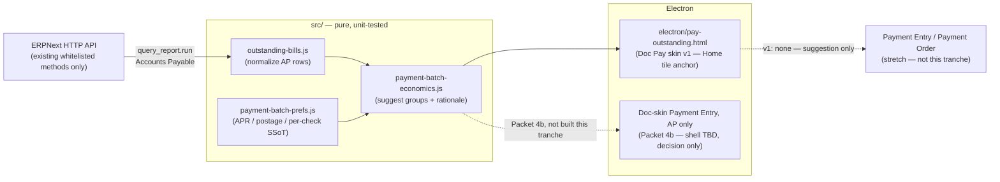

# Implementation plan — Doc Pay skin: economic batching of outstanding Bills (OI-138 / OI-161)

> **Working plan (temporary).** `docs/implementation-plan-YYYY-MM-DD.md`
> When this tranche's durable facts live in HANDOFF / OI status / CHANGELOG, **delete this file**.
>
> **Started:** 2026-09-03 · **Does not supersede** `implementation-plan-2026-07-29.md` (Simplified /
> OI-086) or `implementation-plan-2026-08-19.md` (Nav instrumentation) — both stay open in parallel.
> **Repo:** `erpnext-ui-app` · **Museum:** `~/agent-harness/erpnext/doc-shell/open_items.md`
> **Primary OIs:** **OI-138** (Doc Pay skin: outstanding Bills grouped by vendor + payment date —
> brainstorm 2026-08-25) · **OI-161** (Payment batching economics: postage + daily interest vs due
> dates — discovery 2026-08-29). **Sibling context (not in scope, do not build):** OI-129 (list
> return/scroll — explicit no-build until Vanilla dogfood felt), OI-135 (Bill "already paid" JIT
> PE — shipping separately), OI-139 (applied-payments table on submitted Bill — shipping
> separately), OI-064 G (in-doc "Pay Bill" button — museum backlog, unbuilt).

---

## How to handle cross-architecture dogfood (copy into every new dated plan)

> **Template for future plans:** Keep this section near the top of every
> `docs/implementation-plan-YYYY-MM-DD.md`. It is process SSoT for the *working*
> tranche — not for museum `open_items.md` (that inbox stays long-lived discovery).

Cross-surface dogfood (Bill + PO + IR + chrome/nav in one message) strains the
LLM harness when treated as one blob. Prefer **error classes / architecture
families**, not a single mega-diff.

### Intake (before code)

1. Sort 5zorro feedback into **architecture families**.
2. Log under **Dogfood residuals** below. **Do not** reopen Done batches from prior plans.
3. **Do not** dump mid-workflow triage into museum `open_items.md`.
4. Prefer class language in residual rows.

### Execute (one family per slice)

1. Gather context for **one** family only.
2. Surgical fix + sibling/variant check.
3. **Self-critique** (class fixed vs symptom patched).
4. Unit tests for pure logic + `npm test` green.
5. Checkpoint the residual row; then the next family.

### Closeout (before deleting this plan)

1. Append durable **decisions** via `~/agent-harness/scripts/append-decision.sh`.
2. Update museum **OI status** (OI-138, OI-161) — set `done` or note what promoted.
3. **Delete** this dated plan; open a **new** dated plan for the next tranche.

---

## Goal (this tranche)

1. Close the **research gap** OI-161 named ("likely not first-class for this math in Vanilla") with
   a concrete Vanilla inventory — done below in **Packet 0**, so Packet 1+ builds on facts, not a
   guess.
2. Ship a **pure, tested** economics helper (`paymentBatchEconomics`) that takes outstanding-Bill
   data + a cost model and returns suggested batches with an auditable rationale string — no ERP
   writes.
3. Ship a **Doc Pay skin v1**: outstanding Purchase Invoices grouped by vendor + due date, with a
   suggested-batch chip (expand to show the math). **Suggestion only — clerk still drives the
   actual pay action** (existing Vanilla Payment Entry / `Pay Bill` escape hatch); no auto-submit.
4. Leave the **write path** (Payment Entry / Payment Order creation from a chosen batch) as a named
   stretch packet, not required to close this tranche.

> **Gate (5zorro 2026-09-03):** none of this is reviewable against real data until sample data
> exists that actually exercises batching — "a vendor with a bill with 1 payment due every day for
> 3 months." **Packet G** below builds that fixture and is a **prerequisite to dogfooding** Packets
> 1–4 (pure unit tests can proceed in parallel against hand-built fixtures; the live Doc Pay skin
> cannot be judged without it).

Architecture unchanged: **Electron shell → HTTP → unmodified ERPNext**. This tranche adds one pure
module and one new Doc-skin surface; no new ERP-side code (Clean Core — we call existing whitelisted
methods only, never patch `apps/frappe` / `apps/erpnext`).



---

## Packet 0 — Vanilla research (closes OI-161 bullet 5)

> Confirms/extends OI-161's "likely not first-class for this math in Vanilla" hypothesis with
> concrete schema/controller reads (`docker exec frappe_docker-backend-1` browse, 2026-09-03).

| Vanilla mechanism | What it actually does | Gap vs OI-161's economic-batching ask |
|---|---|---|
| **Accounts Payable** report (`erpnext/accounts/report/accounts_payable/`) | Read-only ledger: outstanding Purchase Invoices per supplier, ageing buckets, group-by voucher/party/terms. Shares an engine (`ReceivablePayableReport`) with Accounts Receivable. | No selection/action affordance; no cost model; you read it, then hand-build Payment Entries elsewhere. This is our **data source**, not a suggestion engine. |
| **Payment Schedule** (child table on PI, `payment_schedule` doctype) | Per-installment `due_date`, `discount_date`, `discount_type`, `discount`, `discounted_amount`, `outstanding`. | Early-payment discount data **exists** but nothing surfaces "pay these N by Friday to capture $X" anywhere in the UI. |
| **Payment Order** (`erpnext/accounts/doctype/payment_order/`) | The closest thing to a "check run / ACH run / wire run": create against a `Company Bank Account`, then **manually** pick already-created, already-submitted `Payment Entry` or `Payment Request` rows via a `map_current_doc` picker (filtered by bank account + `payment_order_status = Initiated`). Submitting flips referenced docs to `Payment Ordered`. Rows carry `supplier`, `amount`, `mode_of_payment`, `bank_account` — grouping-by-mode is a **native field**, but nothing suggests *which* payments belong in a run. | Batching mechanism only, no suggestion logic, and it operates **downstream** of Payment Entry — clerk must already have created individual PEs before a run can be assembled. |
| **Mode of Payment** (`type` = `Cash \| Bank \| General \| Phone`) | No structured ACH/Wire/Check distinction — that's just whatever the company names the Mode of Payment record. | Fine to build on (Payment Order Reference already keys off `mode_of_payment`), but confirms there's no built-in per-channel cost (postage/fee) field — OI-161's cost model has nowhere to live in Vanilla. |
| **Bank Account** / **Bank** doctypes | `Bank Account`: `iban`, `bank_account_no`, `branch_code`. `Bank`: `swift_number`. | No ACH routing-number field distinct from account no.; international-wire SWIFT lives one level up on `Bank`. Adequate for *display*, not a gap this tranche needs to close. |
| **Payment Reconciliation** / **Process Payment Reconciliation** | Matches *already-existing* unallocated payments/JEs against invoices for one party. | Different job entirely (bookkeeping cleanup, not forward-looking "what should I pay"). Not a building block here. |
| Accounts **Payments** dashboard (workspace) | 4 number cards (Total Outgoing/Incoming Bills/Payments) + AR/AP ageing charts + bank balance. | Informational only, no drill-to-batch. Not a building block here. |

**Conclusion:** OI-161's hypothesis holds. Nothing in Vanilla computes "combine these bills into one
payment because postage saved > float lost." The **Accounts Payable report** is the right read-only
data source (reuse its engine over HTTP rather than re-deriving ageing/currency math ourselves —
Clean Core: call the existing report, don't reimplement it). Everything past that point — grouping,
economics, suggestion — is new product surface, matching what 5zorro asked to research.

---

## Baseline (honest — 2026-09-03)

| Area | State |
|---|---|
| Doc Pay skin | **Not started.** `src/home-tiles.js` has `pay-bills` / `checks` tiles that deep-link straight to a blank `/app/payment-entry/new` — no list, no suggestions. |
| Bill due-date / payment-schedule plumbing | **Exists** — `src/bill-due-date.js`, `src/bill-payment-schedule.js` already read/write `payment_schedule` rows (`due_date`, multi-installment sync) on the single-Bill Doc skin. New work should reuse these shapes, not invent a second `due_date` convention. |
| Bill "already paid" (OI-135) | **Shipping separately** — JIT Payment Entry on Submit for card-at-entry Bills. Orthogonal: that's Bills paid *at entry*; this tranche is Bills **already submitted and outstanding**. |
| Applied-payments table (OI-139) | **Shipping separately** — read-only PE list on a submitted Bill. Orthogonal (single-Bill view vs cross-vendor batch view). |
| Cost-model prefs (APR / postage / per-check) | **Do not exist anywhere** — new SSoT, this tranche. |
| Multi-installment sample data | **Does not exist** — `ops/sample-data/seed_corpus.py::_normalize_pi_dates` unconditionally clears `payment_schedule` and flattens every seeded Bill to a single 30-day due date. Zero bills in the sandbox today have more than one due date. **Packet G** fixes this for one dedicated fixture. |
| Doc-skin Payment Entry | **Does not exist** — `DOC_SKIN_INDEX` (`src/lens-context.js`) only has `workflow-home` / `bill` / `po` / `receipt`. Payment Entry is Vanilla-only today (`/app/payment-entry/new`), and the doctype is shared by both AP (`payment_type: "Pay"`) and AR (`"Receive"`) flows. 5zorro decided (2026-09-04): **two entry points this tranche — Home tile AND a new Doc-skin Payment Entry form, AP only.** Rejected as anchors: the **Payments workspace** (bleeds AR ageing/reports into what should be an AP-only tool; AR gets its own doc skin later) and the **Payment Entry list/"Find" view** (it's an audit tool over already-created payments, not a bill-selection decision surface). See Packet 4 / new Packet 4b. |

---

## Packet G — Sample-data gate (blocking; 5zorro 2026-09-03)

> Do this **before** Packet 1's IPC wiring is worth dogfooding. Packet 1–3's unit tests can use
> hand-built fixtures and don't strictly need this, but nobody can look at the real Doc Pay skin
> and judge the batching math without it — 5zorro named this the primary gate.

### Business rule

"A vendor with a bill with 1 payment due every day for 3 months" — one Purchase Invoice, one
`payment_schedule` row per calendar day, ~90 rows, so the suggested-batch output (weekly-ish
groups) is visually obvious against a flat list of 90 individual due dates.

### Why today's seed can't show this

`ops/sample-data/seed_corpus.py::_normalize_pi_dates` runs on **every** seeded Purchase Invoice:

```python
doc.due_date = add_days(getdate(posting), 30)
if hasattr(doc, "payment_schedule"):
    doc.set("payment_schedule", [])
```

So all ~25 existing sample Bills get a single flat 30-day due date and an **empty**
`payment_schedule`. This must change for **one** new fixture without touching the other seeded
Bills — other OIs' dogfood already depends on the existing 25 (OI-054 bill-ref, OI-131 vendor
activity ranking, the OI-149/153/154 AP fixtures) staying exactly as they are.

### Confirmed against the ERP controller (2026-09-03 read of `accounts_controller.py`)

- `set_payment_schedule()` only auto-generates rows `if not self.get("payment_schedule")` — if we
  populate the child table **before** `doc.insert()`, our rows are left alone.
- `validate_payment_schedule_dates()` **throws on duplicate `due_date`s** within one doc's schedule
  — daily rows are fine (each is a distinct calendar day) but confirms this fixture couldn't have
  used, say, 90 rows all due "in 30 days."
- `validate_payment_schedule_amount()` requires `payment_schedule` rows' `payment_amount` to sum to
  `grand_total` (within field precision) — design the fixture so this is exact, not rounded.

### Design

| Piece | Detail |
|---|---|
| New supplier | `SUP-DAILY` — "SAMPLE Vendor Daily Payrun." Dedicated key, not reused, so this fixture never mixes with existing vendor-scoped dogfood (OI-054, OI-131, etc.). |
| One Purchase Invoice | Single line, existing sample item, `qty: 90`, `rate: 50.00` → `grand_total = 4500.00` exactly — no fractional rounding to fight. |
| `payment_schedule` | 90 rows. Row *i* (1..90): `due_date = posting_date + i days`; `payment_amount = base_payment_amount = outstanding = base_outstanding = 50.00`; `invoice_portion = 0` (percentage math not needed — amounts are set directly). |
| Header `due_date` | Set to the **last** schedule row's date — same "last row wins" convention `bill-payment-schedule.js::headerDueDateFromPaymentSchedule` already uses, so this fixture is consistent with code that already exists rather than inventing a second rule. |
| Submit | Must land `docstatus=1` — outstanding/ageing data (Accounts Payable report, Packet 1's source) only exists for submitted invoices. No Payment Entry against it, so the full $4,500 stays outstanding across all 90 rows. |
| Optional, propose separately | 2–3 of the 90 rows also carrying `discount_type` / `discount` / `discount_date`, so Packet 2's discount-capture branch has one live fixture too, not only unit-test fixtures. **Confirm with 5zorro before adding** — the daily-due-date shape alone already answers the batching-visualization ask; don't grow this fixture's scope unasked. |

With the default `groupWindowDays: 7` (Packet 2), 90 consecutive daily $50 bills should suggest
roughly **13 weekly batches** — a shape 5zorro can eyeball directly against the raw 90-row list.

### Code changes

| File | Change |
|---|---|
| `src/sample-data/corpus-plan.js` | New `appendPaymentBatchFixture(docs, ctx)`, called alongside `appendApDogfoodFixtures`. Builds the `SUP-DAILY` supplier + one PI spec carrying an explicit `paymentSchedule: [{ dueDate, amount }, …]` array and `dogfoodScenario: "oi161-daily-payrun"`. Bump `SAMPLE_TAG` (`ui-app-sample-v2` → `v3`) — existing convention: shape change ⇒ new tag, `--reset` drops the old one. |
| `ops/sample-data/seed_corpus.py` | In `_normalize_pi_dates` (or a guard just before it runs): if `spec.get("paymentSchedule")`, append those rows onto `doc.payment_schedule` and set `doc.due_date` to the last row's date **instead of** the existing wipe-and-flatten path. Every other Bill keeps today's behavior byte-for-byte. |
| `tests/corpus-plan.test.js` (existing suite) | Extend: plan includes `SUP-DAILY`; schedule has 90 rows on 90 consecutive distinct calendar days; `payment_amount` sum equals `grand_total` exactly. |

### Exit

`CONFIRM_SAMPLE_SEED=1 npm run seed:sample -- --reset` produces one submitted Purchase Invoice under
`SUP-DAILY` with 90 daily `payment_schedule` rows and nothing paid. 5zorro can open the Accounts
Payable report today (pre-Packet-1) and already see 90 distinct due dates from one vendor; once
Packet 1–2 land, the same fixture is what proves the batching math on the real Doc Pay skin.

---

## Packet 1 — `src/outstanding-bills.js` (pure: normalize ERP rows)

### Business rule

The Doc Pay skin must show ERP truth, not a shell-side re-derivation of ageing/outstanding math.
Fetch via the **existing Accounts Payable report** (`frappe.desk.query_report.run` with
`report_name=Accounts Payable`, `filters={company, party_type: "Supplier"}`) over HTTP — same engine
Vanilla's report page uses. This module's job is only to **normalize** that report's row shape (and,
per-row, the linked Purchase Invoice's `payment_schedule` for discount dates) into a flat shape the
economics helper can consume.

### Shape

```js
/**
 * @typedef {{
 *   invoice: string,          // Purchase Invoice name
 *   supplier: string,
 *   postingDate: string,      // ISO
 *   dueDate: string,          // ISO — header due_date (last installment; bill-payment-schedule.js convention)
 *   outstanding: number,      // party currency
 *   currency: string,
 *   discountDate?: string,    // ISO — earliest payment_schedule row with a discount, if any
 *   discountAmount?: number,  // absolute $ saved if paid by discountDate
 * }} OutstandingBillRow
 */
```

### How

| Piece | Job |
|---|---|
| `normalizeAccountsPayableRow(reportRow)` | Map report column names → `OutstandingBillRow` (pure; fixture-driven — report column order is a known contract, test against a captured sample). |
| `attachDiscountWindow(row, paymentScheduleRows)` | Pure merge: earliest schedule row with `discount_type`/`discount` set → `discountDate`/`discountAmount` on the row. Reuses the same `payment_schedule` shape as `bill-payment-schedule.js` — do not invent a second convention. |
| IPC (electron layer, not this packet) | One `get-outstanding-bills` call: report run + per-invoice `payment_schedule` fetch (batched `get_list` on `Payment Schedule` filtered by `parent in [...]`, one round trip, not N). |

### Tests

`tests/outstanding-bills.test.js` — normalize a captured Accounts Payable report row fixture;
discount-window attach with 0/1/many schedule rows; missing discount fields → `undefined`, not `0`
(so the economics helper can tell "no discount offered" from "$0 discount").

---

## Packet 2 — `src/payment-batch-economics.js` (pure: the OI-161 math)

### Business rule (locked intent, from OI-161)

> Minimize **all-in** payment cost (fees + lost float), not due-date slavishness when economics
> favor one check. Batch adjacent small payments when combined per-payment savings exceed lost
> float; never batch past the **earliest** due date in the group (never pay late to save postage).

Concretely, for a same-vendor group of bills with due dates within a configurable window:

- **Per-payment cost** = flat fee (e.g. $0.78 postage) + `perTransactionCost` (e.g. $0.05/check),
  charged once **per payment made**, not per bill.
- **Float value of delaying** one bill from its own due date to an earlier **group** pay date =
  `amount * (apr / 365) * daysEarlier` — this is a **cost** of batching early (paying before you
  have to), not a savings. Batching only wins when `feesSavedByBatching > floatCostOfPayingEarly`.
- Suggested pay date for a group = **earliest** due date among the batched bills (never later —
  that would risk lateness on the earliest one).
- A discount window (Packet 1's `discountDate`/`discountAmount`) **always wins** its own comparison
  first: if `discountAmount > floatCostOfPayingEarly(thatBill, discountDate)`, suggest paying that
  bill alone by `discountDate` regardless of batching (discount capture is usually the largest
  single lever — do not let batching logic bury it).

### Signature

```js
/**
 * @param {{
 *   bills: OutstandingBillRow[],
 *   perPaymentFee: number,      // e.g. 0.78 (postage) + 0.05 (per-check) pre-summed by caller
 *   apr: number,                // e.g. 0.09
 *   groupWindowDays?: number,   // default 7 — max span between due dates to consider batching
 * }} args
 * @returns {{
 *   groups: Array<{
 *     supplier: string,
 *     bills: string[],          // invoice names
 *     payOn: string,            // ISO — earliest due date in group, or a discount date if that wins
 *     totalAmount: number,
 *     feesSaved: number,        // vs paying each bill separately
 *     floatCost: number,        // $ lost by paying earlier than each bill's own due date
 *     netBenefit: number,       // feesSaved - floatCost (+ any discount captured)
 *     rationale: string,        // human-readable, e.g. "3 bills batched: $0.83 fee saved vs $0.31 float cost = $0.52 net"
 *     reason: "batch" | "discount-capture" | "pay-alone",
 *   }>,
 * }}
 */
export function paymentBatchEconomics(args) { ... }
```

`reason: "pay-alone"` rows still appear (single-bill "groups") so the UI has one uniform list to
render — no separate "ungrouped" branch.

### Tests

`tests/payment-batch-economics.test.js` — table-driven:

1. Three $300 same-vendor bills due Mon/Tue/Wed, small per-check fee → batches to one group,
   `payOn` = Monday, `netBenefit > 0`.
2. Same bills but `apr` high enough that float cost of paying Tue/Wed's amount early on Monday
   exceeds fee savings → **does not** batch (each stays `pay-alone`).
3. A bill with a discount window where `discountAmount` beats batching → `reason: "discount-capture"`,
   `payOn = discountDate`, independent of any group it could otherwise join.
4. Different suppliers never batch together (group key is always `supplier`).
5. Bills outside `groupWindowDays` of each other don't batch even same-vendor.
6. Empty `bills` → `{ groups: [] }`. Single bill → one `pay-alone` group, `netBenefit: 0`.

This is the packet the whole tranche hinges on — **auditable math**, per HANDOFF's "auditable how"
rule. 5zorro should read the test table before this packet is called done; the `rationale` string
is user-facing, not just a log line, so its wording is part of the review, not an afterthought.

---

## Packet 3 — `src/payment-batch-prefs.js` (pure: cost-model SSoT)

### Business rule

`apr`, postage, and per-check cost are **company/user judgment calls**, not ERP truth — they don't
exist as fields anywhere in ERPNext (confirmed in Packet 0). Store them the same way other shell-only
prefs live today (pattern: `lens-prefs.js` — per-scope JSON in `userData`, not a new ERP doctype;
Clean Core stays intact since nothing is written to ERP).

### Shape

```js
/** @typedef {{ apr: number, postage: number, perCheck: number, groupWindowDays: number }} PaymentBatchPrefs */
export const DEFAULT_PAYMENT_BATCH_PREFS = Object.freeze({
  apr: 0.09, postage: 0.78, perCheck: 0.05, groupWindowDays: 7,
});
```

| Piece | Job |
|---|---|
| `src/payment-batch-prefs.js` | Defaults + `validatePaymentBatchPrefs(prefs)` (reject negative/NaN). Pure. |
| Electron: `userData/payment-batch-prefs.json` | Persisted overrides, same read/merge/write pattern as `lens-prefs.json`. |
| UI | Small settings affordance on the Doc Pay skin itself (not a separate settings page this tranche) — edit the three numbers inline, see suggestions re-flow live. |

### Tests

`tests/payment-batch-prefs.test.js` — defaults; validate rejects negative/NaN/missing; merge
override over defaults (partial prefs object still yields a complete `PaymentBatchPrefs`).

---

## Packet 4 — Doc Pay skin v1 (`electron/pay-outstanding.html`)

### Business rule

Vanilla's "New Payment Entry → Paid Amount > 0 → Get Outstanding Invoices → allocate" is
per-supplier and forward (start from a blank PE, then find invoices). 5zorro's job is the other
direction: start from **what's owed**, grouped by **vendor + due date**, with the batching
suggestion already computed — pick a group, decide to act, **then** go pay it (v1: hands off to
existing Vanilla Payment Entry / Payment Order as the write path — see Packet 5).

### How

### Entry points (locked 2026-09-04)

**Home tile + Doc-skin Payment Entry form, AP only.** 5zorro reviewed the candidates (Payments
workspace, Payment Entry list, Payment Entry form) and ruled out the first two: the **Payments
workspace** bleeds AR (ageing/reports for both AR and AP live on one page — a check run is AP-only,
so a future AR doc skin is the right home for that surface, not this one); the **Payment Entry
list/"Find" view** is an audit tool for locating already-created payments, not where a clerk decides
which bills go on a check. The **Payment Entry form itself** is where Vanilla already does the real
work this tranche wants to improve (`get_outstanding_invoices` → checkbox-select bills → one PE).
5zorro's own framing: extending that form to show suggested groups across a vendor's open bills is
"about the same" lift as the flow already there — see **Packet 4b** for what that anchor actually
requires to build (bigger than a routing decision; do not conflate "locked as an anchor" with
"built this tranche").

| Piece | Job |
|---|---|
| Home tile | New tile in the existing **Vendors** or **Banking** group (`src/home-tiles.js`) — e.g. `pay-outstanding` → `/pay-outstanding` (shell route, not `/app/...` — this is our own page, like `home.html`/`history.html`). Existing `pay-bills` / `checks` tiles stay as-is (direct-to-blank-PE escape hatch); this is a new, additive tile, not a replacement — do not remove clerk's fast path to a blank PE. |
| List (top level) | Grouped by **vendor**, each vendor section sorted by earliest due date. Row: invoice, due date, outstanding amount, discount badge if `discountDate` set and not yet passed. |
| Suggested-batch chip | On groups where `paymentBatchEconomics` returned `reason: "batch"` or `"discount-capture"` with `netBenefit > 0`: an inline chip (e.g. "Batch 3 → pay Mon, save $0.52") that expands to show the `rationale` string plus a bill-by-bill breakdown. Collapsed by default; **no auto-select, no auto-submit** (OI-161 rule 5, "suggestion only v1"). |
| Prefs affordance | Small gear/inline control (Packet 3) — editing APR/postage/per-check re-runs `paymentBatchEconomics` client-side (data already fetched; this is pure re-computation, no re-fetch). |
| Empty state | No outstanding bills → plain "Nothing outstanding" — do not show a chip UI with nothing in it. |

### Explicitly NOT this packet

- No checkbox multi-select → "Pay Now" action. No Payment Entry / Payment Order creation. Clicking
  a bill or a group is **informational** this tranche (maybe deep-links to the Vanilla Bill or a
  pre-filtered Payment Entry `Get Outstanding` — a link-out, not a shell-side write).
- No list-scroll-position/return-to-list work (that's **OI-129**, explicitly parked until 5zorro
  dogfoods this and feels the same pain — do not pre-solve it here).
- The Doc-skin Payment Entry form (Packet 4b) — locked as the second **anchor** (2026-09-04), but
  its actual build (new shell branch in `doc-form.html`, or a dedicated file) is a separate, bigger
  packet. This packet ships the Home-tile page only; do not block Packet 4 on Packet 4b.

### Tests

Layer 1: none new beyond Packets 1–3 (this packet is presentation over already-tested pure data).
Layer 3 (optional shell smoke): one `scaffold-pay-outstanding.spec.js` proving the route loads and
renders group/chip DOM from injected fixture data — same pattern as other `scaffold-*` specs.

---

## Packet 4b — Doc-skin Payment Entry anchor (AP only) — decision landing zone, not a full build

### Business rule (locked 2026-09-04)

Home tile **and** the Payment Entry form are the two entry points (see Packet 4's "Entry points").
Scope is explicitly **AP only** — this Doc skin activates for Pay-type Payment Entries; Receive-type
(AR) stays Vanilla until AR gets its own doc skin (avoids the same workspace-level AR bleed 5zorro
flagged when rejecting the Payments workspace as an anchor).

### Honest sizing — why this isn't "add one `DOC_SKIN_INDEX` row"

Bill / PO / Receipt all share `shell: "doc-form"` in `src/doc-skin-registry.js` — one HTML shell
(`electron/doc-form.html`) templated by `headerFields` + `itemCols` + `features`, because all three
are fundamentally "header + item grid + taxes" documents (`DOC_SKIN_PROFILES` in that file). Payment
Entry has **no item grid** — its shape is party/bank/amount header fields + a References child table
(`Payment Entry Reference`: `against_voucher_type`, `against_voucher`, `allocated_amount`) +
Deductions. `doc-form.html` doesn't fit as-is; this needs either a new `shell` value with its own
template branch, or a dedicated file — materially bigger than Packets 1–4, not a drop-in profile.

### What this packet delivers **this tranche** (decision only)

1. New `DOC_SKIN_INDEX` entry, **`ready: false`** — matches the existing convention for planned rows
   ("keeps the map honest without showing a broken tab," per that file's own doc comment). Does not
   ship a working tab yet.
2. Open design question, flagged not resolved: `doctypes: ["payment-entry"], needsRecord: true` alone
   can't distinguish AP from AR — `classifySurface`/`lookupDocSkin` key off route + doctype today,
   never a field value. Gating on `payment_type == "Pay"` needs either (a) a query-param convention
   on the Home tile's deep link (`pay-bills`/`checks` tiles already deep-link into
   `/app/payment-entry/new` — extending that with `?party_type=Supplier` is the smallest step), or
   (b) the toolbar re-evaluating once the form's `payment_type` field is actually set. Pick this when
   Packet 4b's real build starts, not now.
3. Content plan for the eventual build: reuse Packets 1–3 verbatim (`outstanding-bills.js`,
   `payment-batch-economics.js`, `payment-batch-prefs.js`) scoped to the one vendor on the form.
   Picking a suggested group still hands off to Vanilla's existing References allocation — no new
   write logic beyond what Packets 4/5 already scope.

### Recommended sequencing

Ship Packet 4 (Home tile + standalone page) first and let 5zorro dogfood the suggestion math itself
before committing to the Payment Entry form's actual layout. Packet 4b's honest size (new shell
branch) argues for **its own follow-up dated plan** once that shape is clear, rather than guessing
the "how" now — this section locks the **decision** (two entry points, AP only), not the **build**.

---

## Packet 5 (stretch — not required to close this tranche) — the write path

Only start after Packet 4 has been dogfooded and 5zorro has actually used the suggestions for a few
real payment runs. Options to evaluate then, **not decided now**:

| Option | Note |
|---|---|
| Deep-link into Vanilla Payment Entry `Get Outstanding Invoices`, pre-filtered to the chosen group's bills | Least shell-side risk; Vanilla still owns the write. |
| Shell-side batch Payment Entry creation via `erp-form-bridge.js` (existing Bill→PO/IR bridge pattern) | More Doc-native feel; more surface to maintain; needs its own dated plan. |
| Feed a **Payment Order** (the closest Vanilla "run" instrument, per Packet 0) from a chosen batch | Matches the "check run / ACH run / wire run" framing directly; still needs individual Payment Entries to exist first per Vanilla's `Payment Order` mechanics (Packet 0) — so this only replaces the *batching* step, not entry creation. |

Do not pick one now — this needs its own "how" once there's real dogfood signal on which
suggestions clerks actually act on.

---

## Dogfood residuals

*(New tranche — nothing carried over into this file. Related-but-out-of-scope OIs are listed in the
header block above; do not fold their status into this table.)*

| Family | Status | Notes |
|---|---|---|
| — | — | Populate as Packets 1–4 land and 5zorro dogfoods. |

---

## Out of this tranche

- Packet 5 (write path) — stretch, explicitly deferred pending dogfood.
- Payment Entry entry point (Vanilla chrome affordance or a future Doc-skin PE) — Home tile only
  this tranche; revisit after dogfood signal (locked 2026-09-03).
- OI-129 (list return/scroll) — explicit no-build until 5zorro dogfoods this tranche's list.
- OI-135 / OI-139 — shipping on their own tracks; only touched here by reusing shared shapes
  (`payment_schedule`), not by changing their code.
- Any change to `Mode of Payment` / `Bank Account` schema (SWIFT/ACH routing fields) — Packet 0
  confirmed the gap but closing it would mean asking clerks to fill in more Vanilla setup, which is
  a product decision for 5zorro, not this tranche.
- Multi-currency batching (grouping bills across different `currency` values) — Packet 2's tests
  assume single-currency-per-group; cross-currency netting is a separate, harder economics problem.

---

## Validate

```bash
cd ~/erpnext-ui-app && npm test && npm start
```

**Git:** commit on `alpha`; only **5zorro** pushes.
