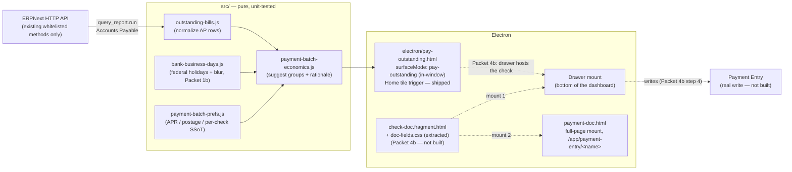

# Implementation plan — Doc Pay skin: economic batching of outstanding Bills (OI-138 / OI-161)

> **Working plan (temporary).** `docs/implementation-plan-YYYY-MM-DD.md`
> When this tranche's durable facts live in HANDOFF / OI status / CHANGELOG, **delete this file**.
>
> **Started:** 2026-09-03 · **Does not supersede** `implementation-plan-2026-07-29.md` (Simplified /
> OI-086), which stays open in parallel. (Nav instrumentation `implementation-plan-2026-08-19.md`
> closed 2026-09-05 — spine folded into HANDOFF § Navigation spine.)
> **Repo:** `erpnext-ui-app` · **Museum:** `~/agent-harness/erpnext/doc-shell/open_items.md`
> **Primary OIs:** **OI-138** (Doc Pay skin: outstanding Bills grouped by vendor + payment date —
> brainstorm 2026-08-25) · **OI-161** (Payment batching economics: postage + daily interest vs due
> dates — discovery 2026-08-29). **Sibling context (not in scope, do not build):** OI-129 (list
> return/scroll — explicit no-build until Vanilla dogfood felt), OI-135 (Bill "already paid" JIT
> PE — shipping separately), OI-139 (applied-payments table on submitted Bill — shipping
> separately), OI-064 G (in-doc "Pay Bill" button — museum backlog, unbuilt).

---

## How to handle cross-architecture dogfood (copy into every new dated plan)

> **Template for future plans:** Keep this section near the top of every
> `docs/implementation-plan-YYYY-MM-DD.md`. It is process SSoT for the *working*
> tranche — not for museum `open_items.md` (that inbox stays long-lived discovery).

Cross-surface dogfood (Bill + PO + IR + chrome/nav in one message) strains the
LLM harness when treated as one blob. Prefer **error classes / architecture
families**, not a single mega-diff.

### Intake (before code)

1. Sort 5zorro feedback into **architecture families**.
2. Log under **Dogfood residuals** below. **Do not** reopen Done batches from prior plans.
3. **Do not** dump mid-workflow triage into museum `open_items.md`.
4. Prefer class language in residual rows.

### Execute (one family per slice)

1. Gather context for **one** family only.
2. Surgical fix + sibling/variant check.
3. **Self-critique** (class fixed vs symptom patched).
4. Unit tests for pure logic + `npm test` green.
5. Checkpoint the residual row; then the next family.

### Closeout (before deleting this plan)

1. Append durable **decisions** via `~/agent-harness/scripts/append-decision.sh`.
2. Update museum **OI status** (OI-138, OI-161) — set `done` or note what promoted.
3. **Delete** this dated plan; open a **new** dated plan for the next tranche.

---

## Goal (this tranche)

1. Close the **research gap** OI-161 named ("likely not first-class for this math in Vanilla") with
   a concrete Vanilla inventory — done below in **Packet 0**, so Packet 1+ builds on facts, not a
   guess.
2. Ship a **pure, tested** economics helper (`paymentBatchEconomics`) that takes outstanding-Bill
   data + a cost model and returns suggested batches with an auditable rationale string — no ERP
   writes.
3. Ship a **Doc Pay skin v1**: outstanding Purchase Invoices grouped by vendor + due date, with a
   suggested-batch chip (expand to show the math). **Suggestion only — clerk still drives the
   actual pay action** (existing Vanilla Payment Entry / `Pay Bill` escape hatch); no auto-submit.
4. Leave the **write path** (Payment Entry / Payment Order creation from a chosen batch) as a named
   stretch packet, not required to close this tranche.

> **Gate (5zorro 2026-09-03):** none of this is reviewable against real data until sample data
> exists that actually exercises batching — "a vendor with a bill with 1 payment due every day for
> 3 months." **Packet G** below builds that fixture and is a **prerequisite to dogfooding** Packets
> 1–4 (pure unit tests can proceed in parallel against hand-built fixtures; the live Doc Pay skin
> cannot be judged without it).

Architecture unchanged: **Electron shell → HTTP → unmodified ERPNext**. This tranche adds one pure
module and one new Doc-skin surface; no new ERP-side code (Clean Core — we call existing whitelisted
methods only, never patch `apps/frappe` / `apps/erpnext`).



---

## Packet 0 — Vanilla research (closes OI-161 bullet 5)

> Confirms/extends OI-161's "likely not first-class for this math in Vanilla" hypothesis with
> concrete schema/controller reads (`docker exec frappe_docker-backend-1` browse, 2026-09-03).

| Vanilla mechanism | What it actually does | Gap vs OI-161's economic-batching ask |
|---|---|---|
| **Accounts Payable** report (`erpnext/accounts/report/accounts_payable/`) | Read-only ledger: outstanding Purchase Invoices per supplier, ageing buckets, group-by voucher/party/terms. Shares an engine (`ReceivablePayableReport`) with Accounts Receivable. | No selection/action affordance; no cost model; you read it, then hand-build Payment Entries elsewhere. This is our **data source**, not a suggestion engine. |
| **Payment Schedule** (child table on PI, `payment_schedule` doctype) | Per-installment `due_date`, `discount_date`, `discount_type`, `discount`, `discounted_amount`, `outstanding`. | Early-payment discount data **exists** but nothing surfaces "pay these N by Friday to capture $X" anywhere in the UI. |
| **Payment Order** (`erpnext/accounts/doctype/payment_order/`) | The closest thing to a "check run / ACH run / wire run": create against a `Company Bank Account`, then **manually** pick already-created, already-submitted `Payment Entry` or `Payment Request` rows via a `map_current_doc` picker (filtered by bank account + `payment_order_status = Initiated`). Submitting flips referenced docs to `Payment Ordered`. Rows carry `supplier`, `amount`, `mode_of_payment`, `bank_account` — grouping-by-mode is a **native field**, but nothing suggests *which* payments belong in a run. | Batching mechanism only, no suggestion logic, and it operates **downstream** of Payment Entry — clerk must already have created individual PEs before a run can be assembled. |
| **Mode of Payment** (`type` = `Cash \| Bank \| General \| Phone`) | No structured ACH/Wire/Check distinction — that's just whatever the company names the Mode of Payment record. | Fine to build on (Payment Order Reference already keys off `mode_of_payment`), but confirms there's no built-in per-channel cost (postage/fee) field — OI-161's cost model has nowhere to live in Vanilla. |
| **Bank Account** / **Bank** doctypes | `Bank Account`: `iban`, `bank_account_no`, `branch_code`. `Bank`: `swift_number`. | No ACH routing-number field distinct from account no.; international-wire SWIFT lives one level up on `Bank`. Adequate for *display*, not a gap this tranche needs to close. |
| **Payment Reconciliation** / **Process Payment Reconciliation** | Matches *already-existing* unallocated payments/JEs against invoices for one party. | Different job entirely (bookkeeping cleanup, not forward-looking "what should I pay"). Not a building block here. |
| Accounts **Payments** dashboard (workspace) | 4 number cards (Total Outgoing/Incoming Bills/Payments) + AR/AP ageing charts + bank balance. | Informational only, no drill-to-batch. Not a building block here. |

**Conclusion:** OI-161's hypothesis holds. Nothing in Vanilla computes "combine these bills into one
payment because postage saved > float lost." The **Accounts Payable report** is the right read-only
data source (reuse its engine over HTTP rather than re-deriving ageing/currency math ourselves —
Clean Core: call the existing report, don't reimplement it). Everything past that point — grouping,
economics, suggestion — is new product surface, matching what 5zorro asked to research.

---

## Baseline (honest — 2026-09-03)

| Area | State |
|---|---|
| Doc Pay skin | **Not started.** `src/home-tiles.js` has `pay-bills` / `checks` tiles that deep-link straight to a blank `/app/payment-entry/new` — no list, no suggestions. |
| Bill due-date / payment-schedule plumbing | **Exists** — `src/bill-due-date.js`, `src/bill-payment-schedule.js` already read/write `payment_schedule` rows (`due_date`, multi-installment sync) on the single-Bill Doc skin. New work should reuse these shapes, not invent a second `due_date` convention. |
| Bill "already paid" (OI-135) | **Shipping separately** — JIT Payment Entry on Submit for card-at-entry Bills. Orthogonal: that's Bills paid *at entry*; this tranche is Bills **already submitted and outstanding**. |
| Applied-payments table (OI-139) | **Shipping separately** — read-only PE list on a submitted Bill. Orthogonal (single-Bill view vs cross-vendor batch view). |
| Cost-model prefs (APR / postage / per-check) | **Do not exist anywhere** — new SSoT, this tranche. |
| Multi-installment sample data | **Does not exist** — `ops/sample-data/seed_corpus.py::_normalize_pi_dates` unconditionally clears `payment_schedule` and flattens every seeded Bill to a single 30-day due date. Zero bills in the sandbox today have more than one due date. **Packet G** fixes this for one dedicated fixture. |
| Doc-skin Payment Entry | **Does not exist** — `DOC_SKIN_INDEX` (`src/lens-context.js`) only has `workflow-home` / `bill` / `po` / `receipt`. Payment Entry is Vanilla-only today (`/app/payment-entry/new`), and the doctype is shared by both AP (`payment_type: "Pay"`) and AR (`"Receive"`) flows. 5zorro decided (2026-09-04): **two entry points this tranche — Home tile AND a new Doc-skin Payment Entry form, AP only.** Rejected as anchors: the **Payments workspace** (bleeds AR ageing/reports into what should be an AP-only tool; AR gets its own doc skin later) and the **Payment Entry list/"Find" view** (it's an audit tool over already-created payments, not a bill-selection decision surface). **Refined 2026-09-05:** the PE anchor splits by route — `isNew` → dashboard, named record → check/ACH document — and "AP only" is now a *default*, not a shell scope limit; see Packet 4b. |

---

## Packet G — Sample-data gate (blocking; 5zorro 2026-09-03)

> Do this **before** Packet 1's IPC wiring is worth dogfooding. Packet 1–3's unit tests can use
> hand-built fixtures and don't strictly need this, but nobody can look at the real Doc Pay skin
> and judge the batching math without it — 5zorro named this the primary gate.

### Business rule

"A vendor with a bill with 1 payment due every day for 3 months" — one Purchase Invoice, one
`payment_schedule` row per calendar day, ~90 rows, so the suggested-batch output (weekly-ish
groups) is visually obvious against a flat list of 90 individual due dates.

### Why today's seed can't show this

`ops/sample-data/seed_corpus.py::_normalize_pi_dates` runs on **every** seeded Purchase Invoice:

```python
doc.due_date = add_days(getdate(posting), 30)
if hasattr(doc, "payment_schedule"):
    doc.set("payment_schedule", [])
```

So all ~25 existing sample Bills get a single flat 30-day due date and an **empty**
`payment_schedule`. This must change for **one** new fixture without touching the other seeded
Bills — other OIs' dogfood already depends on the existing 25 (OI-054 bill-ref, OI-131 vendor
activity ranking, the OI-149/153/154 AP fixtures) staying exactly as they are.

### Confirmed against the ERP controller (2026-09-03 read of `accounts_controller.py`)

- `set_payment_schedule()` only auto-generates rows `if not self.get("payment_schedule")` — if we
  populate the child table **before** `doc.insert()`, our rows are left alone.
- `validate_payment_schedule_dates()` **throws on duplicate `due_date`s** within one doc's schedule
  — daily rows are fine (each is a distinct calendar day) but confirms this fixture couldn't have
  used, say, 90 rows all due "in 30 days."
- `validate_payment_schedule_amount()` requires `payment_schedule` rows' `payment_amount` to sum to
  `grand_total` (within field precision) — design the fixture so this is exact, not rounded.

### Design

Two fixtures, same shape, different scale — 5zorro wants small-dollar and larger-dollar runs to
both be dogfoodable (a flat $0.78+$0.05 fee matters a lot at $50/day and should matter ~nothing at
$2,500/day; seeing both side by side in one Accounts Payable pull is itself a check on Packet 2's
economics, not just a UI fixture).

| Piece | Small (`SUP-DAILY`) | Large (`SUP-DAILY-LG`) |
|---|---|---|
| Supplier | `SUP-DAILY` — "SAMPLE Vendor Daily Payrun." | `SUP-DAILY-LG` — "SAMPLE Vendor Daily Payrun (Large)." |
| One Purchase Invoice | `qty: 90`, `rate: 50.00` → `grand_total = 4500.00` exactly. | `qty: 90`, `rate: 2500.00` → `grand_total = 225000.00` exactly. |
| `payment_schedule` | 90 rows, row *i*: `due_date = posting_date + i days`, `payment_amount = outstanding = 50.00`. | Same cadence, `payment_amount = outstanding = 2500.00`. |
| Expected Packet 2 behavior | Batches into ~13 weekly groups (fee savings beat float cost at this scale). | Should **not** batch — float cost on $2,500/day swamps a $0.83 fee even at `groupWindowDays: 7`. Confirms the economics helper isn't just batching everything, it's actually pricing the tradeoff. |

Both fixtures: `invoice_portion = 0` (amounts set directly, no percentage math); header `due_date` =
**last** schedule row's date (`bill-payment-schedule.js::headerDueDateFromPaymentSchedule` "last row
wins" convention — reuse, don't invent a second rule); must land `docstatus=1` so the full balance
stays outstanding across all 90 rows (Accounts Payable report only sees submitted invoices).

**Parked, not this packet** (5zorro 2026-09-05): 30 bills on one check (stress-tests Packet 2's
per-group bill count, not its per-vendor scale) and applying credits in lieu of payment (a different
data shape — credit notes / negative outstanding, not another `payment_schedule` row). Both are
real Packet-2-adjacent stress tests once the basics are proven; do not build either into Packet G.

Optional, propose separately: 2–3 of either fixture's 90 rows also carrying `discount_type` /
`discount` / `discount_date`, so Packet 2's discount-capture branch has one live fixture too, not
only unit-test fixtures. **Confirm with 5zorro before adding** — the daily shape alone already
answers this packet's ask; don't grow scope unasked.

### Code changes

| File | Change |
|---|---|
| `src/sample-data/corpus-plan.js` | New `appendPaymentBatchFixture(docs, ctx)`, called alongside `appendApDogfoodFixtures`. Builds **both** `SUP-DAILY` and `SUP-DAILY-LG` supplier + PI specs, each carrying an explicit `paymentSchedule: [{ dueDate, amount }, …]` array and a `dogfoodScenario` (`"oi161-daily-payrun-small"` / `"-large"`). Bump `SAMPLE_TAG` (`ui-app-sample-v2` → `v3`) — existing convention: shape change ⇒ new tag, `--reset` drops the old one. |
| `ops/sample-data/seed_corpus.py` | In `_normalize_pi_dates` (or a guard just before it runs): if `spec.get("paymentSchedule")`, append those rows onto `doc.payment_schedule` and set `doc.due_date` to the last row's date **instead of** the existing wipe-and-flatten path. Every other Bill keeps today's behavior byte-for-byte. |
| `tests/corpus-plan.test.js` (existing suite) | Extend: plan includes both suppliers; each schedule has 90 rows on 90 consecutive distinct calendar days; `payment_amount` sum equals `grand_total` exactly for each. |

### Exit

`CONFIRM_SAMPLE_SEED=1 npm run seed:sample -- --reset` produces two submitted Purchase Invoices —
`SUP-DAILY` (90 × $50) and `SUP-DAILY-LG` (90 × $2,500) — each with 90 daily `payment_schedule` rows
and nothing paid. 5zorro can open the Accounts Payable report today (pre-Packet-1) and already see
180 distinct due-date rows across the two vendors; once Packet 1–2 land, this pair is what proves
the batching math scales correctly (small batches, large doesn't) on the real Doc Pay skin.

---

## Packet 1 — `src/outstanding-bills.js` (pure: normalize ERP rows)

### Business rule

The Doc Pay skin must show ERP truth, not a shell-side re-derivation of ageing/outstanding math.
Fetch via the **existing Accounts Payable report** (`frappe.desk.query_report.run` with
`report_name=Accounts Payable`, `filters={company, party_type: "Supplier"}`) over HTTP — same engine
Vanilla's report page uses. This module's job is only to **normalize** that report's row shape (and,
per-row, the linked Purchase Invoice's `payment_schedule` for discount dates) into a flat shape the
economics helper can consume.

### Shape

```js
/**
 * @typedef {{
 *   invoice: string,          // Purchase Invoice name (report's voucher_no)
 *   supplier: string,         // report's party (shared AR/AP engine field name)
 *   postingDate: string,      // ISO
 *   dueDate: string,          // ISO — header due_date (last installment; bill-payment-schedule.js convention)
 *   invoiced: number,         // bill's own grand total (report's invoiced) — needed for % discount math, not just display
 *   outstanding: number,      // party currency
 *   currency: string,
 *   discountDate?: string,    // ISO — earliest payment_schedule row with a discount, if any
 *   discountAmount?: number,  // absolute $ saved if paid by discountDate
 * }} OutstandingBillRow
 */
```

Captured a real row from the live sandbox (`bench execute frappe.desk.query_report.run`, `SUP-DAILY`,
2026-09-05) to confirm the report's actual field names rather than guessing — `voucher_no`, `party`,
`posting_date`, `due_date`, `invoiced`, `outstanding`, `currency`, `age`, plus ageing `range0..range5`
this packet doesn't need. Matches the typedef above field-for-field.

### How

| Piece | Job |
|---|---|
| `normalizeAccountsPayableRow(reportRow)` | Map report column names → `OutstandingBillRow` (pure; tested against the captured sample above). |
| `attachDiscountWindow(row, paymentScheduleRows)` | Pure merge: earliest-`discount_date` schedule row with `discount_type`/`discount` set → `discountDate`/`discountAmount`. **Found while implementing, not in the original sketch:** `discount_type: "Percentage"` computes off the bill's **`invoiced`/grand total**, not the schedule row's own `payment_amount` — confirmed against ERPNext's own `payment_entry.py::apply_early_payment_discount` (`discount_amount = grand_total * discount/100`). A naive `payment_amount * discount/100` would be wrong for any multi-installment bill (right by coincidence for single-installment ones, which is why this is easy to miss). `discount_type: "Amount"` uses `discount` directly, no total needed. Reuses the same `payment_schedule` shape as `bill-payment-schedule.js` — do not invent a second convention. |
| IPC (electron layer, Packet 4) | `get-outstanding-bills`: report run + per-invoice `payment_schedule` fetch. **Not the single batched `get_list` originally planned** — found live (2026-09-05) that `frappe.client.get_list` on a child doctype strips every field but `name`. Fetches each invoice's full document via `frappe.client.get` instead (child table comes fully populated with the parent), concurrently via `Promise.all`, not sequentially. |
| `explodeInstallments(row, paymentScheduleRows)` | **Added 2026-09-05 — found by running Packet 2 against the real Packet G fixture, not anticipated in the original sketch.** The Accounts Payable report is invoice-level: one row per Purchase Invoice, header `due_date` (last installment), full remaining `outstanding`. Fed straight through, `SUP-DAILY`'s 90 daily installments collapsed to **one** $4,500 bill due 2026-10-20 — the fixture's entire point (90 distinct payable obligations to batch) was invisible to Packet 2. Any real multi-installment Bill has this same problem, not just the fixture. When ≥2 unpaid schedule rows carry **distinct** `due_date`s, this returns one `OutstandingBillRow` per unpaid installment (its own `due_date`, its own `outstanding`, its own `discountDate`/`discountAmount` computed from *that row's* `discount_type`/`discount` — **not** `attachDiscountWindow`'s "earliest across the whole invoice," which stops being correct once installments are split apart). Returns `null` when there's only one distinct due date (the common case — nothing to explode); caller falls back to `attachDiscountWindow(row, paymentScheduleRows)` as before, unchanged. |
| `buildOutstandingBillRows(reportRow, paymentScheduleRows)` | New convenience entry point combining the three above — this is what Packet 4's IPC layer should call per invoice, not the individual pieces, so nobody forgets the explode step. |

**Typedef change:** every `OutstandingBillRow` now also carries `installmentKey: string` — unique per
row (`invoice` for a non-exploded bill, `${invoice}#${n}` for an exploded installment). `invoice`
alone stopped being a safe unique key once one invoice can produce several rows; `installmentKey` is
what Packet 2's `bills: string[]` output uses, `invoice` is still there whenever code needs the real
ERP document name back (e.g. a future write path).

### Tests

`tests/outstanding-bills.test.js` — normalize the captured Accounts Payable report row fixture above
(both `SUP-DAILY` and `SUP-DAILY-LG`); discount-window attach with 0/1/many schedule rows; Percentage
vs. Amount discount-type math (Percentage against `invoiced`, not `payment_amount`); multiple
discount-bearing rows picks the **earliest** `discount_date`; missing discount fields → `undefined`,
not `0` (so the economics helper can tell "no discount offered" from "$0 discount"); explode with 1
distinct due date → `null` (no-op); explode with many distinct due dates → one row per unpaid
installment with its own amount and its own discount fields; paid-off installments (`outstanding: 0`)
excluded; run against the real captured `SUP-DAILY` fixture (90 installments) end to end.

---

## Packet 1b — `src/bank-business-days.js` (pure: "not a processing day" calendar)

### Why this exists (5zorro 2026-09-05)

Packet 2's math as drafted below is silently wrong whenever a raw `dueDate` lands on a weekend or a
bank holiday — it would suggest paying on a Sunday. 5zorro's framing: this doesn't need to be
regulatory-grade (not a bank), **"federal holidays plus some blur… call it good enough."** Locked
scope, explicitly not more:

- **Weekends** (Sat/Sun).
- **US federal holidays** (same 11-day list the Federal Reserve uses for ACH/wire processing) —
  computed algorithmically per year (fixed dates + "nth weekday of month" dates), with the standard
  observed-date shift (Saturday holiday → observed Friday, Sunday holiday → observed Monday). No
  external data file, no year-by-year maintenance.
- **Blur days** — 5zorro's two named examples, both are "a Friday adjacent to a holiday that creates
  a long weekend": the Friday **before** a Monday holiday, and the Friday **after** a Thursday
  holiday (e.g., the day after Thanksgiving). One rule covers both: a Friday is a blur day if the
  following Monday is a holiday **or** the preceding Thursday was a holiday.
- **Direction of the shift, locked (5zorro 2026-09-05): earlier, always, as the default.** Real
  vendor terms vary a lot more than a shared calendar can encode — some vendors hand out late fees
  freely, some are relationship-based and forgiving, some may define terms like "net 30 but expect
  7 days of postage" (or 2 days if the remittance address changes) or "next business day after net
  30." **None of that granularity exists in Vanilla's data model** — confirmed directly (MariaDB
  read-only, 2026-09-05): `Payment Term.due_date_based_on` and `.discount_validity_based_on` each
  have exactly 3 options, all pure calendar-day/month arithmetic ("Day(s) after invoice date,"
  "…after the end of the invoice month," "Month(s) after…") — no business-day or holiday concept.
  `Supplier.payment_terms` is only a Link to a Payment Terms Template; the one free-text field
  (`Purchase Invoice.terms`, a Text Editor) is print boilerplate, not data anything could safely
  parse for a postage buffer. There's no mechanical way to pick up per-vendor nuance even if we
  wanted to — so absent real per-vendor detail, always default to the conservative shift: pay the
  last valid business day
  **before** the due date, never later. This is also consistent with the tranche's existing rule
  ("never batch past the earliest due date… never pay late to save postage"). Per-vendor overrides
  (a postage-buffer days field, a "next business day after" flag) are a real future extension point
  once that data is worth capturing — **not this packet**; `effectivePayByDate()`'s signature should
  stay open to an optional per-call override later without a breaking change, but nothing to build
  now.

### Shape

```js
/** @param {number} year @returns {Set<string>} ISO dates, observed-date shifted */
export function usFederalHolidays(year) { ... }

/** @param {string} isoDate @returns {boolean} */
export function isWeekend(isoDate) { ... }
export function isBankHoliday(isoDate) { ... }   // weekend OR federal holiday
export function isBlurDay(isoDate) { ... }       // Friday adjacent to a holiday long weekend

/**
 * Last valid processing day on or before isoDate. If isoDate is already a normal business day
 * (not weekend/holiday/blur), returns it unchanged.
 * @param {string} isoDate
 * @param {{ includeBlur?: boolean }} [opts]  // default true
 * @returns {string} ISO date
 */
export function effectivePayByDate(isoDate, opts) { ... }
```

### Tests

`tests/bank-business-days.test.js` — known federal holidays for a couple of concrete years
(including an observed-Friday and an observed-Monday case); a Sunday due date shifts to the prior
Friday (unless Friday is itself a holiday, then Thursday); the two named blur cases (Friday before a
Monday holiday, Friday after Thanksgiving) both shift; `includeBlur: false` disables blur but keeps
weekend/holiday shifting (so a future prefs toggle is possible without a second implementation).

### How Packet 2 uses it

Every bill's `dueDate` **and** `discountDate` (if present) run through `effectivePayByDate()` before
any grouping/float math — the whole algorithm operates on effective dates, not raw ERP dates. This
also fixes the pay-alone baseline: a bill due on a Sunday already has a nonzero "cost of paying on
time" even with zero batching, and every downstream comparison needs that baseline right.

---

## Packet 2 — `src/payment-batch-economics.js` (pure: the OI-161 math)

### Business rule (locked intent, from OI-161)

> Minimize **all-in** payment cost (fees + lost float), not due-date slavishness when economics
> favor one check. Batch adjacent small payments when combined per-payment savings exceed lost
> float; never batch past the **earliest** due date in the group (never pay late to save postage).

Concretely, for a same-vendor group of bills with due dates within a configurable window:

- **Per-payment cost** = flat fee (e.g. $0.78 postage) + `perTransactionCost` (e.g. $0.05/check),
  charged once **per payment made**, not per bill.
- **Float value of delaying** one bill from its own due date to an earlier **group** pay date =
  `amount * (apr / 365) * daysEarlier` — this is a **cost** of batching early (paying before you
  have to), not a savings. Batching only wins when `feesSavedByBatching > floatCostOfPayingEarly`.
- Suggested pay date for a group = **earliest** *effective* due date among the batched bills, run
  through Packet 1b's `effectivePayByDate()` (never later — that would risk lateness on the earliest
  one, and never a weekend/holiday/blur day either).
- A discount window (Packet 1's `discountDate`/`discountAmount`, also effective-date-shifted)
  **always wins** its own comparison first: if `discountAmount > floatCostOfPayingEarly(thatBill,
  discountDate)`, suggest paying that bill alone by `discountDate` regardless of batching (discount
  capture is usually the largest single lever — do not let batching logic bury it).

### Signature

```js
/**
 * @param {{
 *   bills: OutstandingBillRow[],
 *   perPaymentFee: number,      // e.g. 0.78 (postage) + 0.05 (per-check) pre-summed by caller
 *   apr: number,                // e.g. 0.09
 *   groupWindowDays?: number,   // default 7 — max span between due dates to consider batching
 * }} args
 * @returns {{
 *   groups: Array<{
 *     supplier: string,
 *     bills: string[],          // installmentKeys (Packet 1) — unique per row, not always == invoice name
 *     payOn: string,            // ISO — earliest due date in group, or a discount date if that wins
 *     totalAmount: number,
 *     feesSaved: number,        // vs paying each bill separately
 *     floatCost: number,        // $ lost by paying earlier than each bill's own due date
 *     netBenefit: number,       // feesSaved - floatCost (+ any discount captured)
 *     rationale: string,        // human-readable, e.g. "3 bills batched: $0.83 fee saved vs $0.31 float cost = $0.52 net"
 *     reason: "batch" | "discount-capture" | "pay-alone",
 *   }>,
 * }}
 */
export function paymentBatchEconomics(args) { ... }
```

`reason: "pay-alone"` rows still appear (single-bill "groups") so the UI has one uniform list to
render — no separate "ungrouped" branch.

### Tests

`tests/payment-batch-economics.test.js` — table-driven:

1. Three $300 same-vendor bills due Mon/Tue/Wed, small per-check fee → batches to one group,
   `payOn` = Monday, `netBenefit > 0`.
2. Same bills but `apr` high enough that float cost of paying Tue/Wed's amount early on Monday
   exceeds fee savings → **does not** batch (each stays `pay-alone`).
3. A bill with a discount window where `discountAmount` beats batching → `reason: "discount-capture"`,
   `payOn = discountDate`, independent of any group it could otherwise join.
4. Different suppliers never batch together (group key is always `supplier`).
5. Bills outside `groupWindowDays` of each other don't batch even same-vendor.
6. Empty `bills` → `{ groups: [] }`. Single bill → one `pay-alone` group, `netBenefit: 0`.
7. A single bill due on a Sunday → `payOn` is the prior Friday (Packet 1b), with `floatCost` computed
   against that shifted date, not the raw Sunday.
8. Three bills whose raw earliest due date is a bank holiday → group `payOn` lands on the correct
   prior business day, not the holiday.

This is the packet the whole tranche hinges on — **auditable math**, per HANDOFF's "auditable how"
rule. 5zorro should read the test table before this packet is called done; the `rationale` string
is user-facing, not just a log line, so its wording is part of the review, not an afterthought.

---

## Packet 3 — `src/payment-batch-prefs.js` (pure: cost-model SSoT)

### Business rule

`apr`, postage, and per-check cost are **company/user judgment calls**, not ERP truth — they don't
exist as fields anywhere in ERPNext (confirmed in Packet 0). Store them the same way other shell-only
prefs live today (pattern: `lens-prefs.js` — per-scope JSON in `userData`, not a new ERP doctype;
Clean Core stays intact since nothing is written to ERP).

### Shape

```js
/** @typedef {{ apr: number, postage: number, perCheck: number, groupWindowDays: number }} PaymentBatchPrefs */
export const DEFAULT_PAYMENT_BATCH_PREFS = Object.freeze({
  apr: 0.09, postage: 0.78, perCheck: 0.05, groupWindowDays: 7,
});
```

| Piece | Job | Status |
|---|---|---|
| `src/payment-batch-prefs.js` | `DEFAULT_PAYMENT_BATCH_PREFS` + `validatePaymentBatchPrefs(prefs)` → `{ ok, errors }` (every invalid field reported, not just the first — a settings UI can highlight each one) + `mergePaymentBatchPrefs(raw)` → always a complete `PaymentBatchPrefs`, each field falling back to its own default independently (mirrors the existing `normalizeHealthRemediationPrefs` pattern in `health-remediation.js`, not a new convention). Pure. | **Done 2026-09-05.** |
| Electron: `userData/payment-batch-prefs.json` read/write | Same pattern as `main.js`'s existing `loadPrefs()`/`savePrefs()` for `lens-prefs.json` — raw `fs` read, `JSON.parse` in a try/catch, `mergePaymentBatchPrefs()` to sanitize. | **Done** — `paymentBatchPrefsPath()` + load/save in `main.js`, `get-payment-batch-prefs` / `set-payment-batch-prefs` IPC (confirmed 2026-09-05; this table was stale, landed alongside Packet 4 as expected but never updated here). |
| UI | Small settings affordance on the Doc Pay skin itself (not a separate settings page this tranche) — edit the three numbers inline, see suggestions re-flow live. | **Done** — `⚙ Assumptions` panel (`#prefs-panel`) on `pay-outstanding.html`. |

### Tests

`tests/payment-batch-prefs.test.js` — defaults pass validation; validate rejects non-object,
negative, NaN, `Infinity`, and missing fields (reporting *all* invalid fields at once, not just the
first); zero is a legitimate value, not rejected; merge yields exactly the defaults with no
overrides, a partial override still yields a complete `PaymentBatchPrefs`, an individually-invalid
field falls back to its own default without discarding the rest of the object, unknown extra fields
are ignored, non-object input falls back to full defaults, and the frozen default is never mutated.

---

## Packet 4 — Doc Pay skin v1 (`electron/pay-outstanding.html`)

### Business rule

Vanilla's "New Payment Entry → Paid Amount > 0 → Get Outstanding Invoices → allocate" is
per-supplier and forward (start from a blank PE, then find invoices). 5zorro's job is the other
direction: start from **what's owed**, grouped by **vendor + due date**, with the batching
suggestion already computed — pick a group, decide to act, **then** go pay it (v1: hands off to
existing Vanilla Payment Entry / Payment Order as the write path — see Packet 5).

### How

### Entry points (locked 2026-09-04, **hosting revised 2026-09-05**)

**Home tile, in-window** — not a popup. First shipped (2026-09-05) as a standalone `BrowserWindow`
(same pattern as `open-mockup`); 5zorro's stated vision for the whole app overruled that the same
day: **"stay in window unless I spawn a second all-purpose window."** Reworked to a persistent
`WebContentsView` + a new `surfaceMode: "pay-outstanding"`, wired through `place()`/`showHome()`'s
exact existing pattern (`showPayOutstanding()`) — the same mechanism Bill/PO/Receipt already use,
just without going through `DOC_SKIN_INDEX` (this surface is triggered directly by the Home tile,
not by intercepting a Vanilla navigation, so it doesn't need route-matching). This is now recorded
as **HANDOFF.md invariant 6** ("One window") — durable, not tranche-scoped.

5zorro also named the durable **doc-skin scope boundary**: doc skins live only on the transaction-
entry forms (PO, IR, Bill, Payment Entry, SO, Sales Invoice, Quotation, Journal Entry) — never
spread across list views, reports, or other Vanilla surfaces. Also now HANDOFF invariant 6.

**Where this leaves the Payment-Entry anchor (Packet 4b):** 5zorro's refined vision (2026-09-05) —
Payment Entry becomes the *real* anchor, with an optional **filter by vendor or invoice** narrowing
the same flow view down to one vendor, and a write surface on a suggested group that creates the
actual Payment Entry (folding Packet 5's write path in). The vendor/invoice filter already shipped
on today's Home-triggered surface (`#filter-input`, vendor-scoped — matching by vendor name or one
of its invoice names still shows that vendor's whole bill set, since slicing it would break
`paymentBatchEconomics`' grouping math). **Second pass, same day:** that write surface is a
**check / ACH document in a bottom drawer**, not a modal — see Packet 4b, which supersedes the
"anchor + modal" sketch. **Not yet done:** anchoring to Payment Entry (today's trigger is still the
Home tile only), the check document, and the write path.

| Piece | Job |
|---|---|
| Home tile | `pay-outstanding` tile in the **Vendors** group (`src/home-tiles.js`), route `/pay-outstanding` (shell-only marker, not a real `/app/...` path — `SHELL_ROUTE_TILE_IDS` documents the exception). Existing `pay-bills` / `checks` tiles stay as-is (direct-to-blank-PE escape hatch); this is additive. |
| List (top level) | Grouped by **vendor**, sorted by earliest due date. **Three-stage Sankey** (added in dogfood): Invoice (blue, structural) → Payment Schedule installment (Payment date / Amount, sortable by date or invoice) → Proposed payment (Suggested date / Suggested amount, colored by `paymentBatchEconomics`' reason). Sticky page header, sticky column-label header, sticky per-vendor header. |
| Filter | `#filter-input` — vendor name or invoice name substring, vendor-scoped (see above). |
| Suggested-payment node | Click to expand: `rationale` string + bill-by-bill breakdown. Collapsed by default; **no auto-select, no auto-submit** (OI-161 rule 5, "suggestion only v1"). |
| Prefs affordance | `⚙ Assumptions` panel (Packet 3) — editing APR/postage/per-check/window re-runs `paymentBatchEconomics` client-side, no re-fetch. |
| Empty state | No outstanding bills → "Nothing outstanding"; no filter matches → "No vendor or invoice matches …". |

### Explicitly NOT this packet

- No checkbox multi-select → "Pay Now" action. No Payment Entry / Payment Order creation yet — that's
  Packet 4b's check-document drawer, folded in there rather than Packet 5 standing alone.
  Clicking a group today only deep-links to a blank Vanilla Payment Entry (`Open Payment Entry
  (Get Outstanding Invoices) →`) or the Bill itself — a link-out, not a shell-side write.
- No list-scroll-position/return-to-list work (that's **OI-129**, explicitly parked until 5zorro
  dogfoods this and feels the same pain — do not pre-solve it here).
- Anchoring to the actual Payment Entry form (today's only trigger is the Home tile), the check /
  ACH document, and the write path — **Packet 4b**, still not built; see its updated shape below.

### Tests

Layer 1: none new beyond Packets 1–3 (this packet is presentation over already-tested pure data).
Layer 3: `scaffold-pay-outstanding.spec.js` — Home tile → `surfaceMode` flips to `"pay-outstanding"`
→ real vendor cards/groups/ribbons render from live ERP data → rationale expands on click → Home
button (chrome toolbar) returns `surfaceMode` to `"home"`. Driven via `execInView`, like every other
persistent view (WebContentsView is not a reliable Playwright Page — e2e/GOTCHAS.md #1).

---

## Packet 4b — Payment Entry as a document (AP first, AR-ready) — architecture locked 2026-09-05

> **Supersedes** the 2026-09-04 "anchor + modal" sketch. Same goal, better shape: the write surface
> is a **check / ACH document**, not a modal over a form, and it is built as a **reusable fragment**
> so AR can mount the same thing later without a second implementation.

### Business rule (refined 2026-09-05, second pass)

5zorro's framing: *"I really don't like the database vanilla form entry view. When I look at a
payment, I want to see a document — a check, or an ACH trace document."* The Doc skin for Payment
Entry is therefore a **document rendering**, not a relabelled form:

- **Draft** → inputs laid out *on* a check / ACH advice.
- **Submitted** → a printed check / completed trace document (read-only wash, no input chrome).
- The dashboard (Packet 4's three-stage flow) stays the surface for *choosing* what to pay; the
  check document is the surface for *paying* it.

### Why the document metaphor is the native shape (evidence, not preference)

Read of `erpnext/accounts/doctype/payment_entry/payment_entry.json` (2026-09-05). The AP field set
maps ~1:1 onto a physical check using ERPNext's **own** fields — several of which are already
computed and read-only, so the document gets them free:

| Check element | Existing PE field | Note |
|---|---|---|
| Pay to the order of | `party` / `party_name` | |
| Amount box | `paid_amount` | |
| Written-amount line | `in_words` / `base_in_words` | already computed, read-only — **free** |
| Check no. / date | `reference_no` / `reference_date` | ERPNext labels these literally **"Cheque/Reference No"** |
| Bank block | `bank`, `bank_account_no` | read-only, auto-filled from `bank_account` — **free** |
| Drawing account | `paid_from` | |
| Memo line | `remarks` | |
| Remittance stub | `references` (child table) | the tear-off listing what is being paid |

ACH/wire reuses the same document with a different face: `party_bank_account` + `bank_account` +
`mode_of_payment`, `reference_no` as trace number, `reference_date` as effective date.

**AP-visible field count after dropping** sales-tax template, tax withholding, auto repeat,
accounting dimensions, internal-transfer branches, and the target/source exchange-rate pairs
(single currency): **~12–15 inputs.** Genuinely document-shaped, not form-shaped.

**Sections rendered only when non-empty** (5zorro 2026-09-05 — "I have only seen taxes and charges
on bank payments when there is a chargeback fee or wire fee"): `taxes` (`Advance Taxes and Charges`)
and `deductions` (`Payment Deductions or Loss`). Confirmed rare for AP. Same *earned* principle the
toolbar already applies to lens tabs — a check with a permanently empty tax table reads as a form
again. Do not render an empty one.

### Why not `doc-form.html`

`doc-form.html` is a persistent SPA reconfigured by `docFormUiPayload()`, assembled by
`scripts/assemble-doc-form-html.js` from three fragments, and templated for **header + item grid +
taxes**. Payment Entry has no item grid.

**Open question, deliberately not answered here** (5zorro 2026-09-05, and *not* an invariant): what
`doc-form.html`'s real scope axis is — "documents that touch inventory," or something narrower like
"AP line-item documents." Its three tenants (Bill/PO/IR) are *both* AP-side and item-bearing, so the
current data cannot separate the two hypotheses. One counter-signal for the narrower reading:
`doc-wash.css` already ships **`--stamp-buy` and `--stamp-sell`** tokens, so the wash layer was
designed expecting a selling side. Evidence, not proof. Resolve it in the AR doc-skin discussion,
not here — PE is out of `doc-form.html` under *both* readings, so this tranche is not blocked on it.

### Structural decision: one fragment, two mounts

The check/ACH document is built as **`electron/check-doc.fragment.html`**, never as markup inside
`pay-outstanding.html`. `scripts/assemble-doc-form-html.js` is already exactly this pattern (three
fragments → one HTML, plus a chrome-id-collision guard). Extend it (or add a sibling script) to
inject the same fragment into two hosts:

| Mount | Host | Purpose |
|---|---|---|
| **Drawer** | bottom of `electron/pay-outstanding.html` | pay a suggested batch without losing sight of it |
| **Full page** | `electron/payment-doc.html` (new persistent view) | open an existing PE from Recent / Submitted / OI-139's applied-payments list |

One document, two mounts, no duplicated markup. This is also what keeps AR cheap later: an AR mount
is a third host over the same fragment, not a second implementation.

### CSS: consolidate before building (own commit, first)

**Correction (found 2026-09-05, pre-dev pass — the picture below is more tangled than the first
architecture pass assumed):** there are not two files here, there are **four**, and one pair is
already a live duplicate, not a clean single source:

| File | Holds | Shared today? |
|---|---|---|
| `electron/doc-wash.css` (151 lines) | design tokens, wash/hatch/stamp layers, read-only `data-wash-source` styling. Already defines `--wash-payment: #e6f5f0` / `--accent-payment: #009E73`. | **Yes** — `doc-form.head.html`, `home.html`, `pay-outstanding.html` all link it |
| `electron/doc-skin.css` (713 lines) | toolbar, dirty-pill, commit-gate, Link picker (`.link-wrap`/`.link-dd`), source modal, address modal | **Yes**, but doesn't hold what the check document wants — no `.card`/`.field`/`.cols` |
| `electron/doc-form.head.html`'s inline `<style>` (241 lines) | `.card`, `.field`, `.cols`, `.taxes-table`, `.wrap`, `.banner`, money classes — the component CSS the check document actually wants | **No** — inlined, but see next row |
| `electron/bill-dashboard.css` (645 lines) | **Byte-identical duplicates of ~32 selectors** from the row above (confirmed `.field` and `.card` diff clean) plus real Bill-dashboard-only rules (`.doc-status-badge` tones, due-date badges). Despite the name, it's linked unconditionally from `doc-form.head.html` — PO/IR load it too. | Linked, and because it loads **last** in `doc-form.head.html`'s `<link>` order, **it wins every duplicated selector** — the inline `<style>` block's copy is dead code wherever they overlap. Traced to `8a10b6e` ("unified doc-form shell") never being fully deduped after the fragment split. |

So "extract `.card`/`.field`/`.cols` out of `doc-form.head.html`" is not the mechanical, single-source
move the first pass described — there are already two copies in the render path, and the one that
actually renders (`bill-dashboard.css`) is named for the wrong doctype. **Step 1 is a three-way
consolidation, not a lift-and-shift:** fold the inline `<style>` block's copy and `bill-dashboard.css`'s
duplicate into one new shared **`electron/doc-fields.css`** (component classes only — leave
`bill-dashboard.css`'s genuinely Bill-only rules where they are, or rename the file once the dup is
gone), linked by `doc-form.head.html` and the new check hosts. **Verify computed styles unchanged**
on Bill/PO/IR after the merge (the duplicate has been silently authoritative — deleting the "wrong"
copy by instinct, i.e. the inline one, happens to be correct here, but check don't assume). **Its own
commit, before any check work**, so a regression is unambiguous. Note `doc-wash.css:76` already
reaches into doc-form's `.bill-section` class names — the layering is mildly leaky already; this
consolidation should not add a fourth file to that leak.

The read-only wash system (`doc-wash.css:102-141`, `data-wash-source`) already does the
"auto-filled from elsewhere, style it differently" job the check's bank block needs, and the
draft→submitted state change is the same mechanism.

### The drawer: cheap, with one real cost

In-page bottom drawer on `pay-outstanding.html`. Precedent already in the same file: `#prefs-panel`
toggled by `⚙ Assumptions`. No new view, no new `surfaceMode`, no new preload.

Chosen over the previously-planned **modal** deliberately: a modal occludes the batch being paid,
which is the dashboard's entire point. The drawer keeps the flow view visible while the check is
filled.

| Consideration | Handling |
|---|---|
| **Dirty-gate (the real work)** | The drawer holds an unsaved check, making `pay-outstanding` the **first non-`doc` surface that can be dirty**. Confirmed precisely (2026-09-05): `gateDirtyThen()` (`main.js:3256`) calls `isDocLensSurface()` (`main.js:497-499`, literally `return surfaceMode === "doc"`) first and takes the `"not on Doc lens"` fast path — no snapshot, no prompt — for any other surface. `showHome()` and `showPayOutstanding()` both call `gateDirtyThen()` assuming that's safe. Today it is; once the drawer can hold input it silently discards a half-written check on Home/Recent/anywhere. `isDocLensSurface()` needs to become aware of a dirty drawer too, not just `surfaceMode === "doc"`. |
| **Height** | A check is ~2.4:1 (wide/short) and suits a bottom drawer; ACH is taller. Drawer must be expandable toward full height, not a fixed strip. Targets stay README's 1080p full / 4K half–quarter. |
| **Existing PEs** | A drawer cannot serve "open this payment" — that is the full-page mount above, which is why the fragment split is not optional. |
| **Writes** | Still the only genuinely new risk in this tranche. Reuse OI-135's existing JIT-Payment-Entry write pattern rather than inventing a second one; Clean Core means existing whitelisted methods only. |

### Route anchoring: `isNew` is the discriminator

The check document resolves the A-vs-B tension recorded on 2026-09-04 (one route could not resolve
to two skins without reading a **field**, `payment_type`, which `lookupDocSkin` cannot see). With a
document *and* a dashboard, each route has a natural target — and the split is **route-level**:

| Route | Doc target | Why |
|---|---|---|
| `/app/payment-entry/new` (`isNew: true`) | **dashboard** | nothing chosen yet — this is the decision surface |
| `/app/payment-entry/<name>` (`isNew: false`) | **check document** | you are looking at one payment |

`routeInfo()` already returns **`isNew`** as a first-class field (`src/route-info.js:47`,
`isNewDocRecord`, which also handles Frappe's `/new` → `new-payment-entry-…` promotion). No new
parsing, no field read at hijack time, no load-then-swap, and therefore none of the G6
`currentRoute`-lag race. `chrome-state.js` `docTabState()` stays one-Doc-per-page and needs **no
change**.

### AP vs AR at `/app/payment-entry/new` (5zorro 2026-09-05)

**Problem:** `/new` carries no `payment_type`, so an AR clerk opening it would land on the AP
dashboard. 5zorro's framing: *"separation of duties causes A/R to be separate from A/P, so 90% of
the time a User will use the one according to their payment entry function."*

**Decision — remember the direction, the same way lenses are remembered.** New pure module
`src/payment-direction-prefs.js`, mirroring `src/lens-prefs.js` field-for-field (persisted
`userData/payment-direction-prefs.json`, sanitized on read, immutable `remember…` returning a new
object). Not a new convention — the same one.

Resolution order at `/app/payment-entry/new`, strongest signal first:

| # | Signal | Source | Beats |
|---|---|---|---|
| 1 | **Tile intent** | The Home tile already encodes it: `pay-bills` + `checks` mean Pay, `receive-pay` means Receive — all three route to `/app/payment-entry/new` today (`src/home-tiles.js`). The intent exists and is simply not carried; carry it. | everything |
| 2 | **Remembered direction** | `payment-direction-prefs.json` — last direction this user actually completed | default |
| 3 | **Default `"Pay"`** | this tranche builds AP; Receive falls through to Vanilla until AR ships | — |

Plus an always-visible **direction toggle on the surface itself** (Paying / Receiving), which also
*writes* the pref — so a mis-guess costs one click and never recurs. No settings page.

For `/app/payment-entry/<name>` the pref is **irrelevant**: read the real `payment_type` off the
document. The pref exists only to resolve `/new`'s genuine ambiguity.

While AR is unbuilt, direction `"Receive"` means **stay in Vanilla** (no Doc tab offered) rather
than showing an AP check — consistent with "lens tabs are earned per page."

### Tests

- `tests/payment-direction-prefs.test.js` — defaults to `"Pay"`; remembers per user; invalid/absent
  file falls back to the default without discarding valid neighbours; tile intent beats a stored
  pref; `remember…` is immutable (mirrors `tests/lens-prefs.test.js`).
- `tests/lens-context.test.js` (extend) — `payment-entry` + `isNew: true` → dashboard target;
  `isNew: false` → check-document target; direction `"Receive"` → no Doc tab while AR is unbuilt.
- Layer 3 `scaffold-payment-doc.spec.js` — drawer opens from a suggested group and closes; leaving
  the surface with a dirty drawer prompts (the gate above); full-page mount renders an existing PE.
- No new Layer 1 tests for the document markup itself — presentation over already-tested data,
  same rule as Packet 4.

### Sequencing (each step independently reviewable)

1. **Extract `doc-fields.css`** from `doc-form.head.html`. Reversible, no behavior change.
   **Done 2026-09-05.**
2. **`check-doc.fragment.html`** + assemble-script wiring + **drawer mount** on the dashboard,
   read-only first (render a chosen batch as a check; no writes). **Done 2026-09-06.**
3. **Dirty-gate** extension for a dirty `pay-outstanding` surface. **Done 2026-09-06.**
4. **Write path** in the drawer (reusing OI-135's pattern) — own commit, own review.
   **Built 2026-09-06; live-sandbox verification blocked pending 5zorro's go-ahead (see closeout).**
5. **Full-page mount** `payment-doc.html` + `isNew` route anchoring + direction prefs.

Do 1–3 before 4. Do not block 1–2 on the write path.

**Step 1 closeout (self-critique, per this plan's own process template) — the mechanical move
turned out to hide a real bug, twice:**

- The "two files, one clean" picture this section originally described was wrong (see the CSS
  section's own correction above): `bill-dashboard.css` already duplicated ~96 of
  `doc-form.head.html`'s 114 component rules, and 6 of those duplicates had **silently drifted**
  from the inline copy (`.addr-grid`, `.line-actions`, `.line-tabs`, `.money-stack`, `th`/`td` —
  real property differences, not formatting noise). Resolved by treating `bill-dashboard.css`'s
  version as authoritative for every shared key (it loaded last, so it was what actually
  rendered) rather than "fixing" it to match the stale inline copy — the "don't match buggy code"
  problem, just aimed at CSS instead of logic.
- **Caught before landing, not after:** a first construction pass extracted 2 of the 114 rules
  (`.addr-grid` at a 900px breakpoint, `.cols` at 720px — both genuinely present in
  `doc-form.head.html`'s own `<style>` block, missed on manual read since an early grep pass
  filtered out lines starting with `@`) **without their `@media` wrapper**, which would have made
  both permanently single-column at every viewport width, not just narrow ones — a real, shippable
  regression on Bill/PO/IR. Found by parsing the generated file back and diffing every rule against
  its authoritative source (114/114 exact matches required, not spot-checked), not by visual
  inspection. Fixed before any file was written to the repo.
- Verification method: every one of the 114 moved rules diffed byte-for-byte (whitespace-normalized)
  against its authoritative source both before writing and after; the 96 rules left behind in
  `bill-dashboard.css` diffed to confirm zero were altered. `tests/doc-skin-css.test.js` extended
  with a regression guard for the exact `@media`-loss class of bug, plus positive coverage that
  `doc-fields.css` defines the vocabulary Packet 4b's check document needs. `npm test`: 933 pass
  (was 928 immediately prior; the other 5 are from a concurrent unrelated commit).
- Net: `doc-fields.css` (new, 114 rules) is the single source for `.card`/`.field`/`.cols`/
  `.taxes-table` and friends; `doc-form.head.html`'s inline `<style>` block is gone (replaced by
  one `<link>`); `bill-dashboard.css` keeps its ~156 genuinely Bill-only rules
  (`.doc-status-badge` tones, due-date badges, etc.) and nothing else. `doc-form.html` regenerated
  via `scripts/assemble-doc-form-html.js` (no manual edits to the generated file).

**Step 2 closeout (2026-09-06) — presentation over already-tested data, so the new logic is
thinner than Step 1's, but one real design question surfaced during the build, not before it:**

- **`src/check-doc-view.js`** (pure) maps a `PaymentBatchGroup` (Packet 2) + the `OutstandingBillRow[]`
  it came from into `{ payTo, amount, payOn, memo, stubRows }` — installmentKeys resolved back to
  invoice/dueDate/outstanding for the remittance stub. The header `amount` is always the group's own
  `totalAmount`, never re-summed from the stub rows, so the two can't silently drift if rounding ever
  differs between them. `src/check-doc-mount.js` is the DOM side (paint/close), null-safe like
  `item-col-resize.js` — a repaint before the drawer exists must never throw.
- **What the check does *not* show, on purpose:** `in_words`, check no., and the bank block are
  fields ERPNext computes when a real Payment Entry is saved — this is a proposal, no PE exists yet,
  so inventing them would show data that doesn't exist. The fragment renders "Assigned when saved"
  instead of a blank, so the gap reads as intentional rather than as a bug. Taxes/deductions sections
  are structurally present (`check-doc-taxes` / `check-doc-deductions`, `hidden` by default) but never
  populated at this step, for the same reason — "sections render only when non-empty" is trivially
  true for a proposal today and becomes real once Step 4 creates an actual document.
- **Structural decision confirmed while building, not just planned:** the fragment (`check-doc.
  fragment.html`) carries no inline styles or script — `check-doc.css` and `check-doc-mount.js` are
  separate files a second host can link/import without copying markup, matching the "one fragment,
  two mounts" intent named when the architecture was locked. `pay-outstanding.html` is now itself a
  generated file (`scripts/assemble-pay-outstanding-html.js` from the new `pay-outstanding.src.html`
  + the fragment) — the same pattern `assemble-doc-form-html.js` already established, not a new one.
- **Drawer vs. rationale popup — a real interaction gap found by driving it, not by reading the
  code:** the existing rationale popup does not close when a different group's popup opens, so
  clicking "Preview as check" on a second group while the first's popup is still open is visually
  busy (both a stale rationale card and the freshly-repainted drawer on screen at once). Confirmed via
  a headless Playwright pass against the built file with a mocked `window.erpPayOutstanding` — not a
  regression from this step (the popup-stacking behavior predates it), so left alone rather than
  fixed under this step's scope; worth a look if 5zorro notices it while dogfooding.
- Verification: `tests/check-doc-view.test.js` (9 tests — passthrough, stub ordering independent of
  bills-array order, single-source-of-truth amount, missing-installmentKey fallback, empty-group,
  junk input, no-mutation) and `tests/check-doc-mount.test.js` (null-safety in bare Node, no DOM).
  Headless Playwright smoke (scratch harness, not committed): mocked two vendors (a 2-bill batch and
  a 1-bill pay-alone group), opened the drawer from each, confirmed payee/amount/date/memo/stub rows/
  stub total all match the source group and repaint correctly on a second open (no stale data from
  the first), taxes/deductions stay hidden, close works, zero console errors. Screenshot confirmed
  the drawer renders below the flow view rather than over it, matching the no-modal decision above.
  `npm test`: 1041 pass (was 1030 immediately prior). `tests/html-reachability.test.js`'s OI-067 gate
  required curating the two new HTML files (`pay-outstanding.src.html`, `check-doc.fragment.html`) —
  working as intended, same as the interactable-inventory gate catching Packet T's new buttons.

**Step 3 closeout (2026-09-06) — the guard rail built ahead of the road it protects:**

- Confirmed precisely, matching the architecture note above: `gateDirtyThen()` (`main.js:3256`
  when this was written 2026-09-05, still there) took the `"not on Doc lens"` fast path for any
  `surfaceMode` other than `"doc"`. Left alone, Step 4's write path would ship a drawer that can
  hold real input with **no** protection on day one — the fast path would silently discard it on
  Home, Recent, or any ERP nav. Building the gate now, before there is anything to lose, means
  Step 4 lands already covered instead of needing its own follow-up hardening pass.
- **New pure predicate**, not a special case bolted onto the Doc one: `shouldGateSurfaceNavigation
  (currentSurfaceMode, targetSurfaceMode, dirty)` in `src/dirty-gate.js` — gates only when the
  current surface *is* the target *and* it's dirty, so a dirty flag left over from a surface the
  user already left by some other path can never block unrelated navigation. Generic on purpose:
  a second such surface (the eventual full-page `payment-doc.html` mount, or any future
  independently-dirtyable surface) reuses this rather than getting its own predicate.
  `tests/dirty-gate.test.js` +5 (target/dirty combinations, stale-flag-after-surface-change,
  junk-value coercion).
- **Main-process wiring**: `payOutstandingDirty` (module-level, mirrors `dirtyState`'s existing
  shape), `isPayOutstandingDirtySurface()` next to `isDocLensSurface()`, and one new branch inside
  `gateDirtyThen()` — every existing call site (`showHome`, `showPayOutstanding`, ERP nav, opening
  a Bill/PO/IR) is protected through this single choke point, no call site touched individually.
  `set-pay-outstanding-dirty` IPC + `erpPayOutstanding.setDirty(dirty)` preload method — Step 4's
  write path calls this on input/save/discard; nothing calls it yet, since nothing is editable.
- **No in-page commit-gate for this surface** (that's Doc's own machinery, driven by a real Save
  action the drawer doesn't have until Step 4) — `gatePayOutstandingDirtyThen()` is a plain native
  `dialog.showMessageBox` with two buttons, "Discard and continue" / "Stay". No "Save" option: there
  is nothing to save yet, and offering one would lie about what the button does.
- **Verification went further than this plan's own Doc-lens native fallback ever got**: e2e/GOTCHAS.md
  #7 notes Playwright cannot intercept `dialog.*` — true, so the new test in
  `e2e/scaffold-pay-outstanding.spec.js` stubs `dialog.showMessageBox` itself via `app.evaluate`
  before driving the real flow against the real sandbox ERP: clean drawer → Home proceeds, zero
  dialog calls; dirty drawer → Home prompts, "Stay" keeps the surface, "Discard and continue"
  proceeds *and* clears the flag (confirmed by reopening and leaving again with no further prompt —
  a stale dirty flag surviving a resolved gate was the exact failure mode this exists to prevent).
  Both `scaffold-pay-outstanding.spec.js` tests pass under `xvfb-run` against the live sandbox.
  `npm test`: 1046 pass (was 1041).
- Not built, deliberately: no in-page prompt UI for this surface (would need its own design pass,
  and there's no Save action yet to make "Save and continue" meaningful) — a native dialog is the
  honest tool for what exists today. Revisit if Step 4's write path makes a plain dialog feel thin.

**Step 4 closeout (2026-09-06) — 5zorro caught the plan's own assumption before code was written:**
*"this is a group of unrelated invoices instead of 1 invoice, and the payment date is not the
same... you may need to extract shared tools then use the tools in a more-complete doc-skin."*
Reading `createJitPaymentEntryForBill` (`main.js`, OI-135) confirmed both points precisely rather
than by inspection alone:

- It calls ERPNext's own `get_payment_entry` with a single `(dt, dn)` — there is no server call
  for "one payment covering N unrelated invoices." It then hardcodes `pe.references[0]`
  (assumes exactly one reference row) and sets `reference_date` from the **Bill's own
  `posting_date`** (`dirtyState.doc`, the currently-open Bill) — meaningless for a batch, which
  has no single open Bill and whose payment date is `payOn`, a value `payment-batch-economics.js`
  computed independently (often not any one bill's own due date). Neither assumption survives a
  multi-invoice, economics-driven batch. Confirmed via `payment_entry.py:2885` (`get_payment_entry`
  signature) that it **does** accept a `reference_date` parameter directly — cleaner than the
  existing function's post-insert patch, and lets ERPNext's own `apply_early_payment_discount`
  evaluate the discount window against the *actual* intended pay date instead of implicitly today.
- **The shared tool extracted**: `src/payment-entry-batch.js` — `mergeSinglePaymentEntries(peDocs)`,
  pure. The shell calls `get_payment_entry` once per **unique invoice** in the batch (not once per
  installmentKey — an exploded multi-installment invoice already returns every unpaid installment
  in one call via ERPNext's own Payment Terms Template logic, so calling it twice per invoice would
  duplicate reference rows), letting ERPNext compute each invoice's own account / currency /
  exchange rate / discount correctly, then merges the results here rather than reimplementing that
  computation shell-side. Validates `company`/`party_type`/`party`/`payment_type`/`paid_from`/
  `paid_to`/both currencies match before merging — a real mismatch fails loudly with a named field,
  never silently. `tests/payment-entry-batch.test.js` — 13 tests: multi-doc merge, single-doc
  passthrough, an already-multi-reference draft merged alongside another, six independent mismatch
  rejections (one per matched field), empty/junk input, float-safe summing, no input mutation.
- **Also extracted, scoped narrowly**: the ~50-line `reasonFrom` error-flattener duplicated inside
  `createJitPaymentEntryForBill`'s injected script is now `PE_REASON_FROM_JS`, one `String.raw`
  constant interpolated into the new batch functions. **Deliberately not** also retrofitted onto
  the two already-shipped single-invoice functions (`createDraftPaymentEntryForBill` OI-139,
  `createJitPaymentEntryForBill` OI-135) — same text, but touching two working, already-dogfooded
  financial-write paths to dedupe error strings is a needless regression risk for this change to
  take on. `insertAndSubmitPaymentEntry(pe)` (the identical insert+submit tail
  `createJitPaymentEntryForBill` already had) is genuinely shared — the new batch path calls it;
  the existing single-invoice path is untouched, still doing its own inline version.
- **New write UI**: the check-doc drawer's static "Assigned when saved" bank placeholder (step 2)
  is now real controls — Mode of Payment + Pay-from-account Link pickers (`mountLinkPicker`,
  `searchLink`, reused verbatim from the Bill doc-skin, zero new search logic) and a Check no. /
  Reference input. `doc-skin.css` linked into `pay-outstanding.html` for the `.link-wrap`/`.link-dd`
  styles this needed — checked for bare-element selectors first (none; class-scoped throughout,
  safe to add). New `main.js` IPC: `pay-outstanding-search-link` (thin — reuses the existing
  `searchLink()` function verbatim, the same one Bill/PO/IR already call) and
  `create-batch-payment-entry`.
- **Intra-page dirty gap found while building, not in the original architecture note**: Step 3's
  gate protects *leaving* Pay Outstanding, but switching the drawer to a *different* group while
  mid-edit is a same-surface action the main-process gate never sees. Added a local `drawerDirty`
  mirror in `pay-outstanding.src.html` (kept in sync with `setDirty` IPC) that confirms before an
  in-drawer group switch or Close would silently discard typed input — the same failure mode Step 3
  exists to prevent, one level down.
- **Verification, two tiers**: (1) a headless Playwright pass with a fully mocked bridge covering
  the whole UI contract — write fields render; submit blocked with no IPC call when no account is
  picked; Mode of Payment / Account link pickers search and pick correctly; dirty tracking follows
  every input; a successful submit's IPC payload was inspected directly and confirmed correct
  (`bills` = exactly the batch's own rows, `intent.payOn` = the **group's** date, not any bill's own
  due date); switching to a different group while dirty triggers the confirm, and the new group
  paints with write inputs reset; zero console errors. (2) A **live** run against the real sandbox
  ERP was attempted next — querying real data first found ALPINE SUPPLY carrying several
  $424 invoices due 2026-08-20, a genuine multi-invoice batch candidate — but the actual submit
  step (creating a real, submitted Payment Entry) was **blocked by the permission classifier** as a
  real financial write. Not overridden. **5zorro's call whether to run it** — see chat.
- `npm test`: 1060 pass (was 1046).

**Cascade-order correction (5zorro 2026-09-06) — a same-day reversal, recorded so it isn't
rediscovered as a mystery later.** Immediately after Step 1 landed, a pass here swapped
`bill-dashboard.css` to load *before* `doc-fields.css`, reasoning that a future accidental
redefinition should lose the cascade tie rather than win it — treating **any** override as a bug to
prevent, backed by a comprehensive test that failed on any redefinition either direction. **This was
the wrong rule.** 5zorro's actual framing: *"the bill dashboard is allowed to have different rules
because it is more than just a doc-skin for a transaction entry, it is also the dashboard for
individual voucher-packet controls (the bill receipt and entry is the final act showing approval).
Therefore, the bill-dashboard.css is supposed to load last — that is the business logic."*
`bill-dashboard.css` overriding a shared rule on purpose is a **feature** of its capstone role, not
a hazard to engineer away. Reverted same day:

- Link order restored: `doc-wash.css`, `doc-skin.css`, `doc-fields.css`, **`bill-dashboard.css`
  last** — matching the pre-Step-1 order and the actual business rule.
- The blanket "never redefine" test removed — it enforced the wrong invariant (would have blocked
  every legitimate override decided below). `tests/doc-skin-css.test.js`'s link-order test now
  documents *why* bill-dashboard.css loads last instead of asserting it can't override anything.
- What's still true and still matters: **undocumented** drift (a rule diverging because nobody knew
  there were two copies) is a review/authorship gap, not a cascade-order one — no automated guard
  replaces it; the discipline is deciding and recording each divergence on purpose, which is what
  the six decisions below are.

**The six drifted rules — decisions (5zorro 2026-09-06), against the `docs/mockups/
doc-fields-dry-audit.html` review:**

| Selector | Decision | Resulting state |
|---|---|---|
| `.addr-grid` | Bill's 3-column layout (`minmax(0,1fr) auto minmax(0,1fr)`, `align-items: center`) is nicer than PO/IR's — make it the shared default, drop bill-dashboard.css's copy. | **Already true, no change needed.** `doc-fields.css` has carried this exact value since Step 1 (bill-dashboard.css's version was already taken as authoritative there); `bill-dashboard.css` has had zero base `.addr-grid` rule since Step 1. Its `.bill-section .addr-grid textarea` / `.addr-grid textarea,` rules are separate, more-specific child-selector refinements, not duplicates of the base rule — untouched, unaffected. |
| `.money-stack` | The 2px `#64748b` border is nicer — make it the shared default, drop bill-dashboard.css's copy. Believed Bill-only. | **Already true, no change needed** — same situation as `.addr-grid`. **Correction to the premise:** `.money-stack` is *not* Bill-only — `class="money-stack"` renders from both `bill-shell.fragment.html` (`data-testid="bill-money-stack"`) and the shared PO/IR `doc-form-body.fragment.html` (`data-testid="doc-money-stack"`). It already is the default for everything, which is what was asked for, just on a different premise than stated. |
| `th, td` / `th` (bare, unscoped) | **Deferred — needs more context, then revisit.** | Govern the items-grid table (`#panel-items`) shared identically by Bill and PO/IR (not the taxes table, which has its own more-specific `.taxes-table th`/`.taxes-table td`, untouched, not part of this drift). The `overflow: hidden; text-overflow: ellipsis; white-space: nowrap` bill-dashboard.css carries was added in `26d7b15` ("fixed-layout column sizing on items, taxes, payments") to keep resized columns from breaking on long cell text — a deliberate tradeoff at the time, not an accident, but 5zorro wants to revisit "what 'best' means" for the items-grid look before deciding. **No code change.** `doc-fields.css` keeps the current (truncating) value, matching what's rendered for Bill **and** PO/IR all along — this was never Bill-only, so there is no "Bill vs PO" difference live today to choose between; whatever "PO version" is being pictured predates `26d7b15`. |
| `.line-actions` | **Deferred — no context yet.** | No code change; current shared value stands. |
| `.line-tabs` | **Deferred — no context yet.** | No code change; current shared value stands. |

**`th`/`td` — deeper finding (5zorro 2026-09-06): the real bug isn't a CSS choice at all.**
5zorro's next observation: *"There are item numbers longer than the input box and wrapping does not
increase row height. This is a real problem with both doc-skin default and bill-dashboard default."*
Confirmed against the actual renderers, not assumed:

- `item_code` renders as a plain `<input type="text">` in **both** grids — `src/bill-form-page.js`'s
  and `src/doc-form-page.js`'s item-row builders each fall through to the same generic
  `<td><input … value="${escapeHtml(val)}" /></td>` branch, independently implemented per doctype.
- **A native `<input>` cannot wrap its value text under any CSS** — this is browser behavior, not a
  stylesheet property. `white-space`/`overflow`/`text-overflow` on the `<td>` or the input change how
  overflow is *clipped*, never whether it wraps, so the row can never grow to fit a long code no
  matter which `th`/`td` value (this file's or bill-dashboard.css's) is active. That's exactly why
  5zorro sees the same symptom under both — the drifted CSS was never the actual constraint for this
  specific column; it was already the wrong axis to be deciding on for `item_code` specifically.
- 5zorro's directional call: **Bill's items table should end up genuinely different from PO/IR's**
  (not just inherit whatever's shared) — consistent with the capstone-dashboard business logic
  already recorded above — but *what* that divergence should be is blocked on this widget question,
  not on picking a `th`/`td` value. **No fix attempted; none asked for ("I don't see a fix right
  now").** Real directions that exist for later, named but not evaluated or decided: ellipsis +
  native `title` tooltip on the input (cheap, no row growth); click-to-edit (read-only wrapped
  `<span>` by default, swap to `<input>` on focus — bigger change, real UX shift); a `rows="1"`
  auto-growing `<textarea>` styled as a single-line input (lets the row genuinely grow, but reworks
  Enter-key/multi-line editing behavior). None of these is which `th`/`td` copy wins — that question
  is now understood to be orthogonal to this bug, not a step toward fixing it.

Residual: revisit `th`/`td`/`.line-actions`/`.line-tabs` once 5zorro has decided what "best" means
for the items-grid table — log under **Dogfood residuals** below when that happens, not before.

### Home tile decisions (5zorro 2026-09-05, third pass — resolved)

**The dedicated `pay-outstanding` Home tile is removed once Payment Entry is a real anchor.**
Not deferred, not kept as a fast path — PE *is* the anchor, so a second door to the same
dashboard is redundant. Removal happens at Packet 4b **step 5** (full-page mount + `isNew`
routing land), not before — the tile is still the only trigger until then. Tracked here so
step 5's scope explicitly includes deleting the `pay-outstanding` tile row from
`src/home-tiles.js`'s Vendors group (and its `SHELL_ROUTE_TILE_IDS` entry), not just adding
the new anchor beside it.

**Tiles do NOT collapse.** 5zorro's framing: Home is a **document-flow / process-flow** map,
not a doctype index — so AP and AR each keep their own "Payment" tile (Vendors group / Customers
group) even though both alias the same underlying `payment_type` on one shared ERP doctype. This
is the tile-level expression of the same principle Packet 4b already applies to the toolbar (AP
and AR are different *processes* sharing one *doctype*, never blurred into one surface). Net
effect on `src/home-tiles.js`: `pay-bills` (Vendors) and `receive-pay` (Customers) stay two tiles,
each supplying the **tile intent** signal Packet 4b's direction-prefs resolution order already
names as the strongest signal (`payment-direction-prefs.js` § resolution order, row 1) — this
decision is what makes that row correct, not just convenient.

**Question raised while answering the above (5zorro 2026-09-05) — checked against the real
controller rather than left as a guess:** can a Payment Entry be created **without** a source Bill
or Sales Invoice? **Yes — confirmed** (read of `payment_entry.py`, 2026-09-05). `references` is a
plain `Table` field, not `reqd`; `validate()`'s chain calls `validate_reference_documents()` and
`validate_allocated_amount()`, both of which open `if not self.references: return`, and
`on_submit()`'s only hard gate is `difference_amount == 0` (trivially true for a fully-unallocated
payment — nothing about reference count). Zero-reference Payment Entries are ordinary ERPNext
usage (advances, deposits without an invoice yet), not an edge case the controller merely
tolerates.

**Conclusion: the Banking group's `checks` tile ("Write Checks" → blank `/app/payment-entry/new`)
is a valid standalone entry point as-is.** No redirect to a "Bill entry, already paid" flow needed
— that would have been solving a problem the controller doesn't have. Closed; no residual row.

---

## Packet 5 (stretch — not required to close this tranche) — the write path

**Update 2026-09-05:** dogfood signal arrived faster than expected — 5zorro wants the write path
folded into **Packet 4b's check-document drawer** (step 4 of its sequencing) rather than kept as an
independent stretch. This section's three options are still the real menu for *how* that drawer
actually writes; keep evaluating them here, just under Packet 4b's umbrella now, not as a separate
later packet.

Only start after Packet 4 has been dogfooded and 5zorro has actually used the suggestions for a few
real payment runs. Options to evaluate then, **not decided now**:

| Option | Note |
|---|---|
| Deep-link into Vanilla Payment Entry `Get Outstanding Invoices`, pre-filtered to the chosen group's bills | Least shell-side risk; Vanilla still owns the write. |
| Shell-side batch Payment Entry creation via `erp-form-bridge.js` (existing Bill→PO/IR bridge pattern) | More Doc-native feel; more surface to maintain; needs its own dated plan. |
| Feed a **Payment Order** (the closest Vanilla "run" instrument, per Packet 0) from a chosen batch | Matches the "check run / ACH run / wire run" framing directly; still needs individual Payment Entries to exist first per Vanilla's `Payment Order` mechanics (Packet 0) — so this only replaces the *batching* step, not entry creation. |

Do not pick one now — this needs its own "how" once there's real dogfood signal on which
suggestions clerks actually act on.

---

## Packet T — Item/tax table readability (5zorro 2026-09-06, architecture locked)

Closes the two "Dogfood residuals" rows below (items-grid look; `item_code` can't wrap).

### Business rule (5zorro's framing, verbatim intent)

> "I don't really care too much about the paper metaphor while I'm in the middle of wrangling a
> table. I want the table to be easy to read/understand with as little fussing with 'user toggles'
> as possible. I want user toggles to be available, sure, but I don't want to have to use them to
> simply read my work."

Two consequences that override earlier design instincts in this file:

1. **Readable is the default state, not a mode you enable.** A width/wrap/density toggle may exist,
   but no toggle may be *required* to read a line you just typed.
2. **The paper metaphor yields inside the line grid.** The document framing still governs the
   header, addresses, totals and notes; it does not govern the items/taxes tables.

### The fact that ordered the work

**While a cell's resting widget is `<input>`, the browser cannot see the data.** An input's intrinsic
width comes from its `size` attribute (default ~20 chars), not from its value. So `table-layout: auto`
would size columns by input defaults rather than content — which is *why* `bill-dashboard.css`
hardcodes px/% column widths today. That is a forced move, not a style choice.

Therefore no automatic sizing strategy (CSS or JS-measuring-the-DOM) can work until a cell renders
its value as real text at rest. Everything else in this packet depends on that, so it goes first.

### Refinement: a display *layer*, not a widget *swap* (decided during implementation)

The obvious reading of "display/edit split" is AG-Grid-style: render a `<div>` at rest and swap in an
`<input>` on focus. Rejected after reading the call sites. The input is the anchor for the link
picker (`item_code`), the calculator overlay (`rate`/`qty`), the per-cell keydown/blur/change
bindings bound in one post-paint loop, and every `data-testid`. Swapping the widget means
re-attaching all of that to elements created on demand, and re-entering the `focusItemCell` retry
dance (`requestAnimationFrame` + `setTimeout`) against elements that may not exist yet.

**What ships instead:** the input never leaves the DOM. Each affected cell gains a sibling text layer
that carries the value as wrappable text and *drives the row height*; the input is absolutely
positioned over it, transparent at rest and opaque on focus.

| | Widget swap | Display layer (chosen) |
|---|---|---|
| Wraps + grows row height | yes | yes |
| Content measurable for auto-fit | yes | yes |
| Existing bindings/testids survive untouched | no | **yes** |
| Link picker / calculator anchoring survives | needs rework | **untouched** |
| `focusItemCell` selector survives | no | **yes** |

Same user-visible outcome; the risk is in CSS rather than in re-wiring six event paths.

**Scope of the layer:** only the *generic text* branch of the row builders — in practice `item_code`,
`description`, and editable allocation text columns. Deliberately **not** `qty`/`rate` (short numeric
values, right-aligned, calculator-anchored), not `Amount`, not the line-meta or read-only `.ro` cells.
Those get wrapping CSS where useful but keep their current single-line structure.

### A1 — full-bleed line sections by default

`.bill-section` is `padding: 12px 14px 14px` inside `.wrap { max-width: 1100px; padding: 16px 18px }`.
Three escalating breakout stops; **A1 ships the third as the default** for the items and taxes
sections only:

| Stop | Mechanism | Gain @1600px |
|---|---|---|
| section edge | `margin-inline: -14px` | +28px |
| wrap edge | also cancel `.wrap` padding | +64px |
| **viewport (shipped)** | `width: 100vw; margin-inline: calc(50% - 50vw)` | **~+500px** |

The negative-margin breakout idiom is already in this codebase (`.bill-section .line-tabs`
uses `margin: -12px -14px 0`), so this is consistent, not novel.

`100vw` includes the scrollbar gutter on some platforms; guarded with a `--bleed` custom property so
the value is defined in one place and can be clamped if jitter shows up in dogfood.

### B — the display layer (the keystone)

Row builder emits, for generic text columns only:

```html
<td class="cell-wrap">
  <span class="cell-text">…full value, wraps…</span>
  <input type="text" data-row data-field … />   <!-- unchanged attrs/testid -->
</td>
```

CSS: `td.cell-wrap { position: relative }`, `.cell-text` in flow with
`white-space: pre-wrap; overflow-wrap: anywhere` (so a long unbroken item code breaks mid-token),
input `position: absolute; inset: 0; opacity: 0`, and `td.cell-wrap:focus-within input { opacity: 1 }`
with an opaque background so it covers the text while editing.

Text/input sync: the text layer is only visible when the input is *not* focused, so mid-edit drift is
invisible; it is refreshed on `input` anyway so a repaint is never required for correctness.

### C — content-driven widths, drag-resize as the override

Only works after B (see "the fact that ordered the work").

- New pure module `src/item-col-widths.js`: min/max clamping, distributing available width,
  auto-fit from measured text widths, and prefs (de)serialization. Injectable `storage` in the
  `doc-wash.js` style — no direct `localStorage` reach from pure code.
- DOM side: a grab handle on each `<th>`'s right edge, pointer capture, writes `col.style.width`
  on the existing `<colgroup>`. Double-click a handle = auto-fit that column.
- **Only explicit overrides persist.** A column the user never dragged stays auto — so the default
  stays content-driven and a stale saved width can never make the table unreadable.

The `<colgroup>` + `table-layout: fixed` already in the markup is exactly the structure resizing
wants: set one `<col>` width, one relayout pass, no per-cell work.

### D — wide-mode ergonomics

- Sticky Line + Item columns (`position: sticky; left: 0`) — matters *more* under A1, because
  wide-by-default means more horizontal scrolling. Today only `.imp-preview thead th` is sticky;
  the items table has no sticky anything.
- Density control (compact/standard/comfortable). This is the one legitimate **toggle** —
  available, never load-bearing for reading.

### Explicitly dropped from the earlier draft of this packet

- **A width toggle with the document as default.** Backwards under the business rule above: full-bleed
  is the default, and the toggle (if built) returns you to narrow.
- **Auto-fit measured from row-model strings via canvas `measureText`, before B.** It was a workaround
  for not being able to measure the DOM; B makes the DOM measurable and costs less than first priced.
- **Airtable-style "don't auto-grow rows, ship a row-height toggle."** That caution only exists
  because an input forces reading and editing through one widget. Under the display layer, cells wrap
  *at rest* and go single-line *while focused* — the one row not wrapping is the row under the cursor,
  so rows do not jump while typing. Auto-growth is correct here.
- **Adopting a grid library** (AG Grid / Handsontable / TanStack / Glide). Weight (AG Grid ~1MB+),
  a visual identity that fights the skin, **Handsontable is not free for commercial use**, and
  third-party components do not unit-test the way the locked Layer-1 gate expects. The pure decision
  function + `colgroup` + fixed layout already covers most of a grid's core.

### Mode visibility (folded in, not a separate rung)

`inp.dataset.navFocus = "1"` is set in nav mode by both page modules and **no stylesheet reads it** —
nav and edit look pixel-identical, so the only way to discover the mode is to press an arrow and see
what happened. That is the "janky up/down/left/right" complaint. Styling `[data-nav-focus]` is ~5
lines of CSS and lands with B (the cell already changes appearance on focus, so the two cues reinforce
rather than compete).

Not changed here: `src/item-table-nav.js`'s state machine. It is pure, tested, and its caret-boundary
rules keep working because `selectionStart` / `selectionEnd` / `value.length` are only read while an
input is focused — which under the display layer is exactly edit mode.

### Shared mechanism, per-doctype specs

Bill and PO/IR have independent row builders (`src/bill-form-page.js`, `src/doc-form-page.js`), so
each change lands twice unless the mechanism is shared. 5zorro's standing intent is that Bill's items
table *should* be allowed to diverge from PO/IR's. Shape that follows: **shared mechanism, per-doctype
column specs** — the same split `BILL_ITEM_COLS` / `PO_ITEM_COLS` / `RECEIPT_ITEM_COLS` already implies.

### Tests

- `item-table-layout.test.js` (53) — clamping, distribution, auto-fit, prefs round-trip,
  override-only persistence, strict numeric coercion.
- `item-col-resize.test.js` (25) — column identity, width policy, wiring into both painters,
  totality on a missing table.
- `doc-skin-css.test.js` — bleed custom property, `.cell-text` / `focus-within` rules, frozen-column
  offsets, and a guard that no density rule may touch `white-space` / `overflow-wrap`.
- The DOM itself stays out of the Layer-1 gate per the locked test strategy; browser behaviour was
  checked with a throwaway Playwright harness (see closeout).

### Closeout — all four steps shipped 2026-09-06

| Step | Commit | Outcome |
|---|---|---|
| pure layer | `57ed926` | `src/item-table-layout.js` — gutter, widths, density, distribution |
| A1 bleed | `7ab1c2f` | lines/taxes span the viewport; header + notes stay in the paper column |
| B display layer | `0230a8b` | cells read as wrapped text at rest; mode became visible |
| C widths | `4b4294f` | measured, distributed, drag-resizable, per-profile overrides |
| D frozen + density | `cb2b458` | leading columns freeze; compact/standard/comfortable |
| taxes | `24c4abe` | the same treatment for the tax grids |

**Measured, at 1600px.** Item column 128px (12% of the paper column) → 188px from the bleed alone →
354px once measured from content. A long item code went from one clipped line to four wrapped lines,
fully visible. Column widths now sum to the panel exactly (1570px), where before the static colgroup
left 335px of dead space. At 700px the grid scrolls and the first three columns hold station.

**Six defects found during the work, all by the harness or the existing gates, not by inspection:**

1. `Number(null) === 0`, so a corrupt stored width became a real 40px column instead of "no value" —
   caught by a junk-input test, fixed with strict coercion. This is exactly the promise the module
   exists to keep, so it now has its own regression block.
2. PO/IR's items table has **no colgroup at all**; under `table-layout: fixed` that gave every column
   an identical share. Step C generates the colgroup rather than assuming one.
3. PO/IR's unsorted header branch emits no `data-sort`, so those columns fell back to the generic
   rule — costing Description its `flex` and leaving the bleed full of dead space.
4. The drag preview was handed `colRuleFor()`'s `{minPx,maxPx}` where the clamp expects `{min,max}`,
   so a drag ignored the column's own ceiling and persisted 495px against a 420px cap.
5. Fixed columns ignored their own header: "PO line" in 54px rendered "PO LI…" — the exact
   unreadability this packet exists to remove. A fixed width is now floored by its header.
6. doc-form's tax headers sort under `data-tax-sort`, not `data-sort`, so every tax column was
   falling back to a label slug and losing its sizing rule.

Plus one regression caught by measurement rather than by eye: `min-height` on a content-box text
layer stacks with its padding, which grew *every* short row by ~11px (40 → 51). `box-sizing:
border-box` restored it.

**Not done, deliberately.** `src/item-table-nav.js`'s state machine is untouched — it is pure,
tested, and its caret-boundary rules keep working because `selectionStart` / `selectionEnd` /
`value.length` are only read while an input is focused, which under the display layer is exactly
edit mode. The "arrows never leave edit mode, only Enter/Tab/Escape do" simplification discussed on
2026-09-06 (which would *delete* code) was not attempted; it is a behaviour change, not a
readability fix, and wants its own dogfood signal.

---

## Dogfood residuals

*(New tranche — nothing carried over into this file. Related-but-out-of-scope OIs are listed in the
header block above; do not fold their status into this table.)*

| Family | Status | Notes |
|---|---|---|
| Items-grid table look (`th`/`td`/`.line-actions`/`.line-tabs`) | **Answered by Packet T (2026-09-06)** | "Best" got decided by the readability brief, not by picking a winner between the two drifted values: the grid is content-driven and full-bleed by default (Packet T A1/B/C). The `th`/`td` truncation pair stops mattering for the text columns, which no longer rely on cell-level clipping. `.line-actions`/`.line-tabs` still untouched — never had a reported problem. |
| `item_code` cell doesn't wrap long codes, row height can't grow | **Fixed by Packet T step B (2026-09-06)** | Not a CSS/th-td question: `item_code` is a native `<input>` in both `bill-form-page.js` and `doc-form-page.js`'s row builders, and inputs never wrap value text regardless of stylesheet. Resolved with a display layer (wrappable text sibling drives row height; input overlays it) rather than the widget swap or textarea options originally named — see Packet T. |

---

## Out of this tranche

- Packet 5 (write path) — stretch, explicitly deferred pending dogfood.
- The Doc-skin Payment Entry form's actual **build** (Packet 4b) — the **decision** to anchor there
  (Home tile + PE form, AP first) is locked (2026-09-04) and its **architecture** is locked
  (2026-09-05: check/ACH document, one fragment + two mounts, `isNew` route split, direction prefs);
  the build is deferred to its own follow-up dated plan once Packet 4 is dogfooded.
- The **AR** mount of the check document — Packet 4b's fragment split exists so AR is a third host
  over the same document, not a second implementation, but no AR surface is built here. Direction
  `"Receive"` stays in Vanilla for now.
- Resolving what `doc-form.html`'s real scope axis is ("touches inventory" vs "AP line-item
  documents") — an open question for the AR doc-skin discussion, deliberately **not** an invariant
  and not load-bearing for this tranche (PE is out of `doc-form.html` under either reading).
- Per-vendor payment-terms granularity (postage-buffer days, "next business day after net 30,"
  remittance-address-dependent buffers) — Vanilla has no field for any of this (Packet 0); Packet 1b
  defaults every vendor to the same conservative earlier-shift until real per-vendor detail is worth
  capturing (locked 2026-09-05, see Packet 1b).
- OI-129 (list return/scroll) — explicit no-build until 5zorro dogfoods this tranche's list.
- OI-135 / OI-139 — shipping on their own tracks; only touched here by reusing shared shapes
  (`payment_schedule`), not by changing their code.
- Any change to `Mode of Payment` / `Bank Account` schema (SWIFT/ACH routing fields) — Packet 0
  confirmed the gap but closing it would mean asking clerks to fill in more Vanilla setup, which is
  a product decision for 5zorro, not this tranche.
- Multi-currency batching (grouping bills across different `currency` values) — Packet 2's tests
  assume single-currency-per-group; cross-currency netting is a separate, harder economics problem.

---

## Validate

```bash
cd ~/erpnext-ui-app && npm test && npm start
```

**Git:** commit on `alpha`; only **5zorro** pushes.
