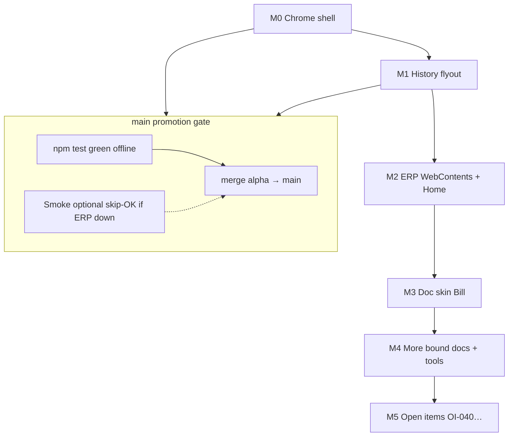

# Implementation plan — museum parity with a test-first cycle

> **Status:** Draft for maintainer review (2026-07-15).  
> **Repo:** `erpnext-ui-app` (`alpha` day-to-day → `main` when gated green).  
> **Museum (reference only):** `~/agent-harness/erpnext/doc-shell/` — do not extend.  
> **Process:** ADR-0002 (unit tests first; dogfood ≠ CI; 5zorro pushes GitHub).

## Goal

Rebuild toward the **useful surface area** of the museum Doc Workflow shell, without copying its brittle Electron/Playwright loop. Each promote-to-`main` is a **small, tested vertical** the public repo can stand behind.

Architecture stays: **Electron shell → HTTP → unmodified ERPNext** (vanilla browser still works for troubleshooting).

## Development cycle (every milestone)

1. **Pure modules first** under `src/` with `tests/` (no Electron required).
2. Thin Electron / UI wiring that *calls* those modules.
3. `npm test` green on `alpha`.
4. Manual smoke only for “does the window feel right?” — never as the only proof.
5. Maintainer merges `alpha` → `main` and pushes when the milestone exit criteria pass.

When unit tests complain, **fix the design or the code before adding features** — that complaint *is* the schedule for the next work, not a reason to dogfood harder.

---

## Milestone 0 — Top chrome + live ERPNext (first `main` candidate)

**Intent:** Useful app chrome **and** a real ERPNext session (login / Desk) so Home and Vanilla are testable.

| Control | Behavior |
|---------|----------|
| **Home** | Shows local Home pane (Open Desk / Login). Toolbar Home returns here anytime. |
| **Vanilla** | Shows live ERPNext (`/desk` — login form if logged out). Session preserved when switching Home ↔ Desk. |
| **DB health** | Poll `GET {erpBase}/api/method/ping`; green/red light |

### Pure units (must exist before Electron polish)

| Module | Tests |
|--------|-------|
| `src/health.js` | Build ping URL; classify response; timeout → `bad` |
| `src/chrome-state.js` | Reduce actions: `setShowingHome`, `setHealth`, `setLens` |
| `src/nav-guard.js` | Only ERP origin (+ blank/blob/data) may load in the ERP view |

### Exit → `main`

- [x] Offline unit tests for health + chrome state + nav guard
- [x] Electron: toolbar; Home ↔ live ERPNext; health light; login possible when stack is up
- [x] Doc skin tab disabled until M3
- [x] README: `npm start`; ERP via `ERP_URL` / localhost:8080

**Landed on `alpha` (2026-07-16):** WebContentsView chrome + home + erp; warm-load `/desk`.

**Museum refs:** `shellConfig.js` (`health`, `bar`), `chrome.html`, `main.js` place/showErpRoute.

---

## Milestone 1 — Deduplicated history flyout (second `main` candidate)

**Intent:** Left nav of recent doctypes, **one entry per doctype**, most-recent first (museum `pushHistory`).

### Pure units

| Module | Tests |
|--------|-------|
| `src/history.js` | `pushHistory`: dedupe by doctype; cap; labels |
| `src/route-info.js` | Parse `/desk|app/...` (+ strip `erpBase`) |
| `src/doctype-labels.js` | Friendly labels (Bill, Item Receipt, …) |

### UI

- Left **Recent** panel; click opens that route in the ERP view.
- Fed by ERP `did-navigate` / in-page navigations.
- Persist / session-by-date (OI-035) and tint/multi-window (OI-040) **out of scope**.

### Exit → `main`

- [x] History dedupe/cap/parser covered by unit tests
- [x] Flyout renders and updates from navigation; click navigates
- [x] M0 still green

**Landed on `alpha` (2026-07-16).**

**Museum refs:** `main.js` `pushHistory` / `routeInfo` / `hist` view.

---

## Milestone 2 — ERP WebContents hardening + richer Home

**Intent:** M0 already loads Desk/login. M2 adds Home workflow tiles (museum-style links), navigation
tracking for history (feeds M1 if not done), and polish (print popups, dirty-gate later).

### Exit → `main`

- [ ] Home tiles open real ERP routes
- [ ] History records navigations (if M1 landed)
- [ ] Offline units still pass without ERP

---

## Milestone 3 — Doc skin: Bill only

**Intent:** One bound doctype (Purchase Invoice / Bill) with read + save; child rows via `frappe.model.set_value` discipline.

### Pure units (extract from museum lessons, rewrite clean)

- Label/term map apply (pure string walk helpers if practical)
- Dirty-gate classifier (museum `shouldGateNavigation` pattern) — unit tested offline
- Line amount helpers if needed

### Exit → `main`

- [ ] Bill Doc path works against sandbox
- [ ] Unit tests for parsers/gates/helpers; live save covered by optional smoke (skip-OK)
- [ ] Vanilla still available for the same form

Original beta-slice item 3.

---

## Milestone 4 — Museum feature ladder (order flexible)

Promote one doctype or tool at a time when tests stay green. Suggested default order (change when tests force a pivot):

| Order | Feature | Museum / OI cue |
|------|---------|-----------------|
| 4a | PO + Item Receipt Doc skins | museum `BOUND` |
| 4b | Source selection modal (shared) | OI-001 / OI-009 |
| 4c | Assumptions / Second Skin (narrow) | OI-012 family |
| 4d | Shortcuts cheat sheet | OI-029 |
| 4e | Doc Ops / start-shell integration docs | ops GUI |

**Rule:** If a unit test suite starts failing or a pure module can’t express the feature, stop and fix the module API before the next doctype.

---

## Milestone 5 — Post-parity enhancements (open items)

Only after M3 (preferably M4a) is stable on `main`:

| ID | Feature |
|----|---------|
| OI-040 | History: multi-window switch, in-window tabs, tint |
| OI-041 | AP bowtie PoC + sample data |
| OI-042 | Nickel rounding UI (stub `roundToNickel` already in repo) |
| OI-043 | 5-digit SO/PO naming (fixtures / Clean Core) |
| OI-044 | Date fat-finger key filter |

---

## What we are *not* doing

- Porting museum Playwright-as-gate or “dogfood until the pattern appears”
- Editing Frappe/ERPNext vendor code
- Publishing secrets, sandbox passwords, or personal names
- Big-bang Electron dump from `doc-shell/`

## Mapping to current `main`

Today’s public `main` is the **scaffold** (AGPL, CI, `roundToNickel` stub).  
**Next promote:** M0 (and optionally M1 in the same release).

## Maintainer decisions (locked in this draft unless revised)

1. First public feature wins = **toolbar (Vanilla + Home + DB health)** then **deduped history**.
2. After that, **tests drive order** within M2–M5.
3. Language remains **plain JavaScript**.
